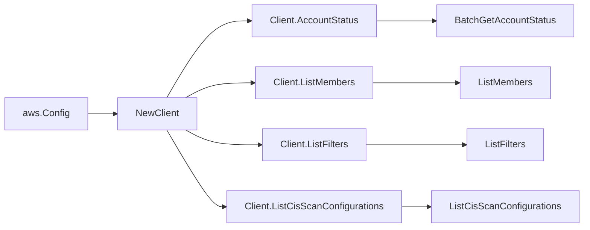

# AWS Inspector v2 SDK Adapter

## Purpose

`internal/collector/awscloud/services/inspector2/awssdk` adapts AWS SDK for Go
v2 Inspector v2 responses to the scanner-owned `inspector2.Client` contract. It
owns Inspector v2 pagination, the account status read, member, filter-name, and
CIS scan configuration list reads, throttle classification, and per-call AWS API
telemetry.

## Ownership boundary

This package owns SDK calls for Inspector v2. It does not own workflow claims,
credential acquisition, Inspector v2 fact selection, graph writes, reducer
admission, or query behavior.

## Exported surface

See `doc.go` for the godoc contract.

- `Client` - AWS SDK-backed implementation of `inspector2.Client`.
- `NewClient` - builds a `Client` for one claimed AWS boundary.

## Dependencies

- `internal/collector/awscloud` for account, region, and service boundary
  labels.
- `internal/collector/awscloud/services/inspector2` for scanner-owned result
  types.
- `internal/telemetry` for AWS API call and throttle instruments.
- AWS SDK for Go v2 `inspector2` and Smithy error contracts.

## Telemetry

Inspector v2 paginator pages and point reads are wrapped with:

- `aws.service.pagination.page`
- `eshu_dp_aws_api_calls_total`
- `eshu_dp_aws_throttle_total`

Metric labels stay bounded to service, account, region, operation, and result.
Account IDs, filter ARNs, CIS configuration ARNs, tags, and raw AWS error
payloads stay out of metric labels.

## Gotchas / invariants

- The allowed call surface is `BatchGetAccountStatus`, `ListMembers`,
  `ListFilters`, and `ListCisScanConfigurations`. The `apiClient` interface
  exposes nothing else, and `client_test.go` reflects over it to fail on any
  forbidden method by substring match.
- `ListFilters` maps the filter name and non-criteria identity only. The
  scanner-owned `FilterSummary` type has no field that can hold criteria,
  description, or reason, so the adapter physically cannot leak them.
- The adapter makes no finding-listing, finding-aggregation, code-snippet,
  SBOM, or CIS scan-result call. Inspector v2 finding details reveal
  exploitation surface and stay out of scope.
- `BatchGetAccountStatus` is scoped to the claimed boundary account.
- The CIS schedule union is reduced to a coarse frequency label; schedule start
  times and day fields are not persisted.
- SDK adapters translate AWS records into scanner-owned types; scanner tests
  should not mock AWS SDK pagination.

## Related docs

- `docs/public/services/collector-aws-cloud.md`
- `docs/public/services/collector-aws-cloud-scanners.md`
- `docs/public/guides/collector-authoring.md`
