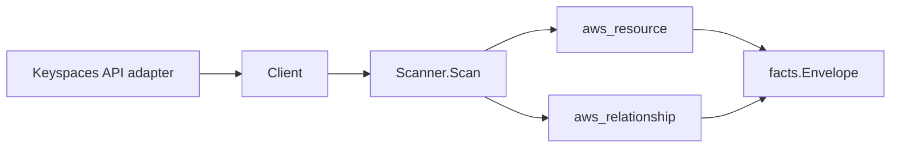

# AWS Keyspaces Scanner

## Purpose

`internal/collector/awscloud/services/keyspaces` owns the Amazon Keyspaces (for
Apache Cassandra) scanner contract for the AWS cloud collector. It converts
keyspace and table control-plane metadata into `aws_resource` facts and emits
relationship evidence for table-in-keyspace membership and the table's
customer-managed server-side encryption KMS key dependency.

Schema column names and data types are structural metadata and are the only
schema information emitted. Table row data, cell values, and CQL query results
are never read or persisted.

## Ownership boundary

This package owns scanner-level Keyspaces fact selection and identity mapping.
It does not own AWS SDK pagination, STS credentials, workflow claims, fact
persistence, graph writes, reducer admission, workload ownership, or query
behavior.

## Exported surface

See `doc.go` for the godoc contract.

- `Client` - minimal Keyspaces metadata snapshot surface consumed by `Scanner`.
- `Snapshot` - keyspace and table metadata plus non-fatal scan warnings.
- `Scanner` - emits keyspace and table metadata plus the table-in-keyspace and
  direct customer-managed KMS relationship facts for one boundary.
- `Keyspace` - scanner-owned metadata-only keyspace representation.
- `Table` - scanner-owned metadata-only table representation.
- `Encryption`, `PointInTimeRecovery`, `Schema`, `Column`, and `ClusteringKey` -
  structural metadata shapes copied into safe resource attributes.

## Dependencies

- `internal/collector/awscloud` for boundaries, resource constants,
  relationship constants, and envelope builders.
- `internal/facts` for emitted fact envelope kinds.

The package depends on a small `Client` interface rather than the AWS SDK for Go
v2 so tests can use fake clients and runtime adapters can own SDK behavior.

## Telemetry

This scanner emits no spans or logs directly. `awsruntime.ClaimedSource`
records scan duration and emitted resource counts after `Scanner.Scan` returns.
The `awssdk` adapter records Keyspaces API call counts, throttles, and
pagination spans.

## Gotchas / invariants

- Keyspaces facts are metadata only. The scanner must not execute CQL, run
  `ExecuteStatement`, `BatchStatement`, or `Select`, read table rows or cells,
  restore tables, or mutate keyspaces or tables. The SDK adapter interface is
  constrained to `ListKeyspaces`, `GetKeyspace`, `ListTables`, `GetTable`, and
  `ListTagsForResource`; an exclusion reflection test fails if any other method
  becomes reachable.
- Schema column names, data types, partition keys, clustering keys, and static
  column names are structural schema metadata, not row data, and are safe to
  report.
- The table-in-keyspace edge keys the keyspace node by its ARN. The keyspace ARN
  is taken from the keyspace's API `ResourceArn` (attached to the table by the
  adapter) and otherwise derived from the table's own ARN by stripping the
  trailing `/table/<name>` segment. Deriving from the table ARN inherits the
  table ARN's partition (`aws` / `aws-cn` / `aws-us-gov`), so the edge never
  dangles in GovCloud or China; the scanner never hardcodes `arn:aws:`.
- The table-uses-KMS-key edge is emitted only for customer-managed keys, where
  Keyspaces reports a KMS key ARN. AWS-owned keys report no identifier and emit
  no edge. `target_arn` is set only when the identifier is ARN-shaped.
- Tags are raw AWS tag evidence. Do not infer environment, owner, workload,
  repository, or deployable-unit truth from tags in this package.
- The relationships are reported join evidence only. Correlation belongs in
  reducers.

## Evidence

Collector Performance Evidence:
`go test ./internal/collector/awscloud/services/keyspaces/...` covers the
bounded Keyspaces metadata path: one paginated ListKeyspaces stream with
MaxResults=100, one GetKeyspace point read per keyspace, one paginated ListTables
stream per keyspace, one GetTable point read per table, and one paginated
ListTagsForResource stream per table; no ExecuteStatement, BatchStatement,
Select, row reads, cell reads, RestoreTable calls, mutations, or graph writes in
the collector.

No-Regression Evidence:
`go test ./cmd/collector-aws-cloud ./internal/collector/awscloud/...` covers
keyspace and table metadata fact emission, table-in-keyspace relationship
emission, direct customer-managed KMS relationship emission, omission of
data-plane row/cell fields, the metadata-only adapter-interface exclusion test,
SDK metadata mapping, runtime registration, and the derived supported-service
guard.

No-Regression Evidence:
`go test ./internal/collector/awscloud/services/keyspaces/... -count=1` covers
`TestTableKeyspaceRelationshipDerivesPartitionFromTableARN` (commercial /
`aws-us-gov` / `aws-cn`), proving the synthesized keyspace ARN inherits the table
ARN's partition instead of hardcoding `aws`, so the table->keyspace edge resolves
to the keyspace node the scanner publishes (`arn:<partition>:cassandra:...:/keyspace/<ks>/`)
in every partition.

Collector Observability Evidence: Keyspaces uses the existing AWS collector
`aws.service.pagination.page` span plus `eshu_dp_aws_api_calls_total`,
`eshu_dp_aws_throttle_total`, `eshu_dp_aws_resources_emitted_total`,
`eshu_dp_aws_relationships_emitted_total`, and `aws_scan_status` rows. Metric
labels stay bounded to service, account, region, operation, result, and status.

No-Observability-Change: the existing AWS collector telemetry contract already
diagnoses Keyspaces scans through `aws.service.scan`,
`aws.service.pagination.page`, API/throttle counters, resource/relationship
counters, and `aws_scan_status`; this scanner adds no new instrument, span,
metric label, or status row.

Collector Deployment Evidence: Keyspaces runs inside the existing hosted
`collector-aws-cloud` runtime, so `/healthz`, `/readyz`, `/metrics`, and
`/admin/status` stay covered by the command wiring and Helm collector runtime.

## Related docs

- `docs/public/services/collector-aws-cloud.md`
- `docs/public/services/collector-aws-cloud-scanners.md`
- `docs/public/guides/collector-authoring.md`
