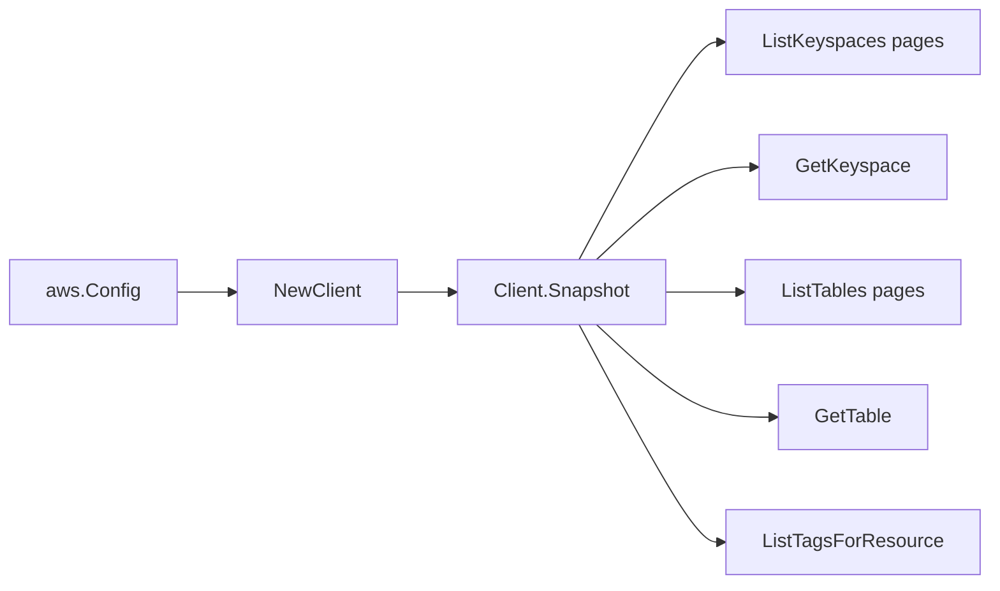

# AWS Keyspaces SDK Adapter

## Purpose

`internal/collector/awscloud/services/keyspaces/awssdk` adapts AWS SDK for Go v2
Amazon Keyspaces (for Apache Cassandra) responses to the scanner-owned `Client`
contract. It owns keyspace and table pagination, keyspace and table point reads,
resource tag reads, throttle classification, and per-call AWS API telemetry.

## Ownership boundary

This package owns SDK calls for Keyspaces. It does not own workflow claims,
credential acquisition, Keyspaces fact selection, graph writes, reducer
admission, workload ownership, or query behavior.

## Exported surface

See `doc.go` for the godoc contract.

- `Client` - AWS SDK-backed implementation of `keyspaces.Client`.
- `NewClient` - builds a `Client` for one claimed AWS boundary.

## Dependencies

- `internal/collector/awscloud` for account, region, and service boundary
  labels.
- `internal/collector/awscloud/services/keyspaces` for scanner-owned result
  types.
- `internal/telemetry` for AWS API call and throttle instruments.
- AWS SDK for Go v2 `keyspaces` and Smithy error contracts.

## Telemetry

Keyspaces list pages, point reads, and tag pages are wrapped with:

- `aws.service.pagination.page`
- `eshu_dp_aws_api_calls_total`
- `eshu_dp_aws_throttle_total`

Metric labels stay bounded to service, account, region, operation, and result.
Keyspace names, table names, ARNs, tags, schema columns, and KMS key IDs stay
out of metric labels.

## Gotchas / invariants

- The adapter calls only `ListKeyspaces`, `GetKeyspace`, `ListTables`,
  `GetTable`, and `ListTagsForResource`. The `apiClient` interface is the only
  AWS surface the adapter can reach, and the package exclusion reflection test
  fails if any data-plane read (`ExecuteStatement`, `BatchStatement`, `Select`)
  or mutation (`Create*`, `Delete*`, `Update*`, `RestoreTable`, `TagResource`,
  `UntagResource`) method becomes reachable.
- `ListKeyspaces` and `ListTables` set `MaxResults=100` and follow `NextToken`.
- `ListTables` reports only the table ARN; the adapter parses the table name back
  out of the ARN's trailing `/table/<name>` segment to issue `GetTable`.
- The adapter attaches the parent keyspace's API `ResourceArn` to each table so
  the table-in-keyspace edge joins the keyspace node by its published ARN.
- The adapter maps safe control-plane fields, including the structural schema
  (column names, data types, partition keys, clustering keys, static columns),
  and never reads table rows, cells, or CQL query results.
- The adapter must not call `ExecuteStatement`, `BatchStatement`, any CQL
  `Select`, `RestoreTable`, or any keyspace/table mutation API.

## Related docs

- `docs/public/services/collector-aws-cloud.md`
- `docs/public/guides/collector-authoring.md`
