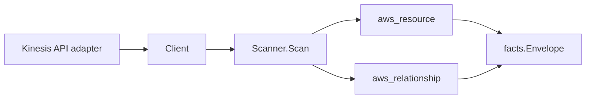

# AWS Kinesis Scanner

## Purpose

`internal/collector/awscloud/services/kinesis` owns the Amazon Kinesis scanner
contract for the AWS cloud collector. One `service_kind` ("kinesis") covers
three sub-services: Kinesis Data Streams, Kinesis Data Firehose, and Kinesis
Video Streams. It converts data-stream, delivery-stream, and video-stream
metadata into `aws_resource` facts and emits relationship evidence for
stream-to-KMS-key, Firehose-to-destination (S3, Redshift, OpenSearch, Splunk,
HTTP endpoint), Firehose-to-Lambda-transform, and Firehose-to-IAM-role
dependencies.

## Ownership boundary

This package owns scanner-level Kinesis fact selection and identity mapping. It
does not own AWS SDK pagination, STS credentials, workflow claims, fact
persistence, graph writes, reducer admission, or query behavior.

## Exported surface

See `doc.go` for the godoc contract.

- `Client` - metadata-only Kinesis read surface consumed by `Scanner`. It spans
  Data Streams, Firehose, and Video Streams and exposes no record-plane,
  media-plane, or mutation method.
- `Scanner` - emits data-stream, delivery-stream, and video-stream facts plus
  relationship facts for one boundary.
- `DataStream`, `FirehoseDeliveryStream`, `FirehoseDestination`, `VideoStream` -
  scanner-owned metadata representations. Secret-bearing fields are absent by
  design.
- `FirehoseDestinationKind*` - destination kind labels recorded on
  `FirehoseDestination.Kind`.

## Dependencies

- `internal/collector/awscloud` for boundaries, resource constants,
  relationship constants, and envelope builders.
- `internal/facts` for emitted fact envelope kinds.

The package depends on a small `Client` interface rather than the AWS SDK for
Go v2 so tests can use fake clients and runtime adapters can own SDK behavior.

## Telemetry

This scanner emits no spans or logs directly. `awsruntime.ClaimedSource`
records scan duration and emitted resource counts after `Scanner.Scan` returns.
The `awssdk` adapter records Kinesis API call counts, throttles, and pagination
spans. Resource counts surface through
`eshu_dp_aws_resources_emitted_total{service="kinesis"}` with the existing
per-resource `resource_type` label, which is the sub-service attribute: it
distinguishes `aws_kinesis_data_stream` (datastream),
`aws_kinesis_firehose_delivery_stream` (firehose), and
`aws_kinesis_video_stream` (video). No new metric or label is introduced.

## Gotchas / invariants

- Kinesis facts are metadata only. The scanner must never read stream records
  (PutRecord/PutRecords/GetRecords/GetShardIterator class), never read video
  media (GetMedia/PutMedia/GetMediaForFragmentList), and never mutate any
  resource.
- The scanner never persists the Firehose processing-configuration Lambda body,
  the HTTP endpoint access key, the Splunk HEC token, or the Redshift
  password/SecretsManager material. Those fields are not present on the
  scanner-owned types, so they cannot be emitted.
- Stream-to-KMS-key and Firehose-to-S3/OpenSearch/IAM-role/Lambda relationships
  emit only when AWS reports the ARN form for the target identity, matching the
  MSK precedent. Splunk and generic HTTP endpoints have no ARN, so those edges
  are keyed by the reported endpoint URL. The Redshift edge is keyed by the
  cluster identifier parsed from the JDBC URL host because Firehose reports no
  Redshift cluster ARN.
- A shared IAM role or transform Lambda referenced by multiple destinations is
  deduplicated into one relationship per ARN to avoid inflating edge counts.
- Tags are raw AWS tag evidence. Do not infer environment, owner, workload, or
  deployable-unit truth from tags in this package.

## Evidence

Collector Performance Evidence: `go test ./internal/collector/awscloud/services/kinesis/...`
covers the bounded Kinesis metadata path: one paginated ListStreams stream for
data streams followed by one DescribeStreamSummary and one ListTagsForStream
per stream, one paginated ListDeliveryStreams stream for Firehose followed by
one DescribeDeliveryStream and one ListTagsForDeliveryStream per delivery
stream, one paginated ListStreams stream for video (StreamInfo is returned in
full, so no per-stream describe) followed by one ListTagsForStream per video
stream, no record-plane or media-plane APIs, no mutation APIs, and no graph
writes inside the collector.

No-Regression Evidence: `go test ./cmd/collector-aws-cloud ./internal/collector/awscloud/...`
covers data-stream, delivery-stream, and video-stream fact emission, ARN-only
KMS key, IAM role, Lambda transform, S3, and OpenSearch relationship emission,
URL-keyed Splunk and HTTP endpoint relationship emission, JDBC-derived Redshift
relationship emission, omission of record, media, processing Lambda body, and
destination secret material, runtime registration, command configuration, and
the SDK adapter's safe metadata mapping. The adapter's reflection contract test
proves the record-plane, media-plane, and mutation APIs are unreachable.

Collector Observability Evidence: Kinesis uses the existing AWS collector
`aws.service.pagination.page` span plus `eshu_dp_aws_api_calls_total`,
`eshu_dp_aws_throttle_total`,
`eshu_dp_aws_resources_emitted_total{service="kinesis"}`,
`eshu_dp_aws_relationships_emitted_total`, and `aws_scan_status` rows. Metric
labels stay bounded to service, account, region, operation, result, and
resource type.

No-Observability-Change: the existing AWS collector telemetry contract already
diagnoses Kinesis scans through `aws.service.scan`,
`aws.service.pagination.page`, API/throttle counters, resource/relationship
counters, and `aws_scan_status`. No new instrument or label was added; the
sub-service distinction rides the existing `resource_type` label.

Collector Deployment Evidence: Kinesis runs inside the existing hosted
`collector-aws-cloud` runtime, so `/healthz`, `/readyz`, `/metrics`, and
`/admin/status` stay covered by the command wiring and Helm collector runtime.

## Related docs

- `docs/public/services/collector-aws-cloud.md`
- `docs/public/services/collector-aws-cloud-scanners.md`
- `docs/public/guides/collector-authoring.md`
