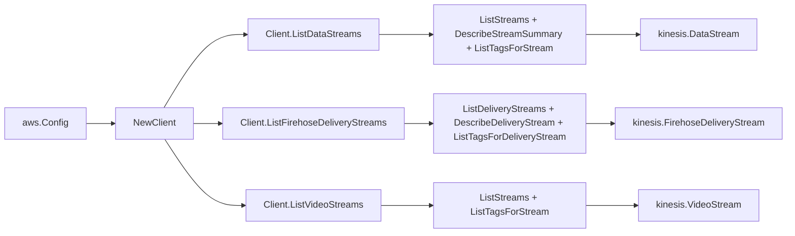

# AWS Kinesis SDK Adapter

## Purpose

`internal/collector/awscloud/services/kinesis/awssdk` adapts AWS SDK for Go v2
Kinesis Data Streams, Kinesis Data Firehose, and Kinesis Video Streams
responses to the scanner-owned `Client` contract. It owns data-stream
discovery and per-stream summary enrichment, Firehose delivery-stream
discovery and per-stream description, video-stream listing, tag listing for all
three sub-services, throttle classification, and per-call AWS API telemetry.

## Ownership boundary

This package owns SDK calls for Kinesis. It does not own workflow claims,
credential acquisition, Kinesis fact selection, graph writes, reducer
admission, or query behavior.

## Exported surface

See `doc.go` for the godoc contract.

- `Client` - AWS SDK-backed implementation of `kinesis.Client`.
- `NewClient` - builds a `Client` for one claimed AWS boundary, constructing
  one SDK client per sub-service from the same `aws.Config`.

## Dependencies

- `internal/collector/awscloud` for account, region, and service boundary
  labels.
- `internal/collector/awscloud/services/kinesis` for scanner-owned result
  types.
- `internal/telemetry` for AWS API call and throttle instruments.
- AWS SDK for Go v2 `kinesis`, `firehose`, `kinesisvideo`, and Smithy error
  contracts.

## Telemetry

Each paginator page and point read is wrapped with:

- `aws.service.pagination.page`
- `eshu_dp_aws_api_calls_total`
- `eshu_dp_aws_throttle_total`

Metric labels stay bounded to service, account, region, operation, and result.
Stream ARNs, KMS key ARNs, IAM role ARNs, Lambda ARNs, S3 bucket ARNs,
OpenSearch domain ARNs, endpoint URLs, tags, and raw AWS error payloads stay
out of metric labels.

## Gotchas / invariants

- The adapter reaches AWS only through three narrow interfaces - `dataStreamsAPI`,
  `firehoseAPI`, `videoAPI`. The `contract_test.go` reflection test asserts
  their exact method shape, which is the load-bearing proof that record-plane,
  media-plane, and mutation APIs are unreachable.
- Data Streams: `ListStreams` discovers names, then `DescribeStreamSummary`
  fetches shard count, retention, encryption type, and KMS key. The adapter
  never calls GetRecords, GetShardIterator, PutRecord, PutRecords, MergeShards,
  SplitShard, or any stream lifecycle mutation.
- Firehose: `ListDeliveryStreams` discovers names, then `DescribeDeliveryStream`
  fetches source, destinations, encryption, IAM role, and the transform Lambda
  ARN. The mapper reads only the `LambdaArn` processor parameter; the rest of
  the processing-configuration body is ignored. `HttpEndpointDescription`
  exposes only Name and Url - the AccessKey lives on the input-only
  `HttpEndpointConfiguration` and is never reachable. The Splunk `HECToken`,
  Redshift `Username`/`SecretsManagerConfiguration`, and any password material
  are never mapped into scanner-owned types.
- Kinesis Video: `ListStreams` returns full `StreamInfo` (status, KMS key,
  retention), so no per-stream describe is needed. The adapter never calls
  GetMedia, PutMedia, or GetMediaForFragmentList.
- SDK adapters translate AWS records into scanner-owned types; scanner tests
  should not mock AWS SDK pagination.

## Related docs

- `docs/public/services/collector-aws-cloud.md`
- `docs/public/services/collector-aws-cloud-scanners.md`
- `docs/public/guides/collector-authoring.md`
