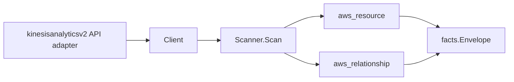

# Amazon Managed Service for Apache Flink Scanner

## Purpose

`internal/collector/awscloud/services/kinesisanalyticsv2` owns the Amazon
Managed Service for Apache Flink (Kinesis Data Analytics v2) scanner contract
for the AWS cloud collector. It converts application control-plane metadata into
`aws_resource` facts and emits relationship evidence for the application's SQL
input/output Kinesis data streams and Firehose delivery streams, its S3 code
bucket, its VPC subnets and security groups, its service execution IAM role, and
its CloudWatch logging log groups.

## Ownership boundary

This package owns scanner-level Managed Flink fact selection and identity
mapping. It does not own AWS SDK pagination, STS credentials, workflow claims,
fact persistence, graph writes, reducer admission, or query behavior.

## Exported surface

See `doc.go` for the godoc contract.

- `Client` - minimal Managed Flink metadata read surface consumed by `Scanner`.
- `Scanner` - emits one application resource plus its relationships for one
  boundary.
- `Application`, `VPCConfiguration`, `Snapshot` - scanner-owned views with code
  bodies, SQL text, environment property values, and run-configuration content
  intentionally absent.

## Dependencies

- `internal/collector/awscloud` for boundaries, resource constants,
  relationship constants, and envelope builders.
- `internal/facts` for emitted fact envelope kinds.

The package depends on a small `Client` interface rather than the AWS SDK for
Go v2 so tests can use fake clients and the runtime adapter can own SDK
behavior.

## Telemetry

This scanner emits no spans or logs directly. `awsruntime.ClaimedSource`
records scan duration and emitted resource counts after `Scanner.Scan` returns.
The `awssdk` adapter records Managed Flink API call counts, throttles, and
pagination spans.

## Gotchas / invariants

- Managed Flink facts are metadata only. The scanner must never read or persist
  application code bodies, SQL text, environment property values,
  run-configuration content, or record payloads, and must never call any
  mutation API.
- The application node publishes its resource_id as the application ARN
  (falling back to the application name). Every application edge is sourced on
  that same value.
- The Kinesis data stream and Firehose delivery stream edges are keyed by the
  reported stream ARN, which is the resource_id the kinesis and firehose
  scanners publish, so the edges target `aws_kinesis_data_stream` and
  `aws_firehose_delivery_stream` by ARN.
- The S3 code-bucket edge is keyed by the reported bucket ARN (the resource_id
  the S3 scanner publishes); only the bucket identity and object key are
  recorded, never the code body.
- The subnet and security group edges are keyed by the bare `subnet-…`/`sg-…`
  id the EC2 scanner publishes, never an ARN.
- The IAM role edge is keyed by the reported service execution role ARN, the
  resource_id the IAM scanner publishes for roles.
- The CloudWatch log group edge is keyed by the log GROUP ARN. AWS reports a log
  STREAM ARN (`arn:…:log-group:<name>:log-stream:<stream>`); the adapter trims
  the log-stream segment and any trailing `:*` wildcard to the log group ARN the
  cloudwatchlogs scanner publishes, so the edge joins the log group node.
- This scanner emits no MSK edge. The control-plane describe output exposes no
  structured MSK cluster reference for a Managed Flink application (MSK is wired
  through environment properties, whose values are never persisted), so an MSK
  edge would have to read secret-bearing property values and is intentionally
  omitted rather than dangled.
- Emit reported evidence only. Do not infer deployment, workload, repository
  ownership, environment, or deployable-unit truth from application names or AWS
  tags.

## Evidence

Collector Performance Evidence:
`go test ./internal/collector/awscloud/services/kinesisanalyticsv2/...` covers
the bounded Managed Flink metadata path: one paginated ListApplications stream,
one DescribeApplication point read per application, one paginated
ListApplicationSnapshots stream per application, one ListTagsForResource point
read per application, no code-body reads, no SQL reads, no mutations, and no
graph writes in the collector.

No-Regression Evidence: metadata-only control-plane scanner; new read path, no
change to existing hot paths. `go test ./internal/collector/awscloud/services/kinesisanalyticsv2/...` green.

No-Observability-Change: reuses shared AWS pagination span + API-call/throttle counters; no telemetry contract change.

Collector Deployment Evidence: Managed Flink runs inside the existing hosted
`collector-aws-cloud` runtime, so `/healthz`, `/readyz`, `/metrics`, and
`/admin/status` stay covered by the command wiring and Helm collector runtime.

## Related docs

- `docs/public/services/collector-aws-cloud.md`
- `docs/public/services/collector-aws-cloud-scanners.md`
- `docs/public/services/collector-aws-cloud-security.md`
