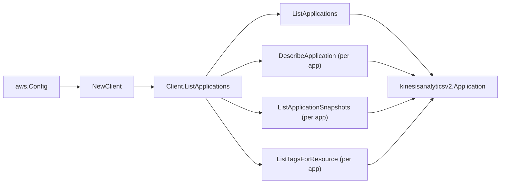

# Amazon Managed Service for Apache Flink SDK Adapter

## Purpose

`internal/collector/awscloud/services/kinesisanalyticsv2/awssdk` adapts AWS SDK
for Go v2 Managed Service for Apache Flink (Kinesis Data Analytics v2) responses
to the scanner-owned `Client` contract. It owns application pagination,
per-application describe and snapshot reads, resource-tag reads, throttle
classification, and per-call AWS API telemetry, plus the conversion of each
reported CloudWatch log stream ARN into the log group ARN the cloudwatchlogs
scanner publishes.

## Ownership boundary

This package owns SDK calls for Managed Flink. It does not own workflow claims,
credential acquisition, Managed Flink fact selection, graph writes, reducer
admission, or query behavior.

## Exported surface

See `doc.go` for the godoc contract.

- `Client` - AWS SDK-backed implementation of `kinesisanalyticsv2.Client`.
- `NewClient` - builds a `Client` for one claimed AWS boundary.

## Dependencies

- `internal/collector/awscloud` for account, region, and service boundary
  labels.
- `internal/collector/awscloud/services/kinesisanalyticsv2` for scanner-owned
  result types.
- `internal/telemetry` for AWS API call and throttle instruments.
- AWS SDK for Go v2 `kinesisanalyticsv2` and Smithy error contracts.

## Telemetry

Managed Flink paginator pages and point reads are wrapped with:

- `aws.service.pagination.page`
- `eshu_dp_aws_api_calls_total`
- `eshu_dp_aws_throttle_total`

Metric labels stay bounded to service, account, region, operation, and result.
Managed Flink resource ARNs, names, tags, and raw AWS error payloads stay out of
metric labels.

## Gotchas / invariants

- The adapter reads metadata only. It must never call any `Create*`, `Update*`,
  `Delete*`, `Start*`, `Stop*`, `Add*`, or `Rollback*` mutation API.
- `DescribeApplication` is called without `IncludeAdditionalDetails`, so the
  verbose job plan is never requested; the adapter copies only the parallelism
  posture, snapshot posture, code content FORMAT, S3 code location reference, and
  SQL input/output stream ARNs. It never copies the text-format code body, the
  zip checksum/size, in-application stream names, schemas, environment property
  values, or run-configuration content.
- AWS reports a CloudWatch log STREAM ARN
  (`arn:…:log-group:<name>:log-stream:<stream>`) for an application's logging
  option. `logGroupARNFromLogStreamARN` trims the log-stream segment and any
  trailing `:*` wildcard to the log group ARN the cloudwatchlogs scanner
  publishes, so the resulting edge joins the log group node instead of dangling.
- `ListTagsForResource` is a metadata read; Managed Flink tags carry no code or
  record content.
- SDK adapters translate AWS records into scanner-owned types; scanner tests
  should not mock AWS SDK pagination.

## Related docs

- `docs/public/services/collector-aws-cloud-scanners.md`
- `docs/public/services/collector-aws-cloud-security.md`
