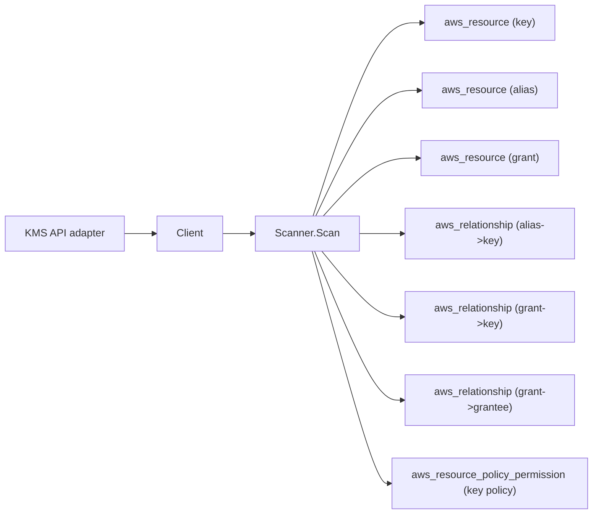

# AWS KMS Scanner

## Purpose

`internal/collector/awscloud/services/kms` owns the KMS scanner contract for
the AWS cloud collector. It converts customer master keys, AWS-managed keys
where AWS makes them listable, aliases, and grants into reported AWS facts
and relationship evidence.

The KMS scanner is the foundation security node for the rest of the AWS
collector. Many other services (RDS, DynamoDB, CloudWatch Logs, Secrets
Manager, SSM, Athena, Redshift, ElastiCache, MSK) already emit
`<resource>_uses_kms_key` edges. This scanner makes the target node real.

## Ownership boundary

This package owns scanner-level KMS fact selection and identity mapping. It
does not own AWS SDK pagination, credential acquisition, workflow claims,
fact persistence, graph writes, reducer admission, or query behavior.

## Exported surface

See `doc.go` for the godoc contract.

- `Client` - minimal KMS metadata read surface consumed by `Scanner`. The
  interface exposes only List/Describe-class methods; the package test
  asserts no method name matches a cryptographic operation or lifecycle
  mutation.
- `Scanner` - emits KMS metadata and direct key/alias/grant relationship
  facts for one boundary.
- `Key` - scanner-owned key metadata (identity, usage, origin, manager,
  state, rotation status known/value, policy revision names, multi-Region
  configuration, supported algorithm lists, and the normalized
  `ResourcePolicyStatements` projection of the key policy).
- `ResourcePolicyStatement` - one normalized, derived key-policy statement
  (effect, normalized actions/resources, condition-key NAMES, and derived
  grantee principal facts). The raw policy Statement body and condition
  values are never represented on it. It feeds the
  `aws_resource_policy_permission` fact.
- `Alias` - alias name/ARN and the target key id it points at.
- `Grant` - grant identity, grantee principal, retiring principal, issuing
  account, and the bounded operation list. The grantee principal is either an
  IAM ARN or an AWS service principal (for example `s3.amazonaws.com`);
  `GranteePrincipalType` records which case it is. The grant->grantee
  relationship mirrors the IAM principal scheme: the target identity is
  `<type>:<principal>` and `target_arn` is populated only for ARN-shaped
  principals. Grant encryption contexts are intentionally absent from this
  type.

## Dependencies

- `internal/collector/awscloud` for boundaries, resource constants,
  relationship constants, and envelope builders.
- `internal/facts` for emitted fact envelope kinds.

The package depends on a small `Client` interface rather than the AWS SDK
for Go v2 so tests can use fake clients and runtime adapters can own SDK
behavior.

## Telemetry

This scanner emits no spans or logs directly. `awsruntime.ClaimedSource`
records scan duration and emitted resource counts after `Scanner.Scan`
returns. The `awssdk` adapter records KMS API call counts, throttles, and
pagination spans. The required resource signal is
`eshu_dp_aws_resources_emitted_total{service="kms"}` with the existing
bounded AWS collector labels.

## Gotchas / invariants

- The scanner is metadata-only. It must never call any cryptographic API:
  Encrypt, Decrypt, GenerateDataKey, GenerateDataKeyPair,
  GenerateDataKeyPairWithoutPlaintext, GenerateDataKeyWithoutPlaintext,
  Sign, Verify, ReEncrypt, GenerateMac, VerifyMac, DeriveSharedSecret,
  GetPublicKey, GenerateRandom.
- It must never call any key lifecycle mutation API: CreateKey,
  ScheduleKeyDeletion, CancelKeyDeletion, EnableKey, DisableKey,
  EnableKeyRotation, DisableKeyRotation, PutKeyPolicy, CreateGrant,
  RevokeGrant, RetireGrant, ReplicateKey, ImportKeyMaterial,
  DeleteImportedKeyMaterial, UpdateKeyDescription, CreateAlias,
  UpdateAlias, DeleteAlias, TagResource, UntagResource,
  RotateKeyOnDemand, UpdatePrimaryRegion.
- It must never persist key policy Statement bodies, statement Sids, or
  condition VALUES. The `awssdk` adapter reads the key policy with
  GetKeyPolicy (owner-approved, PR4b of #1134) only to derive the
  normalized, metadata-only `aws_resource_policy_permission` projection
  (effect, normalized actions/resources, condition-key NAMES, derived
  grantee principal facts). The bounded policy revision names from
  ListKeyPolicies are still emitted as before. PutKeyPolicy (a mutation)
  stays forbidden.
- It must never persist grant encryption contexts. The scanner-owned
  `Grant` type has no field for `EncryptionContextSubset`,
  `EncryptionContextEquals`, or other `GrantConstraints` payload, so leak
  paths do not exist.
- It must never persist key material. The scanner cannot reach it because
  there is no API surface to ask for it.
- `rotation_enabled` is reported only when `rotation_status_known` is
  true. AWS returns UnsupportedOperationException for asymmetric, HMAC,
  AWS-managed, and pending-deletion keys; the adapter treats that as
  "unknown" rather than reporting a false answer.
- Preserve stable key, alias, and grant identities across repeated
  observations in the same AWS generation.
- Keep key ids, ARNs, aliases, grantee principals, and tags out of
  metric labels.

## Evidence

Collector Performance Evidence: `go test ./internal/collector/awscloud/services/kms/...`
covers the bounded KMS metadata path: paginated ListKeys discovery,
per-key DescribeKey, ListAliases roll-up, ListGrants, ListKeyPolicies,
GetKeyRotationStatus with UnsupportedOperationException tolerance, and
ListResourceTags without cryptographic or lifecycle calls.

No-Regression Evidence: `go test ./cmd/collector-aws-cloud ./internal/collector/awscloud/...`
covers KMS resource and relationship fact emission, omission of policy
Statement bodies, omission of grant encryption contexts, runtime
registration, command configuration, and the SDK adapter's safe
metadata mapping.

Collector Observability Evidence: KMS uses the existing AWS collector
`aws.service.pagination.page` span plus `eshu_dp_aws_api_calls_total`,
`eshu_dp_aws_throttle_total`, `eshu_dp_aws_resources_emitted_total`,
`eshu_dp_aws_relationships_emitted_total`, and `aws_scan_status` rows.

No-Observability-Change: the existing AWS collector telemetry contract
already diagnoses KMS scans through the bounded shared instruments.

### Resource-policy permission fact (PR4b of #1134)

No-Regression Evidence: `cd go && go test ./internal/facts ./internal/collector/awscloud ./internal/collector/awscloud/services/kms/... -count=1`
covers the new `aws_resource_policy_permission` emission, the derived
key-policy statement normalization, the GetKeyPolicy adapter call, and the
existing metadata path. This slice is facts-only: no Cypher, graph write,
queue, lease, or reducer change. The added work is one control-plane
`GetKeyPolicy` call per key policy name (almost always the single `default`
policy), bounded by the policy-name count `ListKeyPolicies` already returns,
so the per-key API fan-out grows by one bounded read; AccessDenied on a
policy read is treated as "no readable policy" and contributes no fact rather
than failing the scan.

No-Observability-Change: the `GetKeyPolicy` call flows through the existing
`recordAPICall` path, so it is already counted by
`eshu_dp_aws_api_calls_total{operation="GetKeyPolicy"}` and traced by the
`aws.service.pagination.page` span; the derived fact flows through the
existing `eshu_dp_aws_resources_emitted_total{service="kms"}` collector
signal. No new metric, span, or log is introduced.

Collector Deployment Evidence: KMS runs inside the existing hosted
`collector-aws-cloud` runtime, so `/healthz`, `/readyz`, `/metrics`, and
`/admin/status` stay covered by the command wiring and Helm collector
runtime.

## Related docs

- `docs/public/services/collector-aws-cloud.md`
- `docs/public/services/collector-aws-cloud-scanners.md`
- `docs/public/guides/collector-authoring.md`
