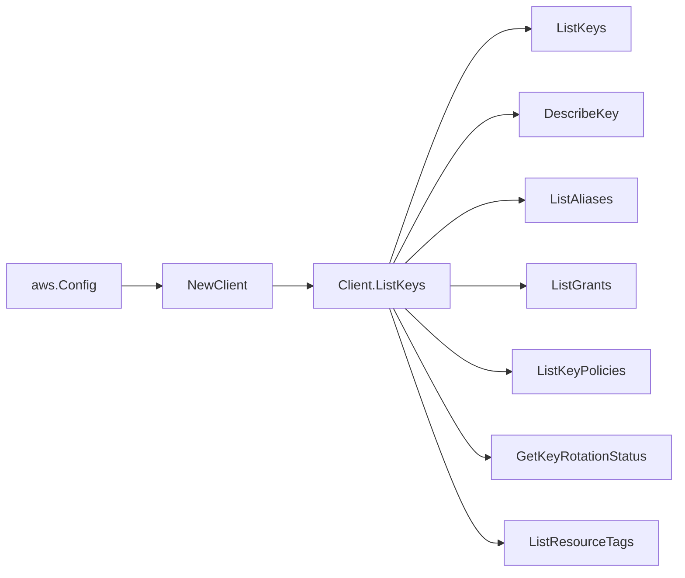

# AWS KMS SDK Adapter

## Purpose

`internal/collector/awscloud/services/kms/awssdk` adapts AWS SDK for Go v2
KMS responses to the scanner-owned `kms.Client` contract. It owns KMS
pagination, per-key control-plane reads, throttle classification, and
per-call AWS API telemetry.

## Ownership boundary

This package owns SDK calls for KMS. It does not own workflow claims,
credential acquisition, KMS fact selection, graph writes, reducer
admission, or query behavior.

The package never calls Encrypt, Decrypt, GenerateDataKey,
GenerateDataKeyPair, GenerateDataKeyPairWithoutPlaintext,
GenerateDataKeyWithoutPlaintext, Sign, Verify, ReEncrypt, GenerateMac,
VerifyMac, DeriveSharedSecret, GetPublicKey, GenerateRandom, CreateKey,
ScheduleKeyDeletion, CancelKeyDeletion, EnableKey, DisableKey,
EnableKeyRotation, DisableKeyRotation, PutKeyPolicy, CreateGrant,
RevokeGrant, RetireGrant, ReplicateKey, ImportKeyMaterial,
DeleteImportedKeyMaterial, UpdateKeyDescription, CreateAlias,
UpdateAlias, DeleteAlias, TagResource, UntagResource, RotateKeyOnDemand,
UpdatePrimaryRegion, or GetKeyPolicy. The adapter-local `apiClient`
interface is the entire SDK surface this package consumes; a test
reflects over it and fails if a forbidden method ever appears.

## Exported surface

See `doc.go` for the godoc contract.

- `Client` - AWS SDK-backed implementation of `kms.Client`.
- `NewClient` - builds a `Client` for one claimed AWS boundary.

## Dependencies

- `internal/collector/awscloud` for account, region, and service boundary
  labels.
- `internal/collector/awscloud/services/kms` for scanner-owned result types.
- `internal/telemetry` for AWS API call and throttle instruments.
- AWS SDK for Go v2 `kms` and Smithy error contracts.

## Telemetry

KMS paginator pages and point reads are wrapped with:

- `aws.service.pagination.page`
- `eshu_dp_aws_api_calls_total`
- `eshu_dp_aws_throttle_total`

Metric labels stay bounded to service, account, region, operation, and
result. Key ids, ARNs, alias names, grantee principals, tags, and raw AWS
error payloads stay out of metric labels.

## Gotchas / invariants

- `GetKeyRotationStatus` is skipped for asymmetric, HMAC, AWS-managed,
  and pending-deletion keys because AWS returns
  `UnsupportedOperationException` for them. Pending-creation keys are
  also skipped. The scanner reports `rotation_status_known=false` for
  those keys.
- `ListResourceTags` may return `AccessDeniedException` for keys outside
  the credential's permissions. The adapter treats that as "no tags
  reported" rather than failing the whole scan.
- `ListAliases` is paginated once for the whole boundary and indexed by
  target key id, so the adapter does not need a per-key alias call.
- The adapter intentionally drops `GrantConstraints.EncryptionContext*`
  pairs when mapping grants. They never reach the scanner type.
- SDK adapters translate AWS records into scanner-owned types; scanner
  tests should not mock AWS SDK pagination.

## Related docs

- `docs/public/services/collector-aws-cloud.md`
- `docs/public/services/collector-aws-cloud-scanners.md`
- `docs/public/guides/collector-authoring.md`
