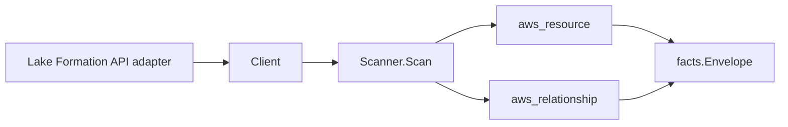

# AWS Lake Formation Scanner

## Purpose

`internal/collector/awscloud/services/lakeformation` owns the Lake Formation
scanner contract for the AWS cloud collector. It converts data-lake settings
(administrator principal identifiers), registered data-location metadata, and
principal/resource permission grants into `aws_resource` facts and emits the
data-access governance relationships over the Glue Data Catalog: registered
location to S3 bucket, registered location to IAM role, permission to Glue
database/table, and permission to IAM-role principal.

Lake Formation governs the Glue catalog, so the permission edges reuse the Glue
scanner's published `resource_id` shapes (bare database name and
`database/table`) as their join keys.

## Ownership boundary

This package owns scanner-level Lake Formation fact selection and identity
mapping. It does not own AWS SDK pagination, STS credentials, workflow claims,
fact persistence, graph writes, reducer admission, or query behavior.

## Exported surface

See `doc.go` for the godoc contract.

- `Client` - minimal Lake Formation metadata read surface consumed by
  `Scanner` (GetDataLakeSettings, ListResources, ListPermissions).
- `Scanner` - emits settings, registered-resource, and permission resources plus
  their relationships for one boundary.
- `Settings`, `RegisteredResource`, `Permission` - scanner-owned views with
  permission policy bodies, condition expressions, and LF-Tag values
  intentionally omitted.

## Dependencies

- `internal/collector/awscloud` for boundaries, resource constants,
  relationship constants, partition helpers, and envelope builders.
- `internal/facts` for emitted fact envelope kinds.

The package depends on a small `Client` interface rather than the AWS SDK for
Go v2 so tests can use fake clients and runtime adapters can own SDK behavior.

## Telemetry

This scanner emits no spans or logs directly. `awsruntime.ClaimedSource`
records scan duration and emitted resource counts after `Scanner.Scan` returns.
The `awssdk` adapter records Lake Formation API call counts, throttles, and
pagination spans.

## Gotchas / invariants

- Lake Formation facts are metadata only with a data-sensitivity contract. The
  scanner must never grant, revoke, register, deregister, put settings, or
  mutate LF-Tags, and it must never persist a permission policy body, a
  permission condition (LF-Tag) expression, an LF-Tag value, or principal
  credentials.
- The scanner emits grant identities, principal identifiers, and resource ARNs
  only. Permission privilege names (`SELECT`, `ALTER`, `ALL`, ...) are a closed
  AWS privilege enum recorded as grant identity, not a policy body.
- Registered-location ARNs and registering-role ARNs come from the API and are
  used directly. The S3 bucket ARN is derived from the registered location ARN
  and inherits that ARN's partition via `awscloud.PartitionFromARN`, so the
  edge joins the bucket node the S3 scanner publishes
  (`arn:<partition>:s3:::<bucket>`) in GovCloud and China without dangling. The
  package-local `partition(boundary)` helper is the region-derived fallback.
- The permission-to-Glue-table edge keys on `database/table`, matching the Glue
  scanner's table `resource_id`; a table-wildcard (database-wide) grant keys on
  the bare database name instead.
- The permission-to-principal edge is emitted only when the Lake Formation
  principal identifier is an IAM role ARN. Special principals
  (`IAM_ALLOWED_PRINCIPALS`) and non-role identities do not produce a dangling
  or mistyped edge; their resource edge still resolves.
- The registered-location-to-S3 edge is emitted only when the registered ARN is
  an S3 location ARN; the registered-location-to-IAM-role edge is emitted only
  when AWS reports an ARN-shaped role identity.
- Emit reported evidence only. Do not infer deployment, workload, repository
  ownership, environment, or deployable-unit truth from principal, database, or
  table names.

## Evidence

Collector Performance Evidence:
`go test ./internal/collector/awscloud/services/lakeformation/...` covers the
bounded Lake Formation metadata path: one `GetDataLakeSettings` point read, one
paginated `ListResources` stream, and one paginated `ListPermissions` stream,
with no grant/revoke, register/deregister, settings-put, LF-Tag mutation, or
credential-vending read, and no graph writes in the collector.

No-Regression Evidence:
`go test ./internal/collector/awscloud/services/lakeformation/... ./internal/collector/awscloud/internal/relguard/... ./cmd/collector-aws-cloud/... -count=1`
covers data-lake settings, registered-resource, and permission metadata fact
emission; registered-resource-to-S3-bucket and registered-resource-to-IAM-role
relationship emission; permission-to-Glue-database, permission-to-Glue-table,
and permission-to-IAM-role-principal relationship emission; the partition-aware
S3 bucket ARN derivation (commercial / `aws-us-gov` / `aws-cn`); the
metadata-only / no-policy-body / no-condition-expression assertions; the SDK
adapter reflection guard proving grant/revoke/register/settings-put/LF-Tag
mutation and credential-vending readers are unreachable; runtime registration;
and the derived supported-services and graph-join guards.

Collector Observability Evidence: Lake Formation uses the existing AWS
collector `aws.service.pagination.page` span plus `eshu_dp_aws_api_calls_total`,
`eshu_dp_aws_throttle_total`, `eshu_dp_aws_resources_emitted_total`,
`eshu_dp_aws_relationships_emitted_total`, and `aws_scan_status` rows. Metric
labels stay bounded to service, account, region, operation, result, and status.

No-Observability-Change: the new scanner reuses the existing AWS collector
telemetry contract (`aws.service.scan`, `aws.service.pagination.page`,
API/throttle counters, resource/relationship counters, and `aws_scan_status`);
no instrument, span, metric label, or status row is added or changed.

Collector Deployment Evidence: Lake Formation runs inside the existing hosted
`collector-aws-cloud` runtime, so `/healthz`, `/readyz`, `/metrics`, and
`/admin/status` stay covered by the command wiring and Helm collector runtime.

## Related docs

- `docs/public/services/collector-aws-cloud.md`
- `docs/public/services/collector-aws-cloud-scanners.md`
- `docs/public/services/collector-aws-cloud-security.md`
