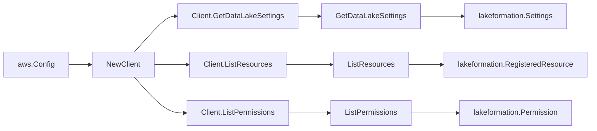

# AWS Lake Formation SDK Adapter

## Purpose

`internal/collector/awscloud/services/lakeformation/awssdk` adapts AWS SDK for
Go v2 Lake Formation responses to the scanner-owned `Client` contract. It owns
the data-lake settings point read, registered-resource pagination, permission
pagination, throttle classification, and per-call AWS API telemetry.

## Ownership boundary

This package owns SDK calls for Lake Formation. It does not own workflow claims,
credential acquisition, Lake Formation fact selection, graph writes, reducer
admission, or query behavior.

## Exported surface

See `doc.go` for the godoc contract.

- `Client` - AWS SDK-backed implementation of `lakeformation.Client`.
- `NewClient` - builds a `Client` for one claimed AWS boundary.

## Dependencies

- `internal/collector/awscloud` for account, region, and service boundary
  labels.
- `internal/collector/awscloud/services/lakeformation` for scanner-owned result
  types.
- `internal/telemetry` for AWS API call and throttle instruments.
- AWS SDK for Go v2 `lakeformation` and Smithy error contracts.

## Telemetry

Lake Formation paginator pages and point reads are wrapped with:

- `aws.service.pagination.page`
- `eshu_dp_aws_api_calls_total`
- `eshu_dp_aws_throttle_total`

Metric labels stay bounded to service, account, region, operation, and result.
Lake Formation ARNs, principal identifiers, and raw AWS error payloads stay out
of metric labels.

## Gotchas / invariants

- The adapter calls only `GetDataLakeSettings`, `ListResources`, and
  `ListPermissions`. The internal `apiClient` interface lists exactly those
  three methods; a reflection guard test in `client_test.go` fails if a
  mutation or credential-vending method ever appears.
- The adapter drops every permission condition (LF-Tag) expression, LF-Tag
  value, and `AdditionalDetails` RAM-share payload. Only the principal
  identifier, the governed resource reference, and the bounded privilege enum
  names survive.
- Permission privilege enum names are sorted lexicographically so the
  `privileges` fact payload stays byte-identical across rescans of identical
  Lake Formation state.
- The adapter must not call `GrantPermissions`, `RevokePermissions`,
  `BatchGrantPermissions`, `BatchRevokePermissions`, `RegisterResource`,
  `DeregisterResource`, `UpdateResource`, `PutDataLakeSettings`, any LF-Tag or
  data-cells-filter mutation, or any credential-vending / governed-data read
  (`GetTemporaryGlueTableCredentials`, `GetTemporaryGluePartitionCredentials`,
  `GetTemporaryDataLocationCredentials`, `GetTableObjects`, `GetWorkUnits`,
  `GetWorkUnitResults`, `StartQueryPlanning`).
- SDK adapters translate AWS records into scanner-owned types; scanner tests
  should not mock AWS SDK pagination.

## Related docs

- `docs/public/services/collector-aws-cloud-scanners.md`
- `docs/public/services/collector-aws-cloud-security.md`
