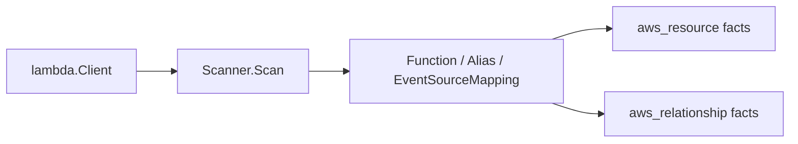

# AWS Lambda Scanner

## Purpose

`internal/collector/awscloud/services/lambda` owns scanner-side Lambda fact
selection for the AWS cloud collector. It converts functions, aliases, event
source mappings, image references, VPC placement, and execution-role evidence
into `aws_resource` and `aws_relationship` facts.

The package implements the Lambda slice from
`docs/public/services/collector-aws-cloud.md`.

## Ownership boundary

This package owns scanner-owned Lambda models and fact-envelope construction.
It does not own AWS SDK calls, credentials, throttling, workflow claims, graph
writes, reducer admission, or query behavior.

## Exported surface

See `doc.go` for the godoc contract.

- `Scanner` - emits Lambda facts for one claimed AWS boundary.
- `Client` - scanner-owned read surface implemented by `awssdk.Client`.
- `Function`, `Alias`, and `EventSourceMapping` - scanner-owned Lambda records.
- `VPCConfig` and `LoggingConfig` - non-secret Lambda configuration blocks used
  as fact attributes.

## Dependencies

- `internal/collector/awscloud` for AWS boundaries and fact envelopes.
- `internal/facts` for durable fact envelopes.
- `internal/redact` for keyed HMAC-SHA256 markers for function environment
  values before persistence.

## Telemetry

This package emits no metrics or spans directly. The `awssdk` adapter emits AWS
API call counters, throttle counters, and pagination spans.

## Gotchas / invariants

- Function environment values are always replaced with keyed HMAC-SHA256
  markers before fact emission.
- The AWS Lambda GetFunction API returns presigned package download URLs. Those URLs must not be
  persisted; only image URI, resolved image URI, and KMS metadata are safe
  scanner evidence.
- Lambda aliases and event-source mappings remain reported AWS evidence. They
  do not prove deployable-unit, workload, or ownership truth until reducer
  correlation admits them.
- VPC subnet and security group relationships are join evidence for EC2
  topology. The collector does not infer network exposure or environment.
- Resource names, ARNs, tags, event-source ARNs, and environment variable names
  must not become metric labels.
- Downstream (issue #5450): `resolved_image_uri` (an exact
  `registry/repository@digest` reference, unlike `image_uri`'s tag-qualified
  form) is the strongest deployed-code signal this package emits for a
  container-image function. The reducer surfaces it two ways: as the
  `CloudResource` node's `running_image_digest` property
  (`go/internal/reducer/aws_resource_running_image.go`), and — since a Lambda
  function is single-image by AWS's own model, so there is no
  multi-container-style ambiguity — as the real target of a two-MATCH-MERGE
  `(:CloudResource)-[:AWS_lambda_function_uses_image]->(:ContainerImage)` graph
  edge (`go/internal/reducer/aws_cloud_image_join.go`'s
  `containerImageNodeUIDFromDigestRef`, matched byte-for-byte against the OCI
  registry collector's own node-uid formula for that same digest).

## Related docs

- `docs/public/services/collector-aws-cloud.md`
- `docs/public/reference/telemetry/index.md`
