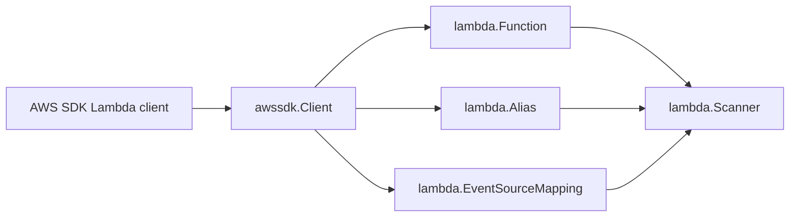

# AWS Lambda SDK Adapter

## Purpose

`internal/collector/awscloud/services/lambda/awssdk` adapts AWS SDK for Go v2
Lambda responses into scanner-owned records. It handles pagination, `GetFunction`
enrichment, telemetry, and response normalization for one claimed account and
region.

## Ownership boundary

This package owns AWS Lambda API calls and SDK-to-scanner mapping. The parent
`lambda` package owns fact-envelope construction and redaction. Credential
loading, workflow claims, graph writes, reducer admission, and query behavior
live outside this package.

## Exported surface

See `doc.go` for the godoc contract.

- `Client` - implements `lambda.Client`.
- `NewClient` - builds a Lambda SDK adapter for one claimed AWS boundary.

## Dependencies

- AWS SDK for Go v2 Lambda client and Lambda types.
- `internal/collector/awscloud` for the claimed boundary.
- `internal/collector/awscloud/services/lambda` for scanner-owned records.
- `internal/telemetry` for AWS API call counters, throttle counters, and
  pagination spans.

## Telemetry

`recordAPICall` emits:

- `aws.service.pagination.page` spans with service, account, region, and
  operation attributes.
- `eshu_dp_aws_api_calls_total` with service, account, region, operation, and
  result labels.
- `eshu_dp_aws_throttle_total` for Lambda throttling errors.

## Gotchas / invariants

- `ListFunctions` does not return all fields needed by Eshu. The adapter calls
  `GetFunction` per listed function to collect tags and image URI evidence.
- `GetFunction.Code.Location` is a presigned package download URL and must not
  cross the adapter boundary.
- Lambda tag retrieval depends on `lambda:ListTags`; absent tags may reflect
  permissions rather than no tags.
- Environment values are mapped into scanner-owned records only so the parent
  scanner can redact them before persistence.

## Related docs

- `docs/docs/adrs/2026-04-20-aws-cloud-scanner-collector.md`
- `docs/docs/reference/telemetry/index.md`
