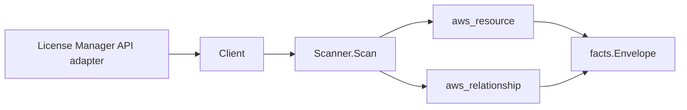

# AWS License Manager Scanner

## Purpose

`internal/collector/awscloud/services/licensemanager` owns the AWS License
Manager scanner contract for the AWS cloud collector. It converts License
Manager license-configuration metadata into `aws_resource` facts and emits
relationship evidence for the configuration-to-EC2-instance association.

## Ownership boundary

This package owns scanner-level License Manager fact selection and identity
mapping. It does not own AWS SDK pagination, STS credentials, workflow claims,
fact persistence, graph writes, reducer admission, or query behavior.

## Exported surface

See `doc.go` for the godoc contract.

- `Client` - minimal License Manager metadata read surface consumed by
  `Scanner`.
- `Scanner` - emits license-configuration resources plus their EC2 instance
  association relationships for one boundary.
- `Snapshot`, `Configuration`, `Association` - scanner-owned views with no
  entitlement token, checkout record, or license usage measurement field.

## Dependencies

- `internal/collector/awscloud` for boundaries, resource constants,
  relationship constants, and envelope builders.
- `internal/facts` for emitted fact envelope kinds.

The package depends on a small `Client` interface rather than the AWS SDK for
Go v2 so tests can use fake clients and the runtime adapter can own SDK
behavior.

## Telemetry

This scanner emits no spans or logs directly. `awsruntime.ClaimedSource`
records scan duration and emitted resource counts after `Scanner.Scan` returns.
The `awssdk` adapter records License Manager API call counts, throttles, and
pagination spans.

## Gotchas / invariants

- License Manager facts are metadata only. The scanner must never grant, check
  out, or mutate a license, never read a license entitlement token, and never
  read license usage records. Only the configuration shape (counting type,
  configured/consumed counts, hard-limit flag, status, association count and
  resource-type set) is recorded.
- The configuration node publishes its resource_id as the configuration ARN
  (falling back to the configuration id, then the name). The
  configuration-applies-to-instance edge is sourced on that same value so it
  joins the configuration node.
- The configuration-applies-to-instance edge is emitted only for an
  `EC2_INSTANCE` association whose `ResourceArn` yields a bare instance id
  (`i-...`). The edge targets the EC2 instance by that bare id, the convention
  every other scanner uses for an EC2 instance target (a forward reference in
  `relguard.KnownTargetTypeAllowlist` until a dedicated EC2 instance scanner
  exists). The bare id is read from the association ARN; no ARN is synthesized.
- `EC2_HOST`, `EC2_AMI`, `RDS`, and `SYSTEMS_MANAGER_MANAGED_INSTANCE`
  associations have no resolvable target node today, so no edge is emitted for
  them; they are still recorded on the configuration node as the
  `association_count` and `associated_resource_types` metadata. Adding an edge
  for them later requires a resolvable target resource type, not a dangling
  guess.
- Emit reported evidence only. Do not infer deployment, workload, repository
  ownership, environment, or deployable-unit truth from configuration names or
  AWS tags.

## Evidence

No-Regression Evidence: metadata-only control-plane scanner; new read path, no change to existing hot paths. `go test ./internal/collector/awscloud/services/licensemanager/...` green.

No-Observability-Change: reuses shared AWS pagination span + API-call/throttle counters; no telemetry contract change.

Collector Performance Evidence:
`go test ./internal/collector/awscloud/services/licensemanager/...` covers the
bounded License Manager metadata path: one paginated ListLicenseConfigurations
stream, one paginated ListAssociationsForLicenseConfiguration stream per
configuration, one ListTagsForResource point read per configuration, no
entitlement reads, no checkouts, no mutations, and no graph writes in the
collector.

## Related docs

- `docs/public/services/collector-aws-cloud.md`
- `docs/public/services/collector-aws-cloud-scanners.md`
- `docs/public/services/collector-aws-cloud-security.md`
