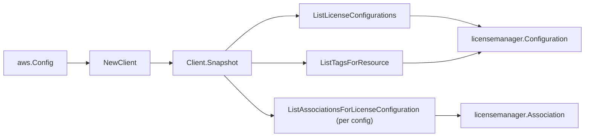

# AWS License Manager SDK Adapter

## Purpose

`internal/collector/awscloud/services/licensemanager/awssdk` adapts AWS SDK for
Go v2 License Manager responses to the scanner-owned `Client` contract. It owns
license-configuration pagination, per-configuration association pagination,
resource-tag reads, throttle classification, and per-call AWS API telemetry.

## Ownership boundary

This package owns SDK calls for License Manager. It does not own workflow
claims, credential acquisition, License Manager fact selection, graph writes,
reducer admission, or query behavior.

## Exported surface

See `doc.go` for the godoc contract.

- `Client` - AWS SDK-backed implementation of `licensemanager.Client`.
- `NewClient` - builds a `Client` for one claimed AWS boundary.

## Dependencies

- `internal/collector/awscloud` for account, region, and service boundary
  labels.
- `internal/collector/awscloud/services/licensemanager` for scanner-owned result
  types.
- `internal/telemetry` for AWS API call and throttle instruments.
- AWS SDK for Go v2 `licensemanager` and Smithy error contracts.

## Telemetry

License Manager paginator pages and point reads are wrapped with:

- `aws.service.pagination.page`
- `eshu_dp_aws_api_calls_total`
- `eshu_dp_aws_throttle_total`

Metric labels stay bounded to service, account, region, operation, and result.
License Manager ARNs, names, counts, tags, and raw AWS error payloads stay out
of metric labels.

## Gotchas / invariants

- The adapter reads metadata only. It must never call `GetLicense`,
  `CheckoutLicense`, `CheckInLicense`, `CheckoutBorrowLicense`, `GetAccessToken`,
  `CreateGrant`, `CreateLicenseConfiguration`, `UpdateLicenseConfiguration`,
  `DeleteLicenseConfiguration`, `UpdateLicenseSpecificationsForResource`, or any
  other mutation API.
- `LicenseExpiry` is reported as an integer Unix-seconds timestamp, not an SDK
  `*time.Time`; `unixSeconds` converts it to a UTC time and a zero/absent expiry
  is omitted.
- A nil `LicenseCount` means AWS did not report a managed license count; the
  adapter records `LicenseCountConfigured=false` so the scanner can distinguish
  an unset count from a real zero without inventing an entitlement value.
- `ListAssociationsForLicenseConfiguration` requires the configuration ARN, so
  it is called once per configuration after the configuration list completes.
- `ListTagsForResource` is a metadata read; License Manager tags carry no
  entitlement content.
- SDK adapters translate AWS responses into scanner-owned types; scanner tests
  should not mock AWS SDK pagination.

## Related docs

- `docs/public/services/collector-aws-cloud-scanners.md`
- `docs/public/services/collector-aws-cloud-security.md`
