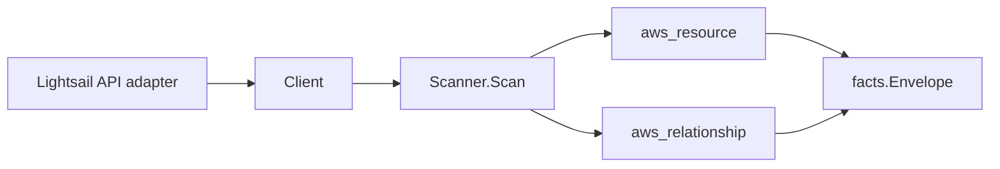

# Amazon Lightsail Scanner

## Purpose

`internal/collector/awscloud/services/lightsail` owns the Lightsail scanner
contract for the AWS cloud collector. It converts Lightsail instance, managed
relational database, load balancer, block-storage disk, and static IP metadata
into `aws_resource` facts and emits the Lightsail-internal relationship evidence
for load-balancer-to-instance, instance-to-disk, and instance-to-static-IP
attachments.

## Ownership boundary

This package owns scanner-level Lightsail fact selection and identity mapping.
It does not own AWS SDK pagination, STS credentials, workflow claims, fact
persistence, graph writes, reducer admission, or query behavior.

## Exported surface

See `doc.go` for the godoc contract.

- `Client` - minimal Lightsail metadata read surface consumed by `Scanner`.
- `Scanner` - emits instance, database, load balancer, disk, and static IP
  resources plus their Lightsail-internal relationships for one boundary.
- `Instance`, `Database`, `LoadBalancer`, `Disk`, `StaticIP` - scanner-owned
  views with secret-bearing fields intentionally omitted.

## Dependencies

- `internal/collector/awscloud` for boundaries, resource constants,
  relationship constants, and envelope builders.
- `internal/facts` for emitted fact envelope kinds.

The package depends on a small `Client` interface rather than the AWS SDK for
Go v2 so tests can use fake clients and runtime adapters can own SDK behavior.

## Identity and graph-join keying

Lightsail edges are almost entirely internal, so a single consistent key is
critical. Every node resource_id is the **bare Lightsail resource name**, and
every relationship join key is also a bare name:

- The load-balancer-to-instance edge keys its source on the bare load balancer
  name and its target on the bare instance name AWS reports in the load
  balancer's instance-health summary (`InstanceHealthSummary[].InstanceName`).
- The instance-to-disk edge keys its source on the bare instance name AWS
  reports in `Disk.AttachedTo` and its target on the bare disk name.
- The instance-to-static-IP edge keys its source on the bare instance name AWS
  reports in `StaticIp.AttachedTo` and its target on the bare static IP name.

Because the source of every internal edge equals the source node's resource_id
and the target equals the target node's resource_id, the edges join the nodes
this scanner publishes instead of dangling. Resource ARNs come from the
Lightsail API and are carried on the resource fact plus as a correlation anchor;
the scanner never synthesizes an ARN and never hardcodes a partition.

## Telemetry

This scanner emits no spans or logs directly. `awsruntime.ClaimedSource`
records scan duration and emitted resource counts after `Scanner.Scan` returns.
The `awssdk` adapter records Lightsail API call counts, throttles, and
pagination spans.

## Gotchas / invariants

- Lightsail facts are metadata only. The scanner must not create, delete,
  reboot, start, stop, or snapshot a Lightsail resource, must not attach or
  detach disks or static IPs, and must not read instance access details,
  default key-pair private keys, or database master passwords.
- Node resource_ids and edge join keys are bare Lightsail names. Never key a
  node or an edge on a list index or API ordering.
- Resource ARNs are used as reported by the Lightsail API. The scanner never
  fabricates an ARN and never hardcodes `arn:aws:`; partitions therefore stay
  correct in GovCloud and China.
- Load-balancer-to-instance edges are emitted once per distinct attached
  instance name. Duplicate instance names within one load balancer collapse to
  one edge.
- Instance-to-disk and instance-to-static-IP edges are emitted only when AWS
  reports a non-empty attachment target.
- Tags are raw AWS tag evidence; do not infer environment, owner, workload, or
  deployable-unit truth in this package.

## Evidence

Collector Performance Evidence:
`go test ./internal/collector/awscloud/services/lightsail/...` covers the
bounded Lightsail metadata path: one paginated GetInstances stream, one
paginated GetRelationalDatabases stream, one paginated GetLoadBalancers stream,
one paginated GetDisks stream, and one paginated GetStaticIps stream, with no
Create/Delete/Reboot/Start/Stop/Snapshot/Attach/Detach calls, no access-key or
master-password reads, no mutations, and no graph writes in the collector.

No-Regression Evidence:
`go test ./internal/collector/awscloud/services/lightsail/... ./internal/collector/awscloud/internal/relguard/... ./cmd/collector-aws-cloud/... -count=1`
covers Lightsail instance, database, load balancer, disk, and static IP
metadata fact emission; load-balancer-to-instance, instance-to-disk, and
instance-to-static-IP relationship emission with target_type and
target_resource_id assertions; source/target keys matching the published node
resource_ids; the metadata-only exclusion reflection gate on the SDK adapter;
SDK pagination and mapping; runtime registration; and the derived
supported-service guard. This is a new metadata-only scanner with no change to
any existing scanner, so existing-path output is byte-for-byte unchanged.

No-Observability-Change: the Lightsail scanner reuses the existing AWS
collector telemetry contract. It adds no instrument, no span name, no metric
label, and no `aws_scan_status` shape. Scans are diagnosed through the existing
`aws.service.scan`, `aws.service.pagination.page`, `eshu_dp_aws_api_calls_total`,
`eshu_dp_aws_throttle_total`, `eshu_dp_aws_resources_emitted_total`,
`eshu_dp_aws_relationships_emitted_total`, and `aws_scan_status` surfaces, with
metric labels bounded to service, account, region, operation, result, and
status.

Collector Deployment Evidence: Lightsail runs inside the existing hosted
`collector-aws-cloud` runtime, so `/healthz`, `/readyz`, `/metrics`, and
`/admin/status` stay covered by the command wiring and Helm collector runtime.

## Related docs

- `docs/public/services/collector-aws-cloud.md`
- `docs/public/services/collector-aws-cloud-scanners.md`
- `docs/public/services/collector-aws-cloud-security.md`
