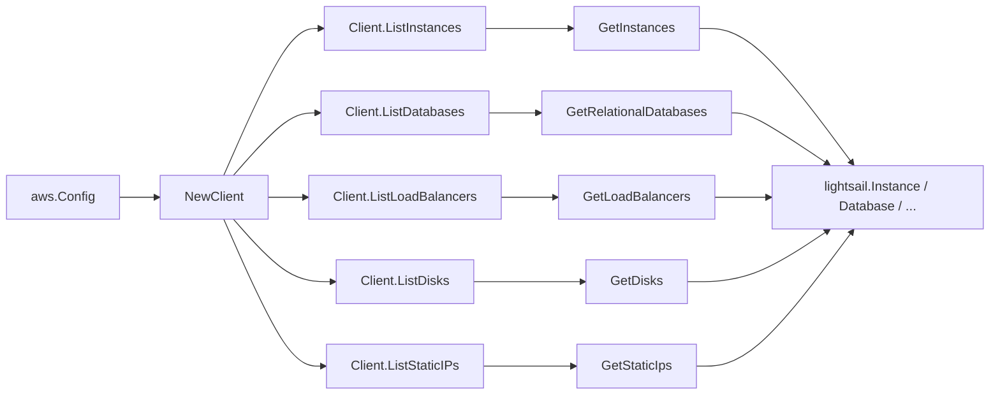

# Amazon Lightsail SDK Adapter

## Purpose

`internal/collector/awscloud/services/lightsail/awssdk` adapts AWS SDK for Go v2
Lightsail responses to the scanner-owned `Client` contract. It owns instance,
relational database, load balancer, disk, and static IP pagination, throttle
classification, and per-call AWS API telemetry.

## Ownership boundary

This package owns SDK calls for Lightsail. It does not own workflow claims,
credential acquisition, Lightsail fact selection, graph writes, reducer
admission, or query behavior.

## Exported surface

See `doc.go` for the godoc contract.

- `Client` - AWS SDK-backed implementation of `lightsail.Client`.
- `NewClient` - builds a `Client` for one claimed AWS boundary.

## Dependencies

- `internal/collector/awscloud` for account, region, and service boundary
  labels.
- `internal/collector/awscloud/services/lightsail` for scanner-owned result
  types.
- `internal/telemetry` for AWS API call and throttle instruments.
- AWS SDK for Go v2 `lightsail` and Smithy error contracts.

## Telemetry

Lightsail paginator pages are wrapped with:

- `aws.service.pagination.page`
- `eshu_dp_aws_api_calls_total`
- `eshu_dp_aws_throttle_total`

Metric labels stay bounded to service, account, region, operation, and result.
Lightsail resource ARNs, names, IP addresses, tags, and raw AWS error payloads
stay out of metric labels.

## Gotchas / invariants

- The adapter calls only `GetInstances`, `GetRelationalDatabases`,
  `GetLoadBalancers`, `GetDisks`, and `GetStaticIps`. The metadata-only
  contract is enforced by a reflective guard test on the adapter-local
  `apiClient` interface (`exclusion_test.go`), which fails the build if any
  mutation, lifecycle, attach/detach, or secret-read method becomes reachable.
- The adapter must not call any `Create*`, `Delete*`, `Reboot*`, `Start*`,
  `Stop*`, `*Snapshot`, `Attach*`, or `Detach*` API.
- The adapter must not call `GetInstanceAccessDetails`,
  `DownloadDefaultKeyPair`, `GetRelationalDatabaseMasterUserPassword`, or any
  other access-secret or credential reader.
- Database master passwords and certificate bodies are never propagated. Only
  the host endpoint address and port survive from the database endpoint.
- The adapter forwards Lightsail resource ARNs exactly as AWS reports them and
  never synthesizes an ARN.
- SDK adapters translate AWS records into scanner-owned types; scanner tests
  should not mock AWS SDK pagination.

## Related docs

- `docs/public/services/collector-aws-cloud-scanners.md`
- `docs/public/services/collector-aws-cloud-security.md`
