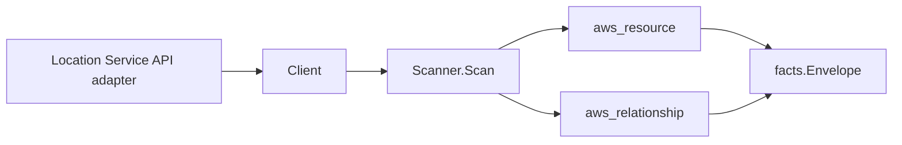

# Amazon Location Service Scanner

## Purpose

`internal/collector/awscloud/services/location` owns the Amazon Location Service
scanner contract for the AWS cloud collector. It converts map, place index,
tracker, geofence collection, and route calculator control-plane metadata into
`aws_resource` facts and emits relationship evidence for tracker and geofence
collection KMS encryption keys and tracker-consumes-geofence-collection consumer
associations.

## Ownership boundary

This package owns scanner-level Location Service fact selection and identity
mapping. It does not own AWS SDK pagination, STS credentials, workflow claims,
fact persistence, graph writes, reducer admission, or query behavior.

## Exported surface

See `doc.go` for the godoc contract.

- `Client` - minimal Location Service metadata read surface consumed by
  `Scanner`.
- `Scanner` - emits map, place index, tracker, geofence collection, and route
  calculator resources plus their relationships for one boundary.
- `Snapshot`, `Map`, `PlaceIndex`, `Tracker`, `GeofenceCollection`,
  `RouteCalculator` - scanner-owned views with device-position, geofence
  geometry, place-result, and route-calculation fields intentionally absent.

## Dependencies

- `internal/collector/awscloud` for boundaries, resource constants,
  relationship constants, partition helpers, and envelope builders.
- `internal/facts` for emitted fact envelope kinds.

The package depends on a small `Client` interface rather than the AWS SDK for
Go v2 so tests can use fake clients and the runtime adapter can own SDK
behavior.

## Telemetry

This scanner emits no spans or logs directly. `awsruntime.ClaimedSource`
records scan duration and emitted resource counts after `Scanner.Scan` returns.
The `awssdk` adapter records Location Service API call counts, throttles, and
pagination spans.

## Gotchas / invariants

- Location Service facts are metadata only. The scanner must never read device
  positions, position history, geofence geometries, place-search results, route
  calculations, or map tiles, and must never call any mutation API.
- Every node publishes its resource_id as the API-reported ARN (falling back to
  the resource name). `DescribeMap`/`DescribePlaceIndex`/`DescribeTracker`/
  `DescribeGeofenceCollection`/`DescribeRouteCalculator` provide the ARN; the
  `List*` entries report names only, so the adapter describes each resource to
  obtain the join-key ARN.
- A tracker's own edges (tracker-to-KMS-key, tracker-consumes-geofence-
  collection) are sourced on the tracker ARN, the resource_id the tracker node
  publishes.
- The KMS edges are emitted only when AWS reports a key identifier. AWS may
  report a key id, key ARN, or alias; `target_arn` is set only for ARN-shaped
  identifiers, matching the KMS scanner's published key resource_id (bare id or
  ARN) and its key-ARN correlation anchor.
- The tracker-consumes-geofence-collection edge is emitted only when
  `ListTrackerConsumers` reports a consumer ARN. That ARN is the geofence
  collection ARN, which the geofence-collection node also publishes as its
  resource_id, so the edge joins the node this scanner emits instead of
  dangling.
- Emit reported evidence only. Do not infer deployment, workload, repository
  ownership, environment, or deployable-unit truth from resource names or AWS
  tags.

## Evidence

Collector Performance Evidence:
`go test ./internal/collector/awscloud/services/location/...` covers the bounded
Location Service metadata path: one paginated `List*` stream per resource family
plus one `Describe*` point read per resource (and one paginated
`ListTrackerConsumers` stream per tracker), no device-position reads, no
geofence reads, no place searches, no route calculations, and no graph writes in
the collector.

No-Regression Evidence: metadata-only control-plane scanner; new read path, no change to existing hot paths. `go test ./internal/collector/awscloud/services/location/...` green.

No-Observability-Change: reuses shared AWS pagination span + API-call/throttle counters; no telemetry contract change.

Collector Deployment Evidence: Location Service runs inside the existing hosted
`collector-aws-cloud` runtime, so `/healthz`, `/readyz`, `/metrics`, and
`/admin/status` stay covered by the command wiring and Helm collector runtime.

## Related docs

- `docs/public/services/collector-aws-cloud.md`
- `docs/public/services/collector-aws-cloud-scanners.md`
- `docs/public/services/collector-aws-cloud-security.md`
