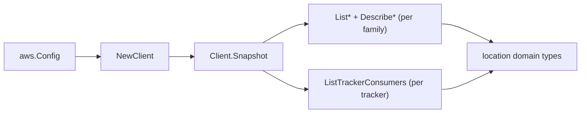

# Amazon Location Service SDK Adapter

## Purpose

`internal/collector/awscloud/services/location/awssdk` adapts AWS SDK for Go v2
Location Service responses to the scanner-owned `Client` contract. It owns
per-family list pagination, per-resource describe reads, per-tracker consumer
pagination, throttle classification, and per-call AWS API telemetry.

## Ownership boundary

This package owns SDK calls for Location Service. It does not own workflow
claims, credential acquisition, Location Service fact selection, graph writes,
reducer admission, or query behavior.

## Exported surface

See `doc.go` for the godoc contract.

- `Client` - AWS SDK-backed implementation of `location.Client`.
- `NewClient` - builds a `Client` for one claimed AWS boundary.

## Dependencies

- `internal/collector/awscloud` for account, region, and service boundary
  labels.
- `internal/collector/awscloud/services/location` for scanner-owned result
  types.
- `internal/telemetry` for AWS API call and throttle instruments.
- AWS SDK for Go v2 `location` and Smithy error contracts.

## Telemetry

Location Service paginator pages and point reads are wrapped with:

- `aws.service.pagination.page`
- `eshu_dp_aws_api_calls_total`
- `eshu_dp_aws_throttle_total`

Metric labels stay bounded to service, account, region, operation, and result.
Location Service resource ARNs, names, tags, and raw AWS error payloads stay out
of metric labels.

## Gotchas / invariants

- The `List*` entries report names only, so the adapter calls the matching
  `Describe*` to obtain the ARN (the join key), the KMS key reference, and the
  remaining metadata. The Describe reads return tags inline, so no separate
  `ListTagsForResource` call is made.
- The adapter reads metadata only. It must never call `ListDevicePositions`,
  `GetDevicePosition*`, `BatchGetDevicePosition`, `VerifyDevicePosition`,
  `ListGeofences`, `GetGeofence`, `SearchPlaceIndexFor*`, `GetPlace`,
  `CalculateRoute*`, `ForecastGeofenceEvents`, `GetMapTile`, `GetMapGlyphs`,
  `GetMapSprites`, `GetMapStyleDescriptor`, `ListKeys`/`DescribeKey`, any
  job-control API, or any mutation API.
- `ListTrackerConsumers` returns geofence collection ARNs only; the adapter
  never reads the geofences in those collections.
- SDK adapters translate AWS records into scanner-owned types; scanner tests
  should not mock AWS SDK pagination.

## Related docs

- `docs/public/services/collector-aws-cloud-scanners.md`
- `docs/public/services/collector-aws-cloud-security.md`
