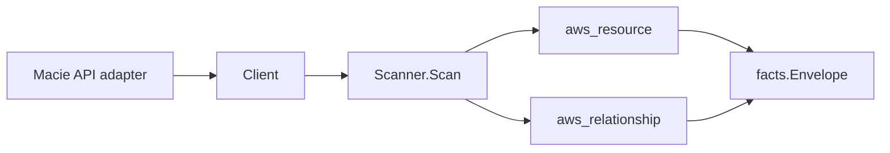

# AWS Macie Scanner

## Purpose

`internal/collector/awscloud/services/macie` owns the Amazon Macie scanner
contract for the AWS cloud collector. It converts the Macie account session
status, member accounts, classification-job metadata, allow-list identities,
custom data identifier identities, findings filter identities, and aggregate
finding counts by severity into reported AWS facts and relationship evidence.

Macie's product is detecting personally identifiable information, so it is the
highest-redaction scanner in the collector. The package deliberately carries
identity and counts only.

## Ownership boundary

This package owns scanner-level Macie fact selection and identity mapping. It
does not own AWS SDK pagination, credential acquisition, workflow claims, fact
persistence, graph writes, reducer admission, or query behavior.

## Exported surface

See `doc.go` for the godoc contract.

- `Client` - minimal, highest-redaction Macie metadata read surface consumed by
  `Scanner`. It exposes no sensitive-data finding read, no regex-body read, no
  allow-list content read, no findings filter criteria read, and no mutation.
- `Scanner` - emits the session, member-account, classification-job, allow-list,
  custom data identifier, and findings filter resources plus the
  member-to-administrator relationship for one boundary.
- `Session` - account session status and coarse configuration metadata.
- `MemberAccount` - metadata-only member summary; no email field exists.
- `ClassificationJob` - identity, type, status, and bucket/account counts. No
  field can hold the bucket list or the bucket-criteria expressions.
- `AllowList`, `CustomDataIdentifier`, `FindingsFilter` - identity-only summaries.
  No field can hold list contents, regex bodies, or filter criteria.

## Dependencies

- `internal/collector/awscloud` for boundaries, resource constants,
  relationship constants, and envelope builders.
- `internal/facts` for emitted fact envelope kinds.

The package depends on a small `Client` interface rather than the AWS SDK for Go
v2 so tests can use fake clients and runtime adapters can own SDK behavior.

## Telemetry

This scanner emits no spans or logs directly. `awsruntime.ClaimedSource`
records scan duration and emitted resource counts after `Scanner.Scan` returns.
The `awssdk` adapter records Macie API call counts, throttles, and pagination
spans. The required resource signal is
`eshu_dp_aws_resources_emitted_total{service="macie2"}` with the existing
bounded AWS collector labels.

## Gotchas / invariants

- Macie facts are metadata only. The scanner must never read or persist
  sensitive-data findings: those are the PII Macie detected.
- Custom data identifier regular-expression bodies are never persisted. The
  regex IS a description of the sensitive data the customer is detecting.
- Allow-list contents and findings filter criteria are never persisted. The
  scanner-owned types have no field able to hold them.
- Classification jobs carry a bucket-criteria summary as an aggregate
  `target_bucket_count`, an aggregate `target_account_count`, and a
  `uses_bucket_criteria` boolean. The explicit bucket list and the
  property/tag bucket-criteria expressions are never persisted.
- Member-account facts come from the delegated-administrator view and omit the
  member email address (personal contact data). A standalone account emits no
  member relationships.
- Aggregate finding counts are grouped by severity label only
  (`GroupBy=severity.description`); no finding type, identifier, bucket name, or
  body is read. The counts live as a `finding_counts_by_severity` attribute on
  the session resource.
- A disabled Macie account emits a single disabled session resource and makes no
  further reads. A genuine authorization failure is surfaced, never reported as
  a clean disabled account.
- Tags are raw AWS tag evidence. Do not infer environment, owner, workload,
  repository, or deployable-unit truth from tags in this package.

## Evidence

Collector Performance Evidence: `go test ./internal/collector/awscloud/services/macie/...`
covers the bounded Macie metadata path: one session read, one administrator
read, one aggregate finding-statistics read, and paginated member, job,
allow-list, custom-data-identifier, and findings-filter list reads. Handler cost
scales with configuration cardinality (jobs, lists, identifiers, filters,
members), not with finding volume, because the scanner issues no per-finding
read. A disabled account stops after the session read.

No-Regression Evidence: `go test ./cmd/collector-aws-cloud ./internal/collector/awscloud/...`
covers Macie resource and relationship fact emission, omission of regex bodies,
allow-list contents, finding criteria, bucket lists, and member email,
standalone-account member suppression, disabled-account early return, runtime
registration, command configuration, and the SDK adapter's safe metadata
mapping plus the reflection exclusion gate.

Collector Observability Evidence: Macie uses the existing AWS collector
`aws.service.pagination.page` span plus `eshu_dp_aws_api_calls_total`,
`eshu_dp_aws_throttle_total`, `eshu_dp_aws_resources_emitted_total`,
`eshu_dp_aws_relationships_emitted_total`, and `aws_scan_status` rows. Metric
labels stay bounded to service, account, region, operation, result, resource
type, and status.

No-Observability-Change: the existing AWS collector telemetry contract already
diagnoses Macie scans through `aws.service.scan`,
`aws.service.pagination.page`, API/throttle counters, resource/relationship
counters, and `aws_scan_status`.

Collector Deployment Evidence: Macie runs inside the existing hosted
`collector-aws-cloud` runtime, so `/healthz`, `/readyz`, `/metrics`, and
`/admin/status` stay covered by the command wiring and Helm collector runtime.

## Related docs

- `docs/public/services/collector-aws-cloud.md`
- `docs/public/services/collector-aws-cloud-scanners.md`
- `docs/public/guides/collector-authoring.md`
