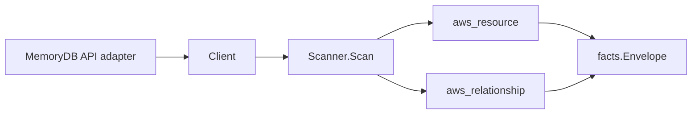

# AWS MemoryDB Scanner

## Purpose

`internal/collector/awscloud/services/memorydb` owns the MemoryDB scanner
contract for the AWS cloud collector. It converts cluster, subnet group,
parameter group, user, ACL, and snapshot metadata into `aws_resource` facts and
emits relationship evidence for cluster-to-subnet-group, cluster-to-KMS,
cluster-to-SNS-topic, and ACL-to-user edges. MemoryDB is the managed
Redis-compatible store, so the package mirrors the ElastiCache scanner shape.

## Ownership boundary

This package owns scanner-level MemoryDB fact selection and identity mapping. It
does not own AWS SDK pagination, STS credentials, workflow claims, fact
persistence, graph writes, reducer admission, or query behavior.

## Exported surface

See `doc.go` for the godoc contract.

- `Client` - minimal MemoryDB metadata read surface consumed by `Scanner`.
- `Scanner` - emits cluster, subnet group, parameter group, user, ACL, and
  snapshot facts for one boundary.
- `Cluster`, `SubnetGroup`, `ParameterGroup`, `User`, `ACL`, `SnapshotMetadata`
  - scanner-owned metadata-only views with AUTH token values, user passwords,
  the raw user access string, and snapshot payload data intentionally omitted.

## Dependencies

- `internal/collector/awscloud` for boundaries, resource constants,
  relationship constants, and envelope builders.
- `internal/facts` for emitted fact envelope kinds.

The package depends on a small `Client` interface rather than the AWS SDK for
Go v2 so tests can use fake clients and runtime adapters can own SDK behavior.

## Telemetry

This scanner emits no spans or logs directly. `awsruntime.ClaimedSource`
records scan duration and emitted resource counts after `Scanner.Scan` returns;
`eshu_dp_aws_resources_emitted_total{service="memorydb"}` covers each new
resource type. The `awssdk` adapter records MemoryDB API call counts,
throttles, and pagination spans.

## Gotchas / invariants

- MemoryDB facts are metadata only. The scanner must not call CreateCluster,
  DeleteCluster, UpdateCluster, CreateUser, DeleteUser, UpdateUser, CreateACL,
  DeleteACL, UpdateACL, or any mutation/data API.
- AUTH token values, user passwords, the raw user access string, cache keys,
  cache values, and snapshot data are never persisted in facts or logs.
  `tls_enabled` is a boolean signal; the keys and tokens stay in AWS.
- MemoryDB's `User` resource exposes an `AccessString` grant string in the AWS
  SDK shape. The SDK adapter drops it before scanner code sees it and records
  only the non-secret `access_string_present` summary. Do not re-introduce the
  raw access string into `User` or its attributes.
- ACL facts carry identity, status, member user names, and associated cluster
  names only. The grant strings that bind those users to permissions live with
  the per-user access string, which is never persisted.
- Snapshot metadata is restricted to name, source cluster, source, and status.
  Cluster configuration, shard sizes, engine version, KMS keys, and any backup
  payload detail stay outside `SnapshotMetadata`.
- Cluster KMS, SNS topic, and subnet-group evidence comes directly from the
  cluster response. Relations are emitted only when AWS reports the target
  identity; the subnet-group edge upgrades to the subnet group ARN when the
  scan observed that group by name.
- Per-shard replica count is derived from the shard node counts reported by
  `DescribeClusters` with shard detail; MemoryDB does not expose a replica
  count field directly.
- Tags are raw AWS tag evidence. Do not infer environment, owner, workload, or
  deployable-unit truth from tags in this package.

## Evidence

Collector Performance Evidence:
`go test ./internal/collector/awscloud/services/memorydb/...` covers the bounded
MemoryDB metadata path: one paginated DescribeClusters stream (with shard detail
for replica derivation), one paginated DescribeSubnetGroups stream, one
paginated DescribeParameterGroups stream, one paginated DescribeUsers stream,
one paginated DescribeACLs stream, one paginated DescribeSnapshots stream, one
ListTags read per ARN-shaped resource, no mutation calls, and no graph writes in
the collector.

No-Regression Evidence:
`go test ./cmd/collector-aws-cloud ./internal/collector/awscloud/...` covers
MemoryDB resource fact emission for all six resource types, relationship
emission for cluster-to-subnet-group, cluster-to-KMS, cluster-to-SNS-topic, and
ACL-to-user edges, redaction of the User AccessString field and snapshot
non-metadata fields, runtime registration, command configuration, and the SDK
adapter's safe metadata mapping.

Collector Observability Evidence: MemoryDB uses the existing AWS collector
`aws.service.pagination.page` span plus `eshu_dp_aws_api_calls_total`,
`eshu_dp_aws_throttle_total`, `eshu_dp_aws_resources_emitted_total`,
`eshu_dp_aws_relationships_emitted_total`, and `aws_scan_status` rows. Metric
labels stay bounded to service, account, region, operation, result, and status.
MemoryDB ARNs, cluster names, user names, ACL names, parameter group families,
and tags stay out of metric labels.

No-Observability-Change: the existing AWS collector telemetry contract already
diagnoses MemoryDB scans through `aws.service.scan`,
`aws.service.pagination.page`, API/throttle counters, resource/relationship
counters, and `aws_scan_status`.

Collector Deployment Evidence: MemoryDB runs inside the existing hosted
`collector-aws-cloud` runtime, so `/healthz`, `/readyz`, `/metrics`, and
`/admin/status` stay covered by the command wiring and Helm collector runtime.

## Related docs

- `docs/public/services/collector-aws-cloud.md`
- `docs/public/services/collector-aws-cloud-scanners.md`
- `docs/public/services/collector-aws-cloud-security.md`
- `docs/public/guides/collector-authoring.md`
