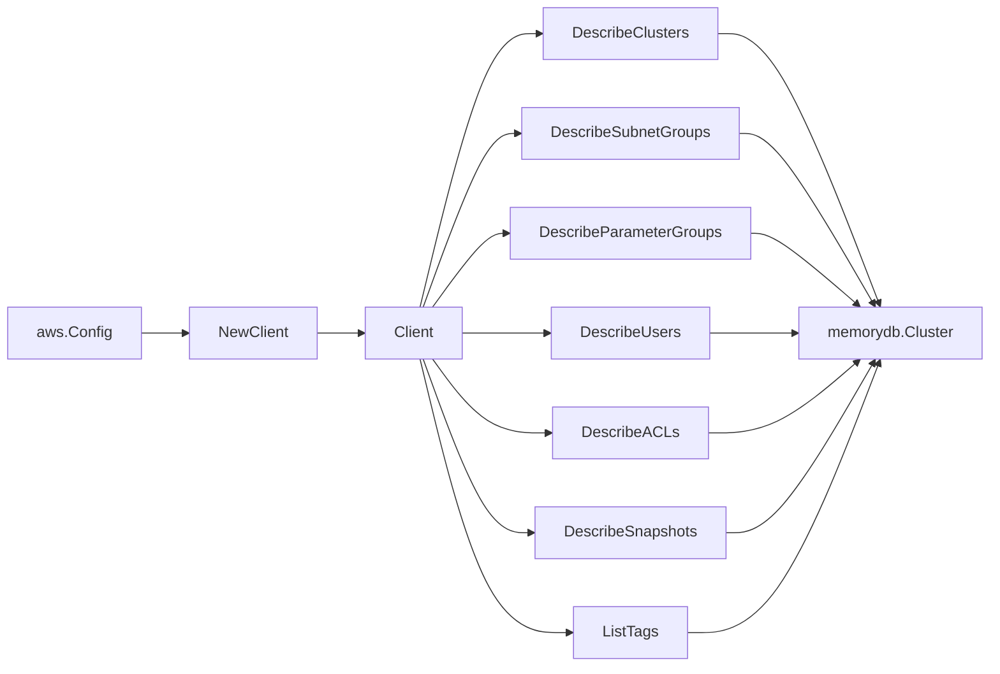

# AWS MemoryDB SDK Adapter

## Purpose

`internal/collector/awscloud/services/memorydb/awssdk` adapts AWS SDK for Go v2
MemoryDB responses to the scanner-owned `Client` contract. It owns cluster
pagination, subnet group pagination, parameter group pagination, user
pagination, ACL pagination, snapshot pagination, tag reads, per-shard replica
derivation, throttle classification, and per-call AWS API telemetry.

## Ownership boundary

This package owns SDK calls for MemoryDB. It does not own workflow claims,
credential acquisition, MemoryDB fact selection, graph writes, reducer
admission, or query behavior.

## Exported surface

See `doc.go` for the godoc contract.

- `Client` - AWS SDK-backed implementation of `memorydb.Client`.
- `NewClient` - builds a `Client` for one claimed AWS boundary.

## Dependencies

- `internal/collector/awscloud` for account, region, and service boundary
  labels.
- `internal/collector/awscloud/services/memorydb` for scanner-owned result
  types.
- `internal/telemetry` for AWS API call and throttle instruments.
- AWS SDK for Go v2 `memorydb` and Smithy error contracts.

## Telemetry

MemoryDB paginator pages and point reads are wrapped with:

- `aws.service.pagination.page`
- `eshu_dp_aws_api_calls_total`
- `eshu_dp_aws_throttle_total`

Metric labels stay bounded to service, account, region, operation, and result.
MemoryDB ARNs, cluster names, user names, ACL names, tags, and raw AWS error
payloads stay out of metric labels.

## Gotchas / invariants

- `DescribeClusters` is invoked with `ShowShardDetails=true` so the adapter can
  derive the per-shard replica count from the shard node counts. MemoryDB does
  not expose a replica-count field on the Cluster response.
- MemoryDB `Cluster` responses include `KmsKeyId`, `SnsTopicArn`, and
  `SubnetGroupName` directly, so the adapter does not need cross-resource
  resolution for those edges.
- The adapter drops `User.AccessString` before scanner code sees it and records
  only `AccessStringPresent`; password material is not present in the describe
  response. ACL grant strings and password material can never reach facts or
  logs.
- Snapshot mapping persists name, source cluster identity, source, and status
  only; cluster configuration, shard sizes, engine version, KMS key, and any
  backup payload detail are intentionally not projected into scanner-owned
  types.
- The adapter must not call CreateCluster, DeleteCluster, UpdateCluster,
  CreateUser, DeleteUser, UpdateUser, CreateACL, DeleteACL, UpdateACL,
  CopySnapshot, DeleteSnapshot, or any other mutation/data API.
- `ListTags` is invoked only when AWS reports an ARN for the resource; ARNs are
  bounded identifiers and not sensitive payload.
- SDK adapters translate AWS records into scanner-owned types; scanner tests
  should not mock AWS SDK pagination.

## Related docs

- `docs/public/services/collector-aws-cloud.md`
- `docs/public/services/collector-aws-cloud-scanners.md`
- `docs/public/services/collector-aws-cloud-security.md`
- `docs/public/guides/collector-authoring.md`
