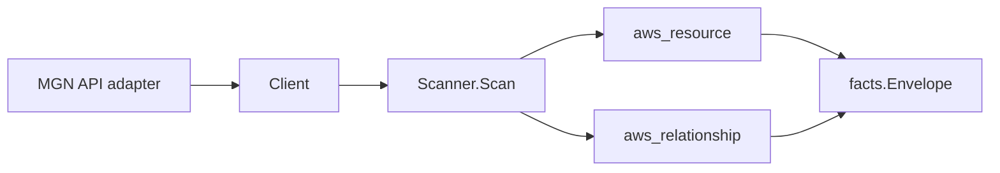

# AWS Application Migration Service (MGN) Scanner

## Purpose

`internal/collector/awscloud/services/mgn` owns the AWS Application Migration
Service scanner contract for the AWS cloud collector. It converts MGN
application, source server, launch configuration, and job metadata into
`aws_resource` facts and emits relationship evidence for application-to-source-
server membership, the EC2 instance MGN launched for a source server, the EC2
launch template a launch configuration references, and the source servers a job
acted on.

## Ownership boundary

This package owns scanner-level MGN fact selection and identity mapping. It does
not own AWS SDK pagination, STS credentials, workflow claims, fact persistence,
graph writes, reducer admission, or query behavior.

## Exported surface

See `doc.go` for the godoc contract.

- `Client` - minimal MGN metadata read surface consumed by `Scanner`.
- `Scanner` - emits application, source server, launch configuration, and job
  resources plus their relationships for one boundary.
- `Snapshot`, `Application`, `SourceServer`, `LaunchConfiguration`, `Job` -
  scanner-owned views with replication-agent credentials, replication
  configuration secrets, and replicated disk contents intentionally absent.

## Dependencies

- `internal/collector/awscloud` for boundaries, resource constants,
  relationship constants, partition helpers, and envelope builders.
- `internal/facts` for emitted fact envelope kinds.

The package depends on a small `Client` interface rather than the AWS SDK for
Go v2 so tests can use fake clients and the runtime adapter can own SDK
behavior.

## Telemetry

This scanner emits no spans or logs directly. `awsruntime.ClaimedSource`
records scan duration and emitted resource counts after `Scanner.Scan` returns.
The `awssdk` adapter records MGN API call counts, throttles, and pagination
spans.

## Gotchas / invariants

- MGN facts are metadata only. The scanner must never read or persist
  replication-agent credentials, replication configuration secrets (it never
  calls `GetReplicationConfiguration` or the replication-template reads), or
  replicated disk contents, and must never call any mutation or replication-
  control API.
- The source-server node publishes its resource_id as the bare MGN source
  server id (falling back to the ARN). The application-contains-source-server
  and job-targets-source-server edges are keyed by that bare id and set no
  `target_arn`, so they join the source-server node instead of dangling.
- The source-server-launched-EC2-instance edge targets `aws_ec2_instance` by
  the bare instance id (`i-...`). No EC2 instance resource scanner exists yet,
  so this is a documented `relguard` forward reference; `target_arn` stays empty
  because the EC2 instance family is keyed by the bare id, not an ARN, and the
  instance id is read from the API, never synthesized.
- The launch-configuration-uses-launch-template edge targets
  `aws_ec2_launch_template` by the launch template id (`lt-...`) MGN reports.
  Launch configurations have no AWS ARN, so the launch-config node and this edge
  share a synthesized stable id (`<source-server-id>/launch-configuration`).
- Emit reported evidence only. Do not infer deployment, workload, repository
  ownership, environment, or deployable-unit truth from application, server, or
  job names, or AWS tags.

## Evidence

Collector Performance Evidence:
`go test ./internal/collector/awscloud/services/mgn/...` covers the bounded MGN
metadata path: one paginated ListApplications stream, one paginated
DescribeSourceServers stream, one GetLaunchConfiguration point read per source
server, one paginated DescribeJobs stream, no replication-configuration reads,
no replication-template reads, no mutations, and no graph writes in the
collector.

No-Regression Evidence: metadata-only control-plane scanner; new read path, no change to existing hot paths. `go test ./internal/collector/awscloud/services/mgn/...` green.

No-Observability-Change: reuses shared AWS pagination span + API-call/throttle counters; no telemetry contract change.

Collector Deployment Evidence: MGN runs inside the existing hosted
`collector-aws-cloud` runtime, so `/healthz`, `/readyz`, `/metrics`, and
`/admin/status` stay covered by the command wiring and Helm collector runtime.

## Related docs

- `docs/public/services/collector-aws-cloud.md`
- `docs/public/services/collector-aws-cloud-scanners.md`
- `docs/public/services/collector-aws-cloud-security.md`
