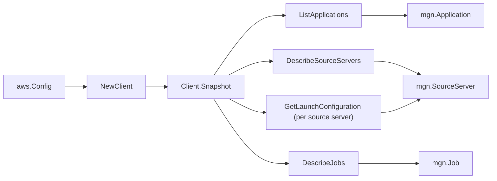

# AWS Application Migration Service (MGN) SDK Adapter

## Purpose

`internal/collector/awscloud/services/mgn/awssdk` adapts AWS SDK for Go v2 MGN
responses to the scanner-owned `Client` contract. It owns application
pagination, source server pagination, per-source-server launch configuration
reads, job pagination, throttle classification, and per-call AWS API telemetry.

## Ownership boundary

This package owns SDK calls for MGN. It does not own workflow claims, credential
acquisition, MGN fact selection, graph writes, reducer admission, or query
behavior.

## Exported surface

See `doc.go` for the godoc contract.

- `Client` - AWS SDK-backed implementation of `mgn.Client`.
- `NewClient` - builds a `Client` for one claimed AWS boundary.

## Dependencies

- `internal/collector/awscloud` for account, region, and service boundary
  labels.
- `internal/collector/awscloud/services/mgn` for scanner-owned result types.
- `internal/telemetry` for AWS API call and throttle instruments.
- AWS SDK for Go v2 `mgn` and Smithy error contracts.

## Telemetry

MGN paginator pages and point reads are wrapped with:

- `aws.service.pagination.page`
- `eshu_dp_aws_api_calls_total`
- `eshu_dp_aws_throttle_total`

Metric labels stay bounded to service, account, region, operation, and result.
MGN resource ARNs, names, lifecycle state, tags, and raw AWS error payloads stay
out of metric labels.

## Gotchas / invariants

- The adapter reads metadata only. It must never call
  `GetReplicationConfiguration` (which carries staging credentials), the
  replication-configuration-template reads, or any `Create*`, `Update*`,
  `Delete*`, `Start*`, `Stop*`, `Terminate*`, `Mark*`, `Initialize*`,
  `Finalize*`, `Disconnect*`, `Archive*`, or `Unarchive*` mutation API. The
  `exclusion_test` fails the build if any forbidden method reaches the adapter
  interface.
- `GetLaunchConfiguration` is a per-source-server point read with no pagination.
  A source server without a launch configuration returns a not-found error,
  which the adapter treats as absent metadata (nil launch configuration) rather
  than a scan failure; only access errors propagate.
- The adapter maps only safe source-properties fields: the recommended instance
  type, OS full string, and non-secret identification hints (hostname, FQDN, AWS
  instance id). Disks, CPUs, RAM detail, network interface detail, and the
  `DataReplicationInfo.ReplicatorId` are intentionally excluded.
- MGN timestamps are RFC3339 strings on the wire; `parseAPITime` parses them and
  omits unparseable or empty values rather than emitting an epoch.
- SDK adapters translate AWS responses into scanner-owned types; scanner tests
  should not mock AWS SDK pagination.

## Related docs

- `docs/public/services/collector-aws-cloud-scanners.md`
- `docs/public/services/collector-aws-cloud-security.md`
