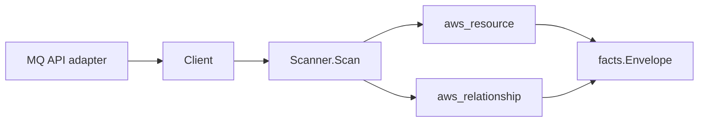

# AWS Amazon MQ Scanner

## Purpose

`internal/collector/awscloud/services/mq` owns the Amazon MQ scanner contract
for the AWS cloud collector. One slice covers both ActiveMQ and RabbitMQ broker
engine types. It converts broker and broker-configuration metadata into
`aws_resource` facts and emits relationship evidence for subnet, security
group, KMS key, configuration, and CloudWatch Logs log group dependencies.

## Ownership boundary

This package owns scanner-level Amazon MQ fact selection and identity mapping.
It does not own AWS SDK pagination, STS credentials, workflow claims, fact
persistence, graph writes, reducer admission, or query behavior.

## Exported surface

See `doc.go` for the godoc contract.

- `Client` - minimal Amazon MQ metadata read surface consumed by `Scanner`.
- `Scanner` - emits broker and configuration facts plus relationship facts for
  one boundary.
- `Broker`, `Encryption`, `ConfigurationReference`, `Logs` - scanner-owned
  broker representations. The broker carries usernames but never a password
  field.
- `Configuration`, `ConfigurationRevisionSummary` - scanner-owned broker
  configuration representation; the configuration XML body is intentionally
  omitted.

## Dependencies

- `internal/collector/awscloud` for boundaries, resource constants,
  relationship constants, and envelope builders.
- `internal/facts` for emitted fact envelope kinds.

The package depends on a small `Client` interface rather than the AWS SDK for
Go v2 so tests can use fake clients and runtime adapters can own SDK behavior.

## Telemetry

This scanner emits no spans or logs directly. `awsruntime.ClaimedSource`
records scan duration and emitted resource counts after `Scanner.Scan` returns.
The `awssdk` adapter records Amazon MQ API call counts, throttles, and
pagination spans. Resource counts surface through
`eshu_dp_aws_resources_emitted_total` with `service="mq"` and per-resource
`resource_type` labels for `aws_mq_broker` and `aws_mq_configuration`.

## Gotchas / invariants

- Amazon MQ facts are metadata only. The scanner must not create, update, or
  delete brokers, configurations, or broker users, must not reboot brokers, and
  must not write tag mutations.
- Broker user passwords are never modeled or persisted. The `Broker` type has
  no password field; only usernames reported by `DescribeBroker` (UserSummary)
  are recorded. The password lives on the User resource returned by
  `DescribeUser`, which the adapter never calls.
- The scanner does not persist configuration XML bodies; only configuration
  ARN, ID, name, description, engine type, engine version, authentication
  strategy, and the latest revision identifier are stored. The body can carry
  inline credentials, broker ACL rules, and queue/topic names that may include
  customer identifiers.
- Queue and topic message contents are out of the management API and are never
  read.
- The broker-to-KMS-key relationship emits only when the broker uses a
  customer-managed key reported in ARN form; brokers using an AWS-owned key emit
  no KMS relationship.
- Broker-to-subnet and broker-to-security-group relationships use the AWS subnet
  IDs and security group IDs reported by `DescribeBroker`. Amazon MQ describes
  brokers by subnet rather than VPC, so `RelationshipMQBrokerInVPC` is reserved
  for evidence sources that report the VPC identity directly and is not emitted
  from broker subnet placement here.
- Broker-to-CloudWatch-log-group relationships synthesize the non-wildcard log
  group ARN (`arn:aws:logs:<region>:<account>:log-group:<name>`) from the
  boundary account and region plus the general and audit log group names, so the
  edge joins the CloudWatch Logs scanner resource, whose ResourceID is that ARN.
  Log contents are never read.
- Broker-to-configuration relationships resolve the broker-reported
  configuration ID to its ARN using the ID-to-ARN map built from
  `ListConfigurations`, because the `aws_mq_configuration` resource publishes its
  ARN as the ResourceID. When the referenced configuration is absent from
  `ListConfigurations` (for example a shared or cross-account configuration), the
  edge falls back to targeting the configuration ID, which the resource carries
  as a correlation anchor, rather than being dropped.
- Tags are raw AWS tag evidence. Do not infer environment, owner, workload, or
  deployable-unit truth from tags in this package.

## Evidence

Collector Performance Evidence: `go test ./internal/collector/awscloud/services/mq/...`
covers the bounded Amazon MQ metadata path: one paginated ListBrokers stream
followed by one DescribeBroker point read per broker (to fetch engine,
deployment, instance, status, encryption, configuration, log destination,
subnet, security group, and username metadata), one paginated ListConfigurations
stream that returns full configuration metadata, no mutation APIs, no
DescribeUser, no DescribeConfigurationRevision, and no graph writes inside the
collector.

No-Regression Evidence: `go test ./cmd/collector-aws-cloud ./internal/collector/awscloud/...`
covers Amazon MQ broker and configuration fact emission for both ActiveMQ and
RabbitMQ engines, customer-managed-key-only KMS relationship emission, subnet,
security group, configuration, and CloudWatch log group relationship emission,
omission of broker password and configuration XML material, runtime
registration, command configuration, and the SDK adapter's safe metadata
mapping including the forbidden-method exclusion guard.

Collector Observability Evidence: Amazon MQ uses the existing AWS collector
`aws.service.pagination.page` span plus `eshu_dp_aws_api_calls_total`,
`eshu_dp_aws_throttle_total`, `eshu_dp_aws_resources_emitted_total`,
`eshu_dp_aws_relationships_emitted_total`, and `aws_scan_status` rows. Metric
labels stay bounded to service, account, region, operation, result, and
resource type.

No-Observability-Change: the existing AWS collector telemetry contract already
diagnoses Amazon MQ scans through `aws.service.scan`,
`aws.service.pagination.page`, API/throttle counters, resource/relationship
counters, and `aws_scan_status`.

Collector Deployment Evidence: Amazon MQ runs inside the existing hosted
`collector-aws-cloud` runtime, so `/healthz`, `/readyz`, `/metrics`, and
`/admin/status` stay covered by the command wiring and Helm collector runtime.

## Related docs

- `docs/public/services/collector-aws-cloud.md`
- `docs/public/services/collector-aws-cloud-scanners.md`
- `docs/public/guides/collector-authoring.md`
