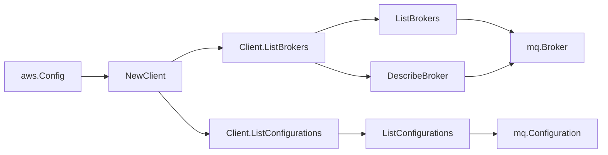

# AWS Amazon MQ SDK Adapter

## Purpose

`internal/collector/awscloud/services/mq/awssdk` adapts AWS SDK for Go v2
Amazon MQ responses to the scanner-owned `Client` contract. It owns broker
pagination, the per-broker `DescribeBroker` enrichment used to capture engine,
deployment, instance, status, encryption, configuration, log destination,
subnet, security group, and username metadata, configuration pagination,
throttle classification, and per-call AWS API telemetry.

## Ownership boundary

This package owns SDK calls for Amazon MQ. It does not own workflow claims,
credential acquisition, MQ fact selection, graph writes, reducer admission, or
query behavior.

## Exported surface

See `doc.go` for the godoc contract.

- `Client` - AWS SDK-backed implementation of `mq.Client`.
- `NewClient` - builds a `Client` for one claimed AWS boundary.

## Dependencies

- `internal/collector/awscloud` for account, region, and service boundary
  labels.
- `internal/collector/awscloud/services/mq` for scanner-owned result types.
- `internal/telemetry` for AWS API call and throttle instruments.
- AWS SDK for Go v2 `mq` and Smithy error contracts.

## Telemetry

Amazon MQ paginator pages and point reads are wrapped with:

- `aws.service.pagination.page`
- `eshu_dp_aws_api_calls_total`
- `eshu_dp_aws_throttle_total`

Metric labels stay bounded to service, account, region, operation, and result.
Broker ARNs, configuration ARNs, KMS key ARNs, subnet IDs, security group IDs,
log group names, usernames, tags, engine versions, instance types, and raw AWS
error payloads stay out of metric labels.

## Gotchas / invariants

- `ListBrokers` returns only BrokerSummary records (no subnet, security group,
  encryption, configuration, log, or username detail), so each broker ID is
  enriched with one `DescribeBroker` call.
- `DescribeBroker` returns broker usernames as UserSummary records, which carry
  the username and a pending-change marker only. The adapter records usernames
  and never calls DescribeUser, which returns the password-bearing User
  resource.
- `ListConfigurations` returns full Configuration records including the latest
  revision summary. The adapter never calls DescribeConfigurationRevision; the
  configuration XML body is intentionally out of scope.
- Encryption mapping records the customer-managed KMS key ID and the
  use-AWS-owned-key flag only; no key material is read.
- Log mapping records the general and audit CloudWatch Logs log group names and
  enablement flags only; log contents are never read.
- The adapter must not call CreateBroker, UpdateBroker, DeleteBroker,
  RebootBroker, CreateConfiguration, UpdateConfiguration, DeleteConfiguration,
  CreateUser, UpdateUser, DeleteUser, CreateTag, or DeleteTag.
- SDK adapters translate AWS records into scanner-owned types; scanner tests
  should not mock AWS SDK pagination.

## Related docs

- `docs/public/services/collector-aws-cloud.md`
- `docs/public/services/collector-aws-cloud-scanners.md`
- `docs/public/guides/collector-authoring.md`
