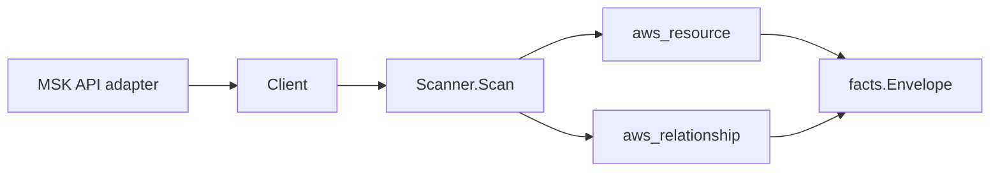

# AWS MSK Scanner

## Purpose

`internal/collector/awscloud/services/msk` owns the Amazon Managed Streaming
for Apache Kafka (MSK) scanner contract for the AWS cloud collector. It
converts cluster, broker configuration, and replicator metadata into
`aws_resource` facts and emits relationship evidence for subnet, security
group, KMS key, IAM role, and configuration dependencies.

## Ownership boundary

This package owns scanner-level MSK fact selection and identity mapping. It
does not own AWS SDK pagination, STS credentials, workflow claims, fact
persistence, graph writes, reducer admission, or query behavior.

## Exported surface

See `doc.go` for the godoc contract.

- `Client` - minimal MSK metadata read surface consumed by `Scanner`.
- `Scanner` - emits cluster, configuration, and replicator facts plus
  relationship facts for one boundary.
- `Cluster`, `ProvisionedCluster`, `ServerlessCluster`, `BrokerNodeGroup`,
  `VPCConfig`, `EncryptionInTransit`, `ClientAuthentication`,
  `ConfigurationReference` - scanner-owned cluster representations.
- `Configuration`, `ConfigurationRevisionSummary` - scanner-owned broker
  configuration representation; the raw server.properties body is intentionally
  omitted.
- `Replicator`, `ReplicatorKafkaCluster`, `ReplicationInfo` - scanner-owned
  replicator representations with topic and consumer-group filters summarized
  as include and exclude pattern counts rather than raw regex lists.

## Dependencies

- `internal/collector/awscloud` for boundaries, resource constants,
  relationship constants, and envelope builders.
- `internal/facts` for emitted fact envelope kinds.

The package depends on a small `Client` interface rather than the AWS SDK for
Go v2 so tests can use fake clients and runtime adapters can own SDK behavior.

## Telemetry

This scanner emits no spans or logs directly. `awsruntime.ClaimedSource`
records scan duration and emitted resource counts after `Scanner.Scan` returns.
The `awssdk` adapter records MSK API call counts, throttles, and pagination
spans. Resource counts surface through `eshu_dp_aws_resources_emitted_total`
with `service="msk"` and per-resource `resource_type` labels for
`aws_msk_cluster`, `aws_msk_configuration`, and `aws_msk_replicator`.

## Gotchas / invariants

- MSK facts are metadata only. The scanner must not mutate clusters,
  configurations, replicators, or topics, must not reboot brokers, and must
  not write tag mutations.
- The scanner does not persist raw broker server.properties bodies; only
  configuration ARN, name, description, kafka versions, state, and the latest
  revision identifier are stored.
- Broker log destinations, Kafka topic contents, Kafka message contents, and
  bootstrap broker endpoints stay outside the scanner contract.
- SCRAM secret material is not read; only the SASL/SCRAM enablement flag is
  recorded.
- Cluster-to-KMS-key, cluster-to-IAM-role, and cluster-to-configuration
  relationships emit only when AWS reports the ARN form for the target
  identity. Cluster-to-subnet and cluster-to-security-group relationships use
  the AWS subnet IDs and security group IDs reported by the provisioned broker
  node group or by serverless VPC configs, matching the EKS topology join
  precedent.
- Replicator topic and consumer-group filter patterns are summarized as
  include and exclude pattern counts, never persisted as raw regex lists.
- Tags are raw AWS tag evidence. Do not infer environment, owner, workload, or
  deployable-unit truth from tags in this package.

## Evidence

Collector Performance Evidence: `go test ./internal/collector/awscloud/services/msk/...`
covers the bounded MSK metadata path: one paginated ListClustersV2 stream
that returns full cluster details, one paginated ListConfigurations stream
that returns full configuration metadata, one paginated ListReplicators
stream followed by one DescribeReplicator point read per replicator (to
fetch service-execution role, Kafka cluster ARNs, replication info, and
tags), no mutation APIs, no DescribeConfigurationRevision, no
GetBootstrapBrokers, no ListScramSecrets, and no graph writes inside the
collector.

No-Regression Evidence: `go test ./cmd/collector-aws-cloud ./internal/collector/awscloud/...`
covers MSK cluster, configuration, and replicator fact emission, ARN-only KMS
key, IAM role, and configuration relationship emission, subnet and security
group relationship emission from both provisioned and serverless clusters,
omission of broker payload, log, and secret material, runtime registration,
command configuration, and the SDK adapter's safe metadata mapping.

Collector Observability Evidence: MSK uses the existing AWS collector
`aws.service.pagination.page` span plus `eshu_dp_aws_api_calls_total`,
`eshu_dp_aws_throttle_total`, `eshu_dp_aws_resources_emitted_total`,
`eshu_dp_aws_relationships_emitted_total`, and `aws_scan_status` rows. Metric
labels stay bounded to service, account, region, operation, result, and
resource type.

No-Observability-Change: the existing AWS collector telemetry contract already
diagnoses MSK scans through `aws.service.scan`,
`aws.service.pagination.page`, API/throttle counters, resource/relationship
counters, and `aws_scan_status`.

Collector Deployment Evidence: MSK runs inside the existing hosted
`collector-aws-cloud` runtime, so `/healthz`, `/readyz`, `/metrics`, and
`/admin/status` stay covered by the command wiring and Helm collector runtime.

## Related docs

- `docs/public/services/collector-aws-cloud.md`
- `docs/public/services/collector-aws-cloud-scanners.md`
- `docs/public/guides/collector-authoring.md`
