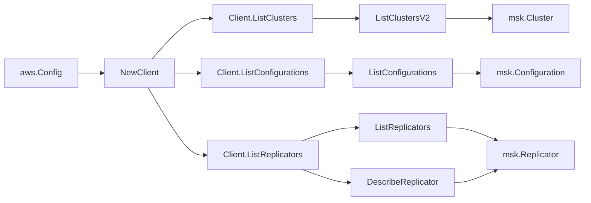

# AWS MSK SDK Adapter

## Purpose

`internal/collector/awscloud/services/msk/awssdk` adapts AWS SDK for Go v2
Kafka (MSK) responses to the scanner-owned `Client` contract. It owns cluster
pagination, configuration pagination, replicator pagination, the per-replicator
`DescribeReplicator` enrichment used to capture the service execution role,
Kafka cluster ARNs, and replication pattern counts, throttle classification,
and per-call AWS API telemetry.

## Ownership boundary

This package owns SDK calls for MSK. It does not own workflow claims,
credential acquisition, MSK fact selection, graph writes, reducer admission,
or query behavior.

## Exported surface

See `doc.go` for the godoc contract.

- `Client` - AWS SDK-backed implementation of `msk.Client`.
- `NewClient` - builds a `Client` for one claimed AWS boundary.

## Dependencies

- `internal/collector/awscloud` for account, region, and service boundary
  labels.
- `internal/collector/awscloud/services/msk` for scanner-owned result types.
- `internal/telemetry` for AWS API call and throttle instruments.
- AWS SDK for Go v2 `kafka` and Smithy error contracts.

## Telemetry

MSK paginator pages and point reads are wrapped with:

- `aws.service.pagination.page`
- `eshu_dp_aws_api_calls_total`
- `eshu_dp_aws_throttle_total`

Metric labels stay bounded to service, account, region, operation, and result.
Cluster ARNs, configuration ARNs, replicator ARNs, KMS key ARNs, IAM role
ARNs, subnet IDs, security group IDs, tags, kafka versions, broker instance
types, storage sizes, topic patterns, consumer-group patterns, and raw AWS
error payloads stay out of metric labels.

## Gotchas / invariants

- `ListClustersV2` returns full Cluster records (including Tags and the
  provisioned or serverless detail), so the adapter does not call
  DescribeClusterV2 per cluster.
- `ListConfigurations` returns full Configuration records including their
  latest revision summary. The adapter never calls DescribeConfigurationRevision;
  the raw server.properties body is intentionally out of scope.
- `ListReplicators` returns ReplicatorSummary records that omit the service
  execution role, Kafka cluster detail, and replication info. Each replicator
  ARN is enriched with one `DescribeReplicator` call to populate the service
  execution role ARN, Kafka clusters (with VPC config), and replication info
  list. Topic and consumer-group filter patterns are reduced to include and
  exclude pattern counts in the mapper.
- The adapter must not call GetBootstrapBrokers, ListScramSecrets,
  BatchAssociateScramSecret, BatchDisassociateScramSecret, GetClusterPolicy,
  PutClusterPolicy, DeleteClusterPolicy, CreateClusterV2,
  UpdateClusterKafkaVersion, DeleteCluster, RebootBroker, UpdateBrokerCount,
  UpdateBrokerStorage, UpdateBrokerType, UpdateConfiguration,
  CreateConfiguration, DeleteConfiguration, CreateReplicator,
  DeleteReplicator, CreateTopic, DeleteTopic, TagResource, or UntagResource.
- SDK adapters translate AWS records into scanner-owned types; scanner tests
  should not mock AWS SDK pagination.

## Related docs

- `docs/public/services/collector-aws-cloud.md`
- `docs/public/services/collector-aws-cloud-scanners.md`
- `docs/public/guides/collector-authoring.md`
