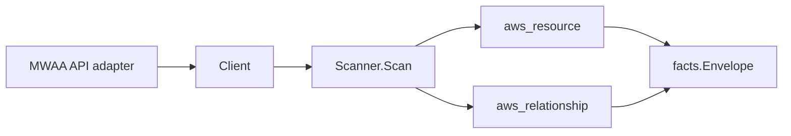

# Amazon MWAA Scanner

## Purpose

`internal/collector/awscloud/services/mwaa` owns the Amazon Managed Workflows
for Apache Airflow (MWAA) scanner contract for the AWS cloud collector. It
converts MWAA environment metadata into `aws_resource` facts and emits
relationship evidence for the S3 DAG bucket, VPC subnets, VPC security groups,
the IAM execution role, the KMS key, and the CloudWatch Logs log groups the
environment publishes Airflow logs to.

## Ownership boundary

This package owns scanner-level MWAA fact selection and identity mapping. It
does not own AWS SDK pagination, STS credentials, workflow claims, fact
persistence, graph writes, reducer admission, or query behavior.

## Exported surface

See `doc.go` for the godoc contract.

- `Client` - minimal MWAA metadata read surface consumed by `Scanner`.
- `Scanner` - emits one environment resource plus its S3, subnet, security
  group, IAM-role, KMS-key, and CloudWatch-log-group relationships for one
  boundary.
- `Environment`, `LogGroup` - scanner-owned views with Airflow configuration
  option values, connection strings, executor queue ARNs, webserver URLs, and
  login tokens intentionally absent.

## Dependencies

- `internal/collector/awscloud` for boundaries, resource constants,
  relationship constants, partition helpers, and envelope builders.
- `internal/facts` for emitted fact envelope kinds.

The package depends on a small `Client` interface rather than the AWS SDK for
Go v2 so tests can use fake clients and runtime adapters can own SDK behavior.

## Telemetry

This scanner emits no spans or logs directly. `awsruntime.ClaimedSource`
records scan duration and emitted resource counts after `Scanner.Scan` returns.
The `awssdk` adapter records MWAA API call counts, throttles, and pagination
spans.

## Gotchas / invariants

- MWAA facts are metadata only. The scanner must never create, update, or
  delete an environment, request an Apache Airflow CLI token or web-login
  token, invoke the Airflow REST API, publish metrics, or read or persist
  Apache Airflow configuration option values, connection strings, the Celery
  executor queue ARN, the database VPC endpoint service, the webserver URL, or
  any secret.
- The scanner-owned `Environment` type has no field that can hold a
  configuration value or secret, so a leak fails to compile and a structural
  reflection test guards the type.
- Every outgoing edge is sourced on the same identifier the environment
  resource publishes as its `resource_id`: the environment ARN when present,
  otherwise the bare environment name.
- The environment-to-S3-bucket edge targets the S3 bucket ARN. When AWS
  reports a full source-bucket ARN it is used verbatim so it inherits its own
  partition; when only a bare bucket name is available the ARN is synthesized
  with `partition(boundary)` so GovCloud and China joins resolve instead of
  dangling.
- The environment-to-subnet and environment-to-security-group edges target the
  bare AWS ids, matching the `resource_id` shape the `ec2` scanner publishes.
- The environment-to-IAM-role edge is emitted only when AWS reports a
  parseable IAM role ARN, matching the `resource_id` the `iam` scanner
  publishes.
- The environment-to-KMS-key edge targets the AWS-reported KMS key reference
  (an ARN), which the `kms` scanner carries as a correlation anchor.
- The environment-to-CloudWatch-log-group edge trims the trailing `:*`
  wildcard suffix MWAA appends to each module's log group ARN so the edge
  joins the non-wildcard ARN `resource_id` the `cloudwatchlogs` scanner
  publishes. Duplicate log group ARNs across modules collapse to one edge.
- Emit reported evidence only. Do not infer deployment, workload, repository
  ownership, environment, or deployable-unit truth from environment names or
  AWS tags.

## Evidence

Collector Performance Evidence:
`go test ./internal/collector/awscloud/services/mwaa/...` covers the bounded
MWAA metadata path: one paginated ListEnvironments stream followed by one
GetEnvironment point read per environment, no CreateEnvironment,
UpdateEnvironment, DeleteEnvironment, CreateCliToken, CreateWebLoginToken,
InvokeRestApi, PublishMetrics, TagResource, or UntagResource calls, no
mutations, and no graph writes in the collector.

No-Regression Evidence:
`go test ./internal/collector/awscloud/services/mwaa/... ./internal/collector/awscloud/internal/relguard/... ./cmd/collector-aws-cloud/... -count=1`
covers MWAA environment metadata fact emission, the environment-to-S3-bucket,
environment-to-subnet, environment-to-security-group, environment-to-IAM-role,
environment-to-KMS-key, and environment-to-CloudWatch-log-group relationship
emission with their `target_type` and `target_resource_id` join shapes, the
no-Airflow-configuration-value and no-secret assertions, the partition-aware
S3 bucket ARN synthesis (commercial / `aws-us-gov` / `aws-cn` / blank-region
fallback), the log-group wildcard-suffix trim, the SDK adapter mutation/token
exclusion reflection test, runtime registration, and the derived
supported-service guard. The change adds one new scanner package, one new
direct SDK dependency (`service/mwaa v1.40.2`, pinned to match the existing
core SDK versions with zero incidental core upgrades), and one append-only
binding import; no existing scanner path changes.

Collector Observability Evidence: MWAA uses the existing AWS collector
`aws.service.pagination.page` span plus `eshu_dp_aws_api_calls_total`,
`eshu_dp_aws_throttle_total`, `eshu_dp_aws_resources_emitted_total`,
`eshu_dp_aws_relationships_emitted_total`, and `aws_scan_status` rows. Metric
labels stay bounded to service, account, region, operation, result, and
status.

No-Observability-Change: the existing AWS collector telemetry contract already
diagnoses MWAA scans through `aws.service.scan`,
`aws.service.pagination.page`, API/throttle counters, resource/relationship
counters, and `aws_scan_status`; this scanner adds no new instrument, span, or
metric label.

Collector Deployment Evidence: MWAA runs inside the existing hosted
`collector-aws-cloud` runtime, so `/healthz`, `/readyz`, `/metrics`, and
`/admin/status` stay covered by the command wiring and Helm collector runtime.

## Related docs

- `docs/public/services/collector-aws-cloud.md`
- `docs/public/services/collector-aws-cloud-scanners.md`
- `docs/public/services/collector-aws-cloud-security.md`
