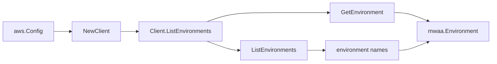

# Amazon MWAA SDK Adapter

## Purpose

`internal/collector/awscloud/services/mwaa/awssdk` adapts AWS SDK for Go v2
MWAA responses to the scanner-owned `Client` contract. It owns environment
name pagination, per-environment point reads, throttle classification, and
per-call AWS API telemetry.

## Ownership boundary

This package owns SDK calls for MWAA. It does not own workflow claims,
credential acquisition, MWAA fact selection, graph writes, reducer admission,
or query behavior.

## Exported surface

See `doc.go` for the godoc contract.

- `Client` - AWS SDK-backed implementation of `mwaa.Client`.
- `NewClient` - builds a `Client` for one claimed AWS boundary.

## Dependencies

- `internal/collector/awscloud` for account, region, and service boundary
  labels.
- `internal/collector/awscloud/services/mwaa` for scanner-owned result types.
- `internal/telemetry` for AWS API call and throttle instruments.
- AWS SDK for Go v2 `mwaa` and Smithy error contracts.

## Telemetry

MWAA paginator pages and point reads are wrapped with:

- `aws.service.pagination.page`
- `eshu_dp_aws_api_calls_total`
- `eshu_dp_aws_throttle_total`

Metric labels stay bounded to service, account, region, operation, and result.
MWAA ARNs, names, tags, and raw AWS error payloads stay out of metric labels.

## Gotchas / invariants

- The adapter calls `ListEnvironments` and `GetEnvironment` only. The
  `apiClient` interface has no mutation, token, REST-API, metric-publishing, or
  tagging method, proven by a reflection guard test, so the adapter cannot
  create, update, or delete an environment or mint an Apache Airflow token.
- The mapper never reads `AirflowConfigurationOptions` (the Apache Airflow
  configuration option values), `CeleryExecutorQueue`,
  `DatabaseVpcEndpointService`, `WebserverUrl`, or
  `WebserverVpcEndpointService`, so configuration values, internal queue
  identities, and webserver endpoints never leave the adapter.
- The mapper preserves the raw CloudWatch Logs log group ARN (including any
  trailing `:*` wildcard); the scanner trims the wildcard so the join shape
  stays a scanner-level concern.
- SDK adapters translate AWS records into scanner-owned types; scanner tests
  should not mock AWS SDK pagination.

## Related docs

- `docs/public/services/collector-aws-cloud-scanners.md`
- `docs/public/services/collector-aws-cloud-security.md`
