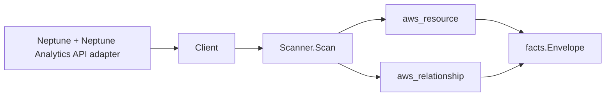

# AWS Neptune Scanner

## Purpose

`internal/collector/awscloud/services/neptune` owns the Amazon Neptune scanner
contract for the AWS cloud collector. It covers both Neptune (provisioned,
RDS-shaped) and Neptune Analytics (graph) resources under one
`service_kind=neptune`. It converts Neptune control-plane metadata into
`aws_resource` facts for DB clusters, cluster instances, cluster parameter
groups, cluster snapshots, subnet groups, global clusters, Neptune Analytics
graphs, and graph snapshots, and emits relationship evidence for the
dependencies Neptune directly reports. The provisioned surface mirrors the RDS
and DocumentDB scanner patterns.

## Ownership boundary

This package owns scanner-level Neptune fact selection and identity mapping. It
does not own AWS SDK pagination, STS credentials, workflow claims, fact
persistence, graph writes (into Eshu's own canonical graph), reducer admission,
workload ownership, or query behavior.

## Exported surface

See `doc.go` for the godoc contract.

- `Client` - minimal Neptune metadata read surface consumed by `Scanner`. Its
  method set is the only path to the Neptune and Neptune Analytics APIs and is
  asserted by `contract_test.go` to exclude every mutation and graph
  data-plane call.
- `Scanner` - emits cluster, instance, parameter group, snapshot, subnet group,
  global cluster, graph, graph snapshot, and direct relationship facts for one
  boundary.
- `DBCluster`, `ClusterInstance`, `ClusterParameterGroup`, `ClusterSnapshot`,
  `SubnetGroup`, `GlobalCluster`, `Graph`, and `GraphSnapshot` - scanner-owned
  metadata-only resource representations.
- `ClusterMember` and `GlobalClusterMember` - reported Neptune membership
  details.

## Resources and relationships

Resources: `aws_neptune_db_cluster`, `aws_neptune_db_instance`,
`aws_neptune_db_cluster_parameter_group`, `aws_neptune_db_cluster_snapshot`,
`aws_neptune_db_subnet_group`, `aws_neptune_global_cluster`,
`aws_neptune_graph`, `aws_neptune_graph_snapshot`.

Relationships: `neptune_db_cluster_in_vpc` (derived from the cluster's subnet
group VPC), `neptune_db_cluster_in_subnet_group`,
`neptune_db_cluster_uses_kms_key`, `neptune_db_cluster_uses_iam_role`,
`neptune_db_instance_member_of_cluster`, `neptune_global_cluster_has_cluster`,
and `neptune_graph_uses_kms_key`. Every edge sets a non-empty `target_type`
matching the target scanner's resource type: KMS keys join `aws_kms_key`, VPCs
join `aws_ec2_vpc`, IAM roles join `aws_iam_role`, and clusters join
`aws_neptune_db_cluster`.

## Dependencies

- `internal/collector/awscloud` for boundaries, resource constants,
  relationship constants, and envelope builders.
- `internal/facts` for emitted fact envelope kinds.

The package depends on a small `Client` interface rather than the AWS SDK for Go
v2 so tests can use fake clients and runtime adapters can own SDK behavior.

## Telemetry

This scanner emits no spans or logs directly. `awsruntime.ClaimedSource`
records scan duration and emitted resource counts after `Scanner.Scan` returns;
`eshu_dp_aws_resources_emitted_total{service="neptune"}` carries the emitted
resource count. The `awssdk` adapter records Neptune API call counts,
throttles, and pagination spans.

## Gotchas / invariants

- Neptune facts are metadata only. The scanner must not connect to a cluster or
  graph endpoint, run a graph query, read graph vertex or edge contents, read
  snapshot contents, read cluster parameter values, or mutate any Neptune
  resource.
- Master user passwords, master user secrets, graph vertex and edge contents,
  `ExecuteQuery` results, and cluster parameter values are never persisted.
  `DescribeDBClusters` and `DescribeDBInstances` report `MasterUsername` (marked
  "Not supported by Neptune"); the scanner drops it. The password is never
  returned by the API and is never stored.
- Cluster parameter groups persist name and family only. The adapter never
  reads or counts parameter values.
- Neptune Analytics graphs persist name, status, the vector-search embedding
  dimension, and provisioning shape. The dimension is read from `GetGraph`
  detail (the list summary does not carry it). No vertex, edge, or query data
  is read.
- Cluster and instance endpoints are reported control-plane metadata, used only
  as resource attributes and correlation anchors, never as metric labels.
- The cluster-to-VPC edge is derived from the cluster's DB subnet group VPC,
  because `DescribeDBClusters` does not report a VPC directly. This mirrors the
  DocumentDB scanner.
- Global clusters are region-scoped reads in this slice; cross-region global
  cluster membership is reported join evidence by DB cluster ARN. Correlation
  belongs in reducers.
- Tags are raw AWS tag evidence. Do not infer environment, owner, workload,
  repository, or deployable-unit truth from tags in this package.

## Evidence

Collector Performance Evidence: `go test
./internal/collector/awscloud/services/neptune/...` covers the bounded Neptune
metadata path: paginated DescribeDBClusters, DescribeDBInstances,
DescribeDBClusterParameterGroups, DescribeDBClusterSnapshots,
DescribeDBSubnetGroups, DescribeGlobalClusters, and ListTagsForResource for
ARN-addressable Neptune resources, plus Neptune Analytics ListGraphs (each
resolved with GetGraph for the vector-search dimension), ListGraphSnapshots,
and ListTagsForResource. Every provisioned describe call sets `MaxRecords=100`
and follows `Marker` pagination; every Neptune Analytics list call sets
`MaxResults=100` and follows `NextToken` pagination, so per-account/region API
fan-out is bounded by resource count, not unbounded. No database or graph
connections, graph queries, vertex/edge reads, snapshot content reads,
parameter-value reads, mutations, or Eshu graph writes occur in the collector.

No-Regression Evidence: `go test ./cmd/collector-aws-cloud
./internal/collector/awscloud/...` covers Neptune metadata fact emission,
direct relationship emission, omission of master-username/secret/vertex/edge/
query-result fields, runtime registration, command configuration, and the SDK
adapter's safe metadata mapping. The Neptune scanner adds a new bounded
metadata read path and does not change any existing scanner, reducer, queue,
or graph-write hot path.

Collector Observability Evidence: Neptune uses the existing AWS collector
`aws.service.pagination.page` span plus `eshu_dp_aws_api_calls_total`,
`eshu_dp_aws_throttle_total`, `eshu_dp_aws_resources_emitted_total`,
`eshu_dp_aws_relationships_emitted_total`, and `aws_scan_status` rows. Metric
labels stay bounded to service, account, region, operation, result, and status.
An operator diagnoses a slow or failing Neptune scan from the per-operation
API call counter and throttle counter labeled `service="neptune"`.

Collector Deployment Evidence: Neptune runs inside the existing hosted
`collector-aws-cloud` runtime, so `/healthz`, `/readyz`, `/metrics`, and
`/admin/status` stay covered by the command wiring and Helm collector runtime.

## Related docs

- `docs/public/services/collector-aws-cloud-scanners.md`
- `docs/public/services/collector-aws-cloud.md`
- `docs/public/guides/collector-authoring.md`
