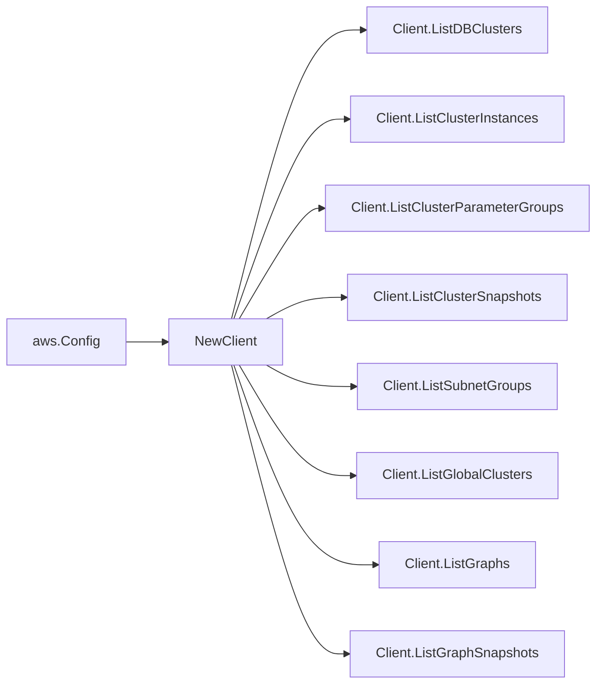

# AWS Neptune SDK Adapter

## Purpose

`internal/collector/awscloud/services/neptune/awssdk` adapts AWS SDK for Go v2
Amazon Neptune and Neptune Analytics responses to the scanner-owned `Client`
contract. It owns Neptune pagination, resource tag reads, graph detail
resolution, throttle classification, and per-call AWS API telemetry.

## Ownership boundary

This package owns SDK calls for Neptune (provisioned) and Neptune Analytics. It
does not own workflow claims, credential acquisition, Neptune fact selection,
graph writes, reducer admission, workload ownership, or query behavior.

## Exported surface

See `doc.go` for the godoc contract.

- `Client` - AWS SDK-backed implementation of `neptune.Client`.
- `NewClient` - builds a `Client` for one claimed AWS boundary, constructing
  both the Neptune (provisioned) and Neptune Analytics SDK clients.

## Dependencies

- `internal/collector/awscloud` for account, region, and service boundary
  labels.
- `internal/collector/awscloud/services/neptune` for scanner-owned result
  types.
- `internal/telemetry` for AWS API call and throttle instruments.
- AWS SDK for Go v2 `neptune`, `neptunegraph`, and Smithy error contracts.

## Telemetry

Neptune list pages, graph detail reads, and tag reads are wrapped with:

- `aws.service.pagination.page`
- `eshu_dp_aws_api_calls_total`
- `eshu_dp_aws_throttle_total`

Metric labels stay bounded to service, account, region, operation, and result.
Neptune ARNs, endpoints, tags, KMS key IDs, subnet group names, parameter
group names, graph identifiers, and raw AWS error payloads stay out of metric
labels.

## Gotchas / invariants

- The provisioned adapter calls only `DescribeDBClusters`,
  `DescribeDBInstances`, `DescribeDBClusterParameterGroups`,
  `DescribeDBClusterSnapshots`, `DescribeDBSubnetGroups`,
  `DescribeGlobalClusters`, and `ListTagsForResource`.
- The Neptune Analytics adapter calls only `ListGraphs`, `GetGraph`,
  `ListGraphSnapshots`, and `ListTagsForResource`. It never calls
  `ExecuteQuery`, `CancelQuery`, `GetQuery`, `ListQueries`, any graph mutation
  (`CreateGraph`/`DeleteGraph`/`ResetGraph`/`UpdateGraph`/
  `RestoreGraphFromSnapshot`/`CreateGraphSnapshot`), or import/export task APIs.
  The `neptuneGraphAPI` interface shape makes those calls unreachable.
- `GetGraph` is called per graph only to read control-plane detail (the
  vector-search embedding dimension and KMS key). No graph vertex, edge, or
  query data is ever read.
- Neptune parameter values are never read. The adapter does not call
  `DescribeDBClusterParameters`.
- Provisioned describe calls set `MaxRecords=100`, the documented maximum, and
  follow Neptune `Marker` pagination. Neptune Analytics list calls set
  `MaxResults=100` and follow `NextToken` pagination.
- `ListTagsForResource` is called only when AWS returned an ARN. Global
  clusters carry an inline `TagList`, so the adapter does not issue a separate
  tag call for them. Neptune Analytics tags are returned as a `map[string]string`
  directly, while Neptune (provisioned) tags arrive as a `TagList` slice.
- The adapter maps safe control-plane fields and drops master usernames and
  master user secrets.
- The adapter must not call Neptune mutation APIs (Create/Delete/Modify/
  Restore/Failover/Reboot), snapshot-write APIs, or any data-plane access.

## Related docs

- `docs/public/services/collector-aws-cloud-scanners.md`
- `docs/public/services/collector-aws-cloud.md`
- `docs/public/guides/collector-authoring.md`
