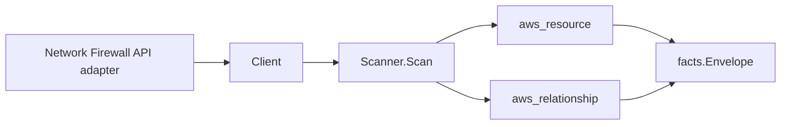

# AWS Network Firewall Scanner

## Purpose

`internal/collector/awscloud/services/networkfirewall` owns the Network Firewall
scanner contract for the AWS cloud collector. It converts firewall, firewall
policy, rule group, and TLS inspection configuration metadata into
`aws_resource` facts and emits relationship evidence from firewalls to their
VPC, subnets, and firewall policy, and from firewall policies to their rule
groups and TLS inspection configuration. Rule group rule sources (Suricata
signature bodies), firewall policy rule bodies, and TLS inspection certificate
bodies are never persisted.

## Ownership boundary

This package owns scanner-level Network Firewall fact selection and identity
mapping. It does not own AWS SDK pagination, STS credentials, workflow claims,
fact persistence, graph writes, reducer admission, or query behavior.

## Exported surface

See `doc.go` for the godoc contract.

- `Client` - minimal Network Firewall metadata read surface consumed by
  `Scanner`.
- `Scanner` - emits Network Firewall metadata facts and relationships for one
  boundary.
- `Firewall`, `FirewallPolicy`, `RuleGroup`, `TLSInspectionConfiguration` -
  scanner-owned resource representations. `RuleGroup` carries the type and
  capacity, never the rule source. `FirewallPolicy` carries default-action names
  and reference ARNs, never the full policy rule body.

## Dependencies

- `internal/collector/awscloud` for boundaries, Network Firewall resource and
  relationship constants, and envelope builders.
- `internal/facts` for emitted fact envelope kinds.

The package depends on a small `Client` interface rather than the AWS SDK for Go
v2 so tests use fake clients and the runtime adapter owns SDK behavior.

## Telemetry

This scanner emits no spans or logs directly. `awsruntime.ClaimedSource` records
scan duration and emitted resource counts after `Scanner.Scan` returns through
`eshu_dp_aws_resources_emitted_total{service="networkfirewall"}` and
`eshu_dp_aws_relationships_emitted_total`. The `awssdk` adapter records Network
Firewall API call counts, throttles, and pagination spans.

## Gotchas / invariants

- Network Firewall facts are metadata only. The scanner must never persist rule
  group rule sources (Suricata signature bodies, the threat intelligence),
  firewall policy rule bodies, or TLS inspection certificate bodies. Persist
  identity, type, capacity, default-action names, and reference ARNs only.
- The firewall-to-VPC and firewall-to-subnet edges target the bare VPC id
  (`aws_ec2_vpc`) and bare subnet id (`aws_ec2_subnet`) reported by AWS; those
  resources are owned by the EC2 scanner.
- Relationships are emitted only when AWS reports both endpoints (the source
  identity and the target id or ARN).
- The rule group type is the AWS-reported `STATEFUL` or `STATELESS` value; the
  scanner records it but never inspects rule content.
- Tags are raw AWS tag evidence. Do not infer environment, owner, workload, or
  deployable-unit truth from tags in this package.

## Evidence

Collector Performance Evidence: `go test ./internal/collector/awscloud/services/networkfirewall/...`
covers the bounded Network Firewall metadata path: one token-paginated list per
resource kind, one detail read per resource, and per-rule-group tag reads. Rule
group metadata is read through `DescribeRuleGroupMetadata`, which never returns
the rule source.

No-Regression Evidence: `go test ./cmd/collector-aws-cloud ./internal/collector/awscloud/...`
covers Network Firewall resource fact emission, all five relationship kinds,
metadata-only rule group emission, the SDK adapter's read-only interface
(reflection exclusion test) and rule-body-free domain types (struct reflection
test), runtime registration, and command configuration.

Collector Observability Evidence: Network Firewall uses the existing AWS
collector `aws.service.pagination.page` span plus `eshu_dp_aws_api_calls_total`,
`eshu_dp_aws_throttle_total`, `eshu_dp_aws_resources_emitted_total`,
`eshu_dp_aws_relationships_emitted_total`, and `aws_scan_status` rows. Metric
labels stay bounded to service, account, region, operation, result, and status.

No-Observability-Change: the existing AWS collector telemetry contract already
diagnoses Network Firewall scans through `aws.service.scan`,
`aws.service.pagination.page`, API/throttle counters, resource/relationship
counters, and `aws_scan_status`.

Collector Deployment Evidence: Network Firewall runs inside the existing hosted
`collector-aws-cloud` runtime, so `/healthz`, `/readyz`, `/metrics`, and
`/admin/status` stay covered by the command wiring and Helm collector runtime.

## Related docs

- `docs/public/services/collector-aws-cloud-scanners.md`
- `docs/public/services/collector-aws-cloud-security.md`
- `docs/public/guides/collector-authoring.md`
