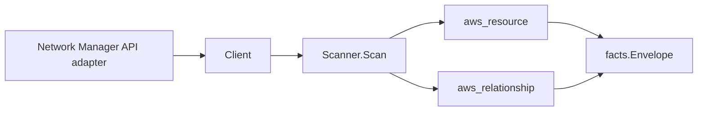

# AWS Network Manager Scanner

## Purpose

`internal/collector/awscloud/services/networkmanager` owns the AWS Network
Manager scanner contract for the AWS cloud collector. It converts global-network
and core-network control-plane metadata into `aws_resource` facts and emits
relationship evidence for child-in-global-network membership, device/link
placement at a site, device-to-link associations, connection-to-device
references, and transit gateway registrations.

AWS Network Manager is a **global** service: its control plane is reachable only
in one region per partition (us-west-2 commercial, us-gov-west-1 GovCloud,
cn-north-1 China). The `awssdk` adapter pins that region while the scan boundary
keeps its claimed account and region for attribution.

## Ownership boundary

This package owns scanner-level Network Manager fact selection and identity
mapping. It does not own AWS SDK pagination, STS credentials, workflow claims,
fact persistence, graph writes, reducer admission, or query behavior.

## Exported surface

See `doc.go` for the godoc contract.

- `Client` - minimal Network Manager metadata read surface consumed by
  `Scanner`.
- `Scanner` - emits global-network, site, device, link, connection, and
  core-network resources plus their relationships for one boundary.
- `Snapshot`, `GlobalNetwork`, `Site`, `Device`, `Link`, `Connection`,
  `LinkAssociation`, `TransitGatewayRegistration`, `CoreNetwork` - scanner-owned
  views carrying control-plane metadata only.

## Resources and relationships

| Resource | Type | resource_id |
| --- | --- | --- |
| Global network | `aws_networkmanager_global_network` | ARN |
| Site | `aws_networkmanager_site` | ARN |
| Device | `aws_networkmanager_device` | ARN |
| Link | `aws_networkmanager_link` | ARN |
| Connection | `aws_networkmanager_connection` | ARN |
| Core network | `aws_networkmanager_core_network` | ARN |

Edges: core/site/device/link/connection → parent global network (keyed by the
global-network ARN); device → site and link → site (keyed by the site ARN);
device → link association (keyed by the link ARN); connection → device (each
endpoint, keyed by the device ARN); global network → transit gateway (keyed by
the **bare** `tgw-...` id the transit gateway scanner publishes, extracted from
the registration ARN).

## Gotchas / invariants

- Network Manager facts are metadata only. The scanner never reads route
  analyses, network routes, network telemetry, or routing policy documents, and
  never mutates Network Manager state.
- Every node publishes its API-reported ARN as resource_id. Network Manager ARNs
  carry **no region** segment because the service is global.
- Child resources report only the parent id, so parent edges synthesize the
  partition-aware parent ARN (`arn:<partition>:networkmanager::<account>:...`)
  via `awscloud.PartitionForBoundary` so GovCloud and China edges join the real
  node instead of dangling.
- The transit gateway scanner publishes its resource_id as the **bare** `tgw-`
  id, not an ARN. The registration edge extracts the bare id from the reported
  transit gateway ARN and keys the target by it, leaving `target_arn` empty.
- The device `subnet_arn` is retained as context metadata only; Eshu does not
  yet publish a VPC subnet resource node, so no graph edge is keyed to it.
- Emit reported evidence only. Do not infer deployment, workload, repository
  ownership, or environment truth from names, locations, or AWS tags.

## Evidence

No-Regression Evidence: metadata-only control-plane scanner; new read path, no change to existing hot paths. `go test ./internal/collector/awscloud/services/networkmanager/...` green.
No-Observability-Change: reuses shared AWS pagination span + API-call/throttle counters; no telemetry contract change.

## Related docs

- `docs/public/services/collector-aws-cloud.md`
- `docs/public/services/collector-aws-cloud-scanners.md`
- `docs/public/services/collector-aws-cloud-security.md`
