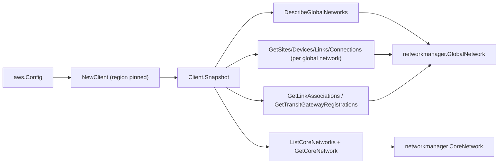

# AWS Network Manager SDK Adapter

## Purpose

`internal/collector/awscloud/services/networkmanager/awssdk` adapts AWS SDK for
Go v2 Network Manager responses to the scanner-owned `Client` contract. It owns
global-network pagination, per-global-network child pagination (sites, devices,
links, connections, link associations, transit gateway registrations), core
network listing and per-core-network resolution, throttle classification, and
per-call AWS API telemetry.

Network Manager is a **global** service. `NewClient` pins the SDK client to the
partition's control-plane region (us-west-2 commercial, us-gov-west-1 GovCloud,
cn-north-1 China) regardless of the claim region.

## Ownership boundary

This package owns SDK calls for Network Manager. It does not own workflow
claims, credential acquisition, Network Manager fact selection, graph writes,
reducer admission, or query behavior.

## Exported surface

See `doc.go` for the godoc contract.

- `Client` - AWS SDK-backed implementation of `networkmanager.Client`.
- `NewClient` - builds a `Client` for one claimed AWS boundary with the
  control-plane region pinned per partition.

## Dependencies

- `internal/collector/awscloud` for account, region, service boundary labels,
  and partition helpers.
- `internal/collector/awscloud/services/networkmanager` for scanner-owned result
  types.
- `internal/telemetry` for AWS API call and throttle instruments.
- AWS SDK for Go v2 `networkmanager` and Smithy error contracts.

## Telemetry

Network Manager paginator pages and point reads are wrapped with:

- `aws.service.pagination.page`
- `eshu_dp_aws_api_calls_total`
- `eshu_dp_aws_throttle_total`

Metric labels stay bounded to service, account, region, and operation. Network
Manager ARNs, names, locations, tags, and raw AWS error payloads stay out of
metric labels.

## Gotchas / invariants

- Network Manager is global; pin the partition's control-plane region in
  `NewClient`. Do not let a GovCloud or China claim fall through to us-west-2.
- The adapter reads metadata only. It must never call any Create/Update/Delete,
  Register/Deregister, Associate/Disassociate, Tag, Put, Start, or
  StartRouteAnalysis API. The exclusion test fails the build if a mutation
  method reaches the interface.
- A blank global network id cannot anchor child reads; `fillGlobalNetwork`
  returns the network with no children rather than issuing account-wide reads.
- `ListCoreNetworks` returns summaries without segment/edge detail, so each core
  network is resolved with `GetCoreNetwork`; a missing description falls back to
  the summary.
- SDK adapters translate AWS records into scanner-owned types; scanner tests
  should not mock AWS SDK pagination.

## Related docs

- `docs/public/services/collector-aws-cloud-scanners.md`
- `docs/public/services/collector-aws-cloud-security.md`
