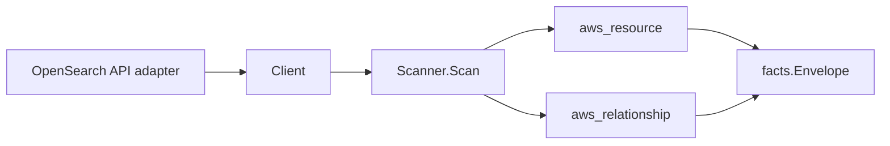

# AWS OpenSearch Scanner

## Purpose

`internal/collector/awscloud/services/opensearch` owns the OpenSearch scanner
contract for the AWS cloud collector. It converts OpenSearch Service
provisioned domains, OpenSearch custom packages, and OpenSearch Serverless
collections, security configurations, and managed VPC endpoints into
`aws_resource` facts, and emits relationship evidence for domain-to-VPC,
domain-to-subnet, domain-to-security-group, domain-to-KMS-key,
domain-to-IAM-role (master-user mapping refs), package-to-domain,
collection-to-VPC-endpoint, and collection-to-KMS-key edges.

## Ownership boundary

This package owns scanner-level OpenSearch fact selection and identity mapping.
It does not own AWS SDK pagination, STS credentials, workflow claims, fact
persistence, graph writes, reducer admission, or query behavior.

## Exported surface

See `doc.go` for the godoc contract.

- `Client` - minimal OpenSearch metadata read surface consumed by `Scanner`.
- `Scanner` - emits domain, package, serverless collection, security config,
  and VPC endpoint facts for one boundary.
- `Domain`, `Package`, `PackageAssociation`, `Collection`, `SecurityConfig`,
  `VPCEndpoint` - scanner-owned metadata-only views with master user passwords,
  domain endpoint contents, access policy bodies, package bodies, and
  serverless saved-object bodies intentionally omitted.

## Dependencies

- `internal/collector/awscloud` for boundaries, resource constants,
  relationship constants, and envelope builders.
- `internal/facts` for emitted fact envelope kinds.

The package depends on a small `Client` interface rather than the AWS SDK for
Go v2 so tests can use fake clients and runtime adapters can own SDK behavior.

## Telemetry

This scanner emits no spans or logs directly. `awsruntime.ClaimedSource`
records scan duration and emitted resource counts after `Scanner.Scan` returns;
`eshu_dp_aws_resources_emitted_total{service="opensearch"}` covers each new
resource type. The `awssdk` adapter records OpenSearch API call counts,
throttles, and pagination spans.

## Gotchas / invariants

- OpenSearch facts are metadata only. The scanner must not call CreateDomain,
  DeleteDomain, UpdateDomainConfig, CreateCollection, DeleteCollection,
  CreatePackage, DeletePackage, AssociatePackage, DissociatePackage,
  AcceptInboundConnection, or any other mutation API.
- The scanner must never reach the OpenSearch HTTP API (`_search`, `_msearch`,
  `_index`, `_doc`, `_bulk`, and similar). That API is reachable only over the
  domain HTTP endpoint, which this package never constructs; the SDK adapter
  interface carries no such method.
- Master user passwords are never persisted. AWS `DescribeDomain` does not
  return the master user password in the first place, and `Domain` has no
  password-shaped field by design (enforced by a struct-shape test).
- Domain endpoint contents, the `Endpoints` map, the access policy body, custom
  package bodies, and serverless saved-object bodies are never persisted. Only
  IAM role ARNs referenced by the access policy reach `MasterUserRoleARNs`.
- Relationships carry a non-empty `target_type` so the reducer can graph-join:
  VPC -> `aws_ec2_vpc`, subnet -> `aws_ec2_subnet`, security group ->
  `aws_ec2_security_group`, KMS -> `aws_kms_key`, IAM role -> `aws_iam_role`,
  package domain -> `aws_opensearch_domain`, and collection endpoint ->
  `aws_opensearch_serverless_vpc_endpoint`.
- A KMS identifier is treated as an ARN target only when AWS reports it in ARN
  shape; non-ARN identifiers (alias names, raw key IDs) stay as the target
  resource id with an empty target ARN. The aws partition is never synthesized.
- Tags are raw AWS tag evidence. Do not infer environment, owner, workload, or
  deployable-unit truth from tags in this package.

## Evidence

Collector Performance Evidence:
`go test ./internal/collector/awscloud/services/opensearch/...` covers the
bounded OpenSearch metadata path: one ListDomainNames read, one batched
DescribeDomains read, one ListTags read per domain ARN, one paginated
DescribePackages stream, one paginated ListDomainsForPackage stream per
package, one paginated ListCollections stream batched through
BatchGetCollection, one paginated ListSecurityConfigs stream per security
config type, one paginated ListVpcEndpoints stream batched through
BatchGetVpcEndpoint, no mutation calls, no OpenSearch HTTP API calls, and no
graph writes in the collector.

No-Regression Evidence:
`go test ./cmd/collector-aws-cloud ./internal/collector/awscloud/...` covers
OpenSearch resource fact emission for all five resource types, relationship
emission for domain-to-VPC, domain-to-subnet, domain-to-security-group,
domain-to-KMS-key, domain-to-IAM-role, package-to-domain,
collection-to-VPC-endpoint, and collection-to-KMS-key edges, the SDK adapter's
metadata-only interface shape (no mutation, inbound-connection, or index APIs
reachable), the absence of any master-password-shaped field on `Domain`,
runtime registration, command configuration, and access-policy role-ARN
extraction without persisting the policy body.

Collector Observability Evidence: OpenSearch uses the existing AWS collector
`aws.service.pagination.page` span plus `eshu_dp_aws_api_calls_total`,
`eshu_dp_aws_throttle_total`, `eshu_dp_aws_resources_emitted_total`,
`eshu_dp_aws_relationships_emitted_total`, and `aws_scan_status` rows. Metric
labels stay bounded to service, account, region, operation, result, and
status. OpenSearch ARNs, domain names, package IDs, collection IDs, and tags
stay out of metric labels.

No-Observability-Change: the existing AWS collector telemetry contract already
diagnoses OpenSearch scans through `aws.service.scan`,
`aws.service.pagination.page`, API/throttle counters, resource/relationship
counters, and `aws_scan_status`.

Collector Deployment Evidence: OpenSearch runs inside the existing hosted
`collector-aws-cloud` runtime, so `/healthz`, `/readyz`, `/metrics`, and
`/admin/status` stay covered by the command wiring and Helm collector runtime.

## Related docs

- `docs/public/services/collector-aws-cloud.md`
- `docs/public/services/collector-aws-cloud-scanners.md`
- `docs/public/services/collector-aws-cloud-security.md`
- `docs/public/guides/collector-authoring.md`
