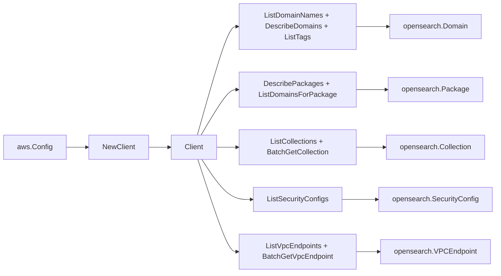

# AWS OpenSearch SDK Adapter

## Purpose

`internal/collector/awscloud/services/opensearch/awssdk` adapts AWS SDK for Go
v2 OpenSearch and OpenSearch Serverless responses to the scanner-owned `Client`
contract. It owns domain listing and description, custom package pagination,
package-to-domain association pagination, serverless collection listing and
batch description, serverless security config pagination, serverless VPC
endpoint listing and batch description, tag reads, throttle classification, and
per-call AWS API telemetry.

## Ownership boundary

This package owns SDK calls for OpenSearch. It does not own workflow claims,
credential acquisition, OpenSearch fact selection, graph writes, reducer
admission, or query behavior.

## Exported surface

See `doc.go` for the godoc contract.

- `Client` - AWS SDK-backed implementation of `opensearch.Client`.
- `NewClient` - builds a `Client` for one claimed AWS boundary.

## Dependencies

- `internal/collector/awscloud` for account, region, and service boundary
  labels.
- `internal/collector/awscloud/services/opensearch` for scanner-owned result
  types.
- `internal/telemetry` for AWS API call and throttle instruments.
- AWS SDK for Go v2 `opensearch`, `opensearchserverless`, and Smithy error
  contracts.

## Telemetry

OpenSearch paginator pages and point reads are wrapped with:

- `aws.service.pagination.page`
- `eshu_dp_aws_api_calls_total`
- `eshu_dp_aws_throttle_total`

Metric labels stay bounded to service, account, region, operation, and result.
OpenSearch ARNs, domain names, package IDs, collection IDs, tags, and raw AWS
error payloads stay out of metric labels.

## Gotchas / invariants

- The adapter never reaches the OpenSearch HTTP API (`_search`, `_index`,
  `_doc`, `_bulk`, and similar). That API is not part of the AWS SDK client; it
  is reachable only over the domain HTTP endpoint, which this adapter never
  constructs. The `domainAPI` and `serverlessAPI` interfaces are the only ways
  the adapter reaches AWS, and a reflection test asserts neither carries a
  mutation verb nor a `GetIndex` / index / search / data method.
- `DescribeDomains` does not return the master user password, and the adapter
  drops the domain `Endpoint`, `Endpoints` map, and access policy body. Only
  IAM role ARNs referenced by the access policy reach the scanner, resolved by
  `accessPolicyRoleARNs` without persisting the policy body.
- `accessPolicyRoleARNs` recognizes role ARNs by the
  `arn:<partition>:iam::<account>:role/` shape so aws, aws-cn, and aws-us-gov
  role ARNs are matched; the partition is never synthesized.
- Serverless `ListSecurityConfigs` requires a `Type`; the adapter iterates
  every `SecurityConfigType` reported by the SDK enum so all config types are
  covered without hardcoding the list.
- `BatchGetCollection` and `BatchGetVpcEndpoint` are batched at 100 ids per
  call to respect the AWS batch limit and avoid unbounded request bodies.
- The adapter must not call CreateDomain, DeleteDomain, UpdateDomainConfig,
  CreateCollection, DeleteCollection, CreatePackage, DeletePackage,
  AssociatePackage, DissociatePackage, AcceptInboundConnection, GetIndex, or any
  other mutation, data, or HTTP index/search API.
- `ListTags` is invoked only when AWS reports an ARN for the domain; ARNs are
  bounded identifiers and not sensitive payload.
- SDK adapters translate AWS records into scanner-owned types; scanner tests
  should not mock AWS SDK pagination.

## Related docs

- `docs/public/services/collector-aws-cloud.md`
- `docs/public/services/collector-aws-cloud-scanners.md`
- `docs/public/services/collector-aws-cloud-security.md`
- `docs/public/guides/collector-authoring.md`
