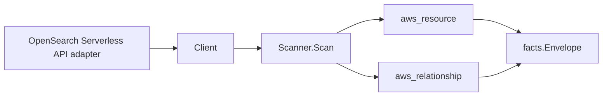

# Amazon OpenSearch Serverless Scanner

## Purpose

`internal/collector/awscloud/services/opensearchserverless` owns the Amazon
OpenSearch Serverless (aoss) scanner contract for the AWS cloud collector. It
converts collection, security-policy, and managed VPC-endpoint metadata into
`aws_resource` facts and emits relationship evidence for the collection KMS
encryption key (resolved from the matching encryption security policy) and the
managed VPC endpoint's VPC, subnet, and security-group placement.

It is a distinct `service_kind` (`opensearchserverless`) from the `opensearch`
scanner, which surfaces Serverless collections only as a side slice of the
OpenSearch Service domain scan. This scanner is the first-class Serverless owner
that additionally emits security policies as resources and the managed VPC
endpoint's network edges, mirroring how the `firehose` scanner coexists with the
`kinesis` Firehose side slice.

## Ownership boundary

This package owns scanner-level OpenSearch Serverless fact selection and identity
mapping. It does not own AWS SDK pagination, STS credentials, workflow claims,
fact persistence, graph writes, reducer admission, or query behavior.

## Exported surface

See `doc.go` for the godoc contract.

- `Client` - minimal OpenSearch Serverless metadata read surface consumed by
  `Scanner`.
- `Scanner` - emits collection, security-policy, and VPC-endpoint resources plus
  their relationships for one boundary.
- `Snapshot`, `Collection`, `SecurityPolicy`, `VPCEndpoint`,
  `EncryptionKeyBinding` - scanner-owned views with collection/dashboard
  endpoints, saved-object bodies, and policy document bodies intentionally
  absent.
- `CollectionPatternFromResource` - strips the `collection/` prefix from an
  encryption-policy resource entry so the SDK adapter can project the policy body
  into collection patterns.

## Dependencies

- `internal/collector/awscloud` for boundaries, resource constants, relationship
  constants, partition helpers, and envelope builders.
- `internal/facts` for emitted fact envelope kinds.

The package depends on a small `Client` interface rather than the AWS SDK for Go
v2 so tests can use fake clients and the runtime adapter can own SDK behavior.

## Telemetry

This scanner emits no spans or logs directly. `awsruntime.ClaimedSource` records
scan duration and emitted resource counts after `Scanner.Scan` returns. The
`awssdk` adapter records OpenSearch Serverless API call counts, throttles, and
pagination spans.

## Gotchas / invariants

- OpenSearch Serverless facts are metadata only. The scanner must never reach the
  OpenSearch HTTP data plane (index, search, bulk, document APIs), never persist
  access-policy or security-policy document bodies, never persist collection or
  dashboard endpoints, and never call any mutation API.
- The collection node publishes its resource_id as the collection ARN (falling
  back to id then name). The collection-to-KMS edge is sourced on that value.
- The collection-to-KMS edge is derived from the matching encryption security
  policy: the adapter parses the customer-managed `KmsARN` and collection
  resource patterns out of the encryption policy body, discards the body, and the
  scanner matches collection names against those patterns using AWS's documented
  "most specific rule wins" precedence (exact name beats a prefix; a longer prefix
  beats a shorter one). AWS-owned-key policies emit no edge. AWS reports a key
  ARN, which matches the KMS scanner's published key resource_id; `target_arn` is
  set only for ARN-shaped identifiers.
- The managed VPC endpoint reports its VPC, subnets, and security groups as bare
  EC2 ids (`vpc-…`, `subnet-…`, `sg-…`), which match how the EC2 scanner
  publishes those resource_ids. The endpoint-to-VPC/subnet/security-group edges
  are keyed by those bare ids, never synthesized ARNs.
- A security policy node publishes its resource_id as the type-qualified name
  (`encryption/<name>` or `network/<name>`) so encryption and network policies
  that share a name stay distinct.
- Emit reported evidence only. Do not infer deployment, workload, repository
  ownership, environment, or deployable-unit truth from collection, policy, or
  endpoint names, or AWS tags.

## Evidence

Collector Performance Evidence:
`go test ./internal/collector/awscloud/services/opensearchserverless/...` covers
the bounded OpenSearch Serverless metadata path: one paginated ListCollections
stream plus batched BatchGetCollection reads, one paginated ListSecurityPolicies
stream per policy type plus one GetSecurityPolicy point read per encryption
policy, one paginated ListVpcEndpoints stream plus batched BatchGetVpcEndpoint
reads, one ListTagsForResource point read per collection, no data-plane reads, no
mutations, and no graph writes in the collector.

No-Regression Evidence: metadata-only control-plane scanner; new read path, no change to existing hot paths. `go test ./internal/collector/awscloud/services/opensearchserverless/...` green.

No-Observability-Change: reuses shared AWS pagination span + API-call/throttle counters; no telemetry contract change.

Collector Deployment Evidence: OpenSearch Serverless runs inside the existing
hosted `collector-aws-cloud` runtime, so `/healthz`, `/readyz`, `/metrics`, and
`/admin/status` stay covered by the command wiring and Helm collector runtime.

## Related docs

- `docs/public/services/collector-aws-cloud.md`
- `docs/public/services/collector-aws-cloud-scanners.md`
- `docs/public/services/collector-aws-cloud-security.md`
