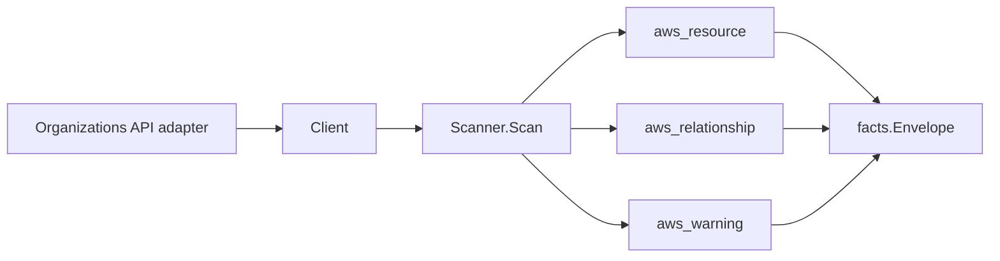

# AWS Organizations Scanner

## Purpose

`internal/collector/awscloud/services/organizations` owns the AWS
Organizations scanner contract for the AWS cloud collector. It converts
organization root, OU, account, policy summary, policy target, and delegated
administrator metadata into `aws_resource`, `aws_relationship`, and
`aws_warning` facts.

## Ownership boundary

This package owns scanner-level Organizations fact selection, account
redaction, and identity mapping. It does not own AWS SDK pagination, STS
credentials, workflow claims, fact persistence, graph writes, reducer
admission, or query behavior.

## Exported surface

See `doc.go` for the godoc contract.

- `Client` - minimal Organizations metadata read surface consumed by
  `Scanner`.
- `Scanner` - emits Organizations metadata facts and redacts account email/name
  values through `awscloud.RedactString`.
- `Snapshot` - one metadata-only Organizations view for a claimed account.
- `Organization`, `Root`, `OrganizationalUnit`, `Account`, `Policy`,
  `PolicyTarget`, and `DelegatedAdministrator` - scanner-owned representations
  that keep policy bodies out of the scanner contract.

## Dependencies

- `internal/collector/awscloud` for boundaries, resource constants,
  relationship constants, warning constants, redaction helper, and envelope
  builders.
- `internal/facts` for emitted fact envelope kinds.
- `internal/redact` for deployment-keyed account email/name markers.

The package depends on a small `Client` interface rather than the AWS SDK for Go
v2 so tests can use fake clients and runtime adapters can own SDK behavior.

## Telemetry

This scanner emits no spans or logs directly. `awsruntime.ClaimedSource`
records scan duration, emitted resource counts, relationship counts, and
Organizations org-aware skip counts after `Scanner.Scan` returns. The `awssdk`
adapter records Organizations API call counts, throttles, and pagination spans.

## Gotchas / invariants

- Organizations facts are metadata only. Do not add CreateAccount, MoveAccount,
  CloseAccount, AttachPolicy, DetachPolicy, EnableAWSServiceAccess,
  DisableAWSServiceAccess, RegisterDelegatedAdministrator,
  DeregisterDelegatedAdministrator, RemoveAccountFromOrganization,
  CreatePolicy, UpdatePolicy, or DeletePolicy.
- Policy summaries and target bindings are in scope. Policy document bodies,
  statements, conditions, actions, and guardrail text are out of scope unless a
  future security-reviewed opt-in contract is added.
- Account email and account name must be redacted before persistence. Do not
  put raw account names into resource names, relationship attributes, logs,
  spans, or metric labels.
- Policy target account names are not persisted. Target IDs, ARNs, and target
  types are enough relationship evidence.
- Organizations runs require management-account or delegated-administrator
  credentials. Non-org-aware credentials emit an `aws_warning` with
  `warning_kind="organizations_org_access_skipped"` and leave resource facts
  absent for that claim.
- Tags are raw AWS tag evidence. Do not infer environment, owner, workload, or
  deployable-unit truth from tags in this package.

## Evidence

Performance Evidence: `go test ./internal/collector/awscloud/services/organizations/... -count=1`
passed on 2026-05-27 after rebasing onto `origin/main` commit `73a9fa27`.
The fixture input is one in-memory Organizations snapshot with one root, nested
OU/account placement, policy summaries and target bindings, delegated
administrators, tags, and an org-aware skip warning; it has no Postgres queue
rows and no graph backend. The scanner emits in-memory fact envelopes only, so
there is no added graph write, worker claim fanout, lease contention, or reducer
queue pressure in this package.

No-Regression Evidence: `go test ./cmd/collector-aws-cloud ./internal/collector/awscloud/...`
covers Organizations metadata fact emission, policy body redaction, account
email/name redaction, org-aware skipped warning behavior, runtime registration,
command configuration, and the SDK adapter's safe metadata mapping.

Observability Evidence: Organizations uses the existing AWS collector
`aws.service.scan` and `aws.service.pagination.page` spans plus
`eshu_dp_aws_api_calls_total`, `eshu_dp_aws_throttle_total`,
`eshu_dp_aws_resources_emitted_total`,
`eshu_dp_aws_relationships_emitted_total`,
`eshu_dp_aws_org_access_skipped_total`, and `aws_scan_status` rows to show
successful metadata emission, AWS API/throttle volume, partial org-aware skips,
and skipped credentials. Metric labels stay bounded to service, account,
region, operation, result, resource type, and skip reason.

Collector Deployment Evidence: Organizations runs inside the existing hosted
`collector-aws-cloud` runtime, so `/healthz`, `/readyz`, `/metrics`, and
`/admin/status` stay covered by the command wiring and Helm collector runtime.

## Related docs

- `docs/public/services/collector-aws-cloud.md`
- `docs/public/services/collector-aws-cloud-scanners.md`
- `docs/public/services/collector-aws-cloud-security.md`
- `docs/public/guides/collector-authoring.md`
