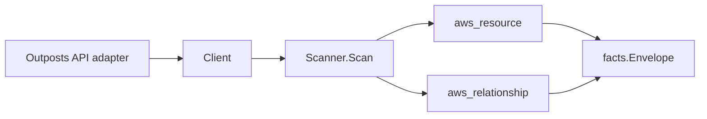

# AWS Outposts Scanner

## Purpose

`internal/collector/awscloud/services/outposts` owns the AWS Outposts scanner
contract for the AWS cloud collector. It converts Outposts outpost, site, and
rack/server asset metadata into `aws_resource` facts and emits relationship
evidence for outpost-in-site and asset-in-outpost membership.

This service is intentionally low-edge. Most cross-references to an Outpost
(subnets, EBS volumes, and load balancers that carry an `OutpostArn`) are owned
by the VPC, EC2, and ELB scanners as reverse edges, so this scanner does not
invent them.

## Ownership boundary

This package owns scanner-level Outposts fact selection and identity mapping. It
does not own AWS SDK pagination, STS credentials, workflow claims, fact
persistence, graph writes, reducer admission, or query behavior.

## Exported surface

See `doc.go` for the godoc contract.

- `Client` - minimal Outposts metadata read surface consumed by `Scanner`.
- `Scanner` - emits outpost, site, and asset resources plus their relationships
  for one boundary.
- `Snapshot`, `Outpost`, `Site`, `Asset` - scanner-owned views with physical
  address, shipping/contact, free-form note, and rack physical-property fields
  intentionally absent.

## Dependencies

- `internal/collector/awscloud` for boundaries, resource constants,
  relationship constants, partition helpers, and envelope builders.
- `internal/facts` for emitted fact envelope kinds.

The package depends on a small `Client` interface rather than the AWS SDK for
Go v2 so tests can use fake clients and the runtime adapter can own SDK
behavior.

## Telemetry

This scanner emits no spans or logs directly. `awsruntime.ClaimedSource` records
scan duration and emitted resource counts after `Scanner.Scan` returns. The
`awssdk` adapter records Outposts API call counts, throttles, and pagination
spans.

## Gotchas / invariants

- Outposts facts are metadata only. The scanner must NEVER read or persist
  physical site street addresses, shipping or contact details, free-form site
  notes, or rack physical-property logistics, and must never mutate Outposts
  state. The scanner-owned `Site` and `Asset` types have no field for those
  values, so they cannot reach a fact payload.
- The outpost node publishes its resource_id as the outpost ARN (falling back to
  the short outpost id). The asset-in-outpost edge is keyed by that same outpost
  ARN so it joins the outpost node instead of dangling.
- The site node publishes its resource_id as the site ARN (falling back to the
  short site id). The outpost-in-site edge is keyed by that site ARN.
- Assets have no AWS ARN, so the scanner synthesizes a stable asset resource_id
  under the parent outpost ARN (`<outpost-arn>/asset/<asset-id>`). Deriving it
  from the outpost ARN keeps it partition-aware in GovCloud and China without
  ever concatenating a literal `arn:aws:`. The asset's own edge is sourced on
  that synthesized id.
- `target_arn` is set on an edge only when the join key is ARN-shaped, so a bare
  short id is never given a fabricated ARN.
- Emit reported evidence only. Do not infer deployment, workload, repository
  ownership, environment, or deployable-unit truth from outpost, site, or asset
  names, or AWS tags.

## Evidence

Collector Performance Evidence:
`go test ./internal/collector/awscloud/services/outposts/...` covers the bounded
Outposts metadata path: one paginated ListOutposts stream, one GetOutpost point
read per outpost, one paginated ListAssets stream per outpost, one paginated
ListSites stream, one GetSite point read per site, one ListTagsForResource point
read per outpost and per site, no address/order/billing reads, and no graph
writes in the collector.

No-Regression Evidence: metadata-only control-plane scanner; new read path, no change to existing hot paths. `go test ./internal/collector/awscloud/services/outposts/...` green.

No-Observability-Change: reuses shared AWS pagination span + API-call/throttle counters; no telemetry contract change.

Collector Deployment Evidence: Outposts runs inside the existing hosted
`collector-aws-cloud` runtime, so `/healthz`, `/readyz`, `/metrics`, and
`/admin/status` stay covered by the command wiring and Helm collector runtime.

## Related docs

- `docs/public/services/collector-aws-cloud.md`
- `docs/public/services/collector-aws-cloud-scanners.md`
- `docs/public/services/collector-aws-cloud-security.md`
