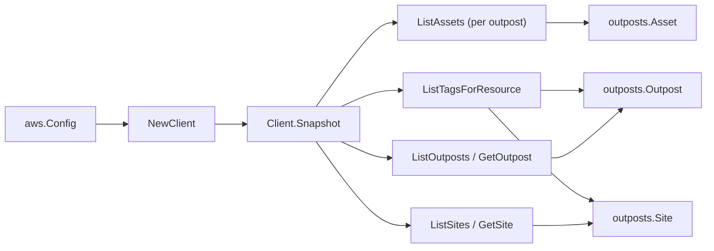

# AWS Outposts SDK Adapter

## Purpose

`internal/collector/awscloud/services/outposts/awssdk` adapts AWS SDK for Go v2
Outposts responses to the scanner-owned `Client` contract. It owns outpost
pagination, per-outpost asset pagination, site pagination, identity-confirming
point reads, resource-tag reads, throttle classification, and per-call AWS API
telemetry.

## Ownership boundary

This package owns SDK calls for Outposts. It does not own workflow claims,
credential acquisition, Outposts fact selection, graph writes, reducer
admission, or query behavior.

## Exported surface

See `doc.go` for the godoc contract.

- `Client` - AWS SDK-backed implementation of `outposts.Client`.
- `NewClient` - builds a `Client` for one claimed AWS boundary.

## Dependencies

- `internal/collector/awscloud` for account, region, and service boundary
  labels.
- `internal/collector/awscloud/services/outposts` for scanner-owned result
  types.
- `internal/telemetry` for AWS API call and throttle instruments.
- AWS SDK for Go v2 `outposts` and Smithy error contracts.

## Telemetry

Outposts paginator pages and point reads are wrapped with:

- `aws.service.pagination.page`
- `eshu_dp_aws_api_calls_total`
- `eshu_dp_aws_throttle_total`

Metric labels stay bounded to service, account, region, operation, and result.
Outposts resource ARNs, names, tags, and raw AWS error payloads stay out of
metric labels.

## Gotchas / invariants

- The adapter reads metadata only. It must never call `GetSiteAddress`, any
  order/billing/connection/catalog read, any pricing/renewal/capacity-task read,
  any instance-type read, or any `Create*`, `Update*`, `Delete*`, or `Cancel*`
  mutation API. The exclusion test fails the build if such a method reaches the
  adapter interface.
- The adapter copies only operational identity from the `Site` record: site id,
  name, and account id. AWS address city/state/region, ISO country code,
  free-form notes, and rack physical-property fields are never read into the
  scanner-owned type.
- The adapter copies only the asset id, type, rack id, compute lifecycle state,
  and rack-unit elevation from `AssetInfo`. Host id, instance families, and
  capacity inventory are not operational identity and are never copied.
- `GetOutpost` and `GetSite` confirm the per-resource control-plane record; the
  list view already carries identity, so a confirmed record only re-reduces to
  the same metadata-only fields.
- `ListTagsForResource` is a metadata read; Outposts tags carry no logistics
  content. When the tag read returns nothing, the adapter falls back to the tags
  on the list/get record.
- SDK adapters translate AWS records into scanner-owned types; scanner tests
  should not mock AWS SDK pagination.

## Related docs

- `docs/public/services/collector-aws-cloud-scanners.md`
- `docs/public/services/collector-aws-cloud-security.md`
