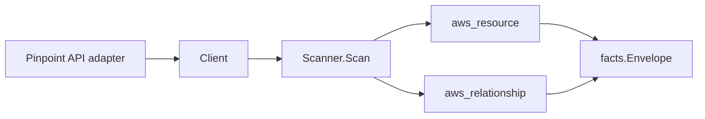

# Amazon Pinpoint Scanner

## Purpose

`internal/collector/awscloud/services/pinpoint` owns the Amazon Pinpoint
scanner contract for the AWS cloud collector. It converts Pinpoint application
(project), segment, and channel-settings metadata into `aws_resource` facts and
emits relationship evidence for application-to-segment membership,
channel-in-application membership, and the email channel's SES sending identity
and SES configuration set.

## Ownership boundary

This package owns scanner-level Pinpoint fact selection and identity mapping. It
does not own AWS SDK pagination, STS credentials, workflow claims, fact
persistence, graph writes, reducer admission, or query behavior.

## Exported surface

See `doc.go` for the godoc contract.

- `Client` - minimal Pinpoint metadata read surface consumed by `Scanner`.
- `Scanner` - emits application, segment, and channel resources plus their
  relationships for one boundary.
- `Snapshot`, `Application`, `Segment`, `Channel` - scanner-owned views with
  endpoint records, addresses, message content, targeting criteria values, the
  import S3 URL, and the email from-address intentionally absent.

## Dependencies

- `internal/collector/awscloud` for boundaries, resource constants,
  relationship constants, and envelope builders.
- `internal/facts` for emitted fact envelope kinds.

The package depends on a small `Client` interface rather than the AWS SDK for
Go v2 so tests can use fake clients and the runtime adapter can own SDK
behavior.

## Telemetry

This scanner emits no spans or logs directly. `awsruntime.ClaimedSource`
records scan duration and emitted resource counts after `Scanner.Scan` returns.
The `awssdk` adapter records Pinpoint API call counts, throttles, and
pagination spans.

## Gotchas / invariants

- Pinpoint facts are metadata only and PII-free. The scanner must never read or
  persist endpoint records, endpoint addresses, phone numbers, the email
  from-address, message or template content, segment targeting dimensions or
  segment-group criteria, the import S3 URL, or the import external id.
- The application node publishes its resource_id as the application id (the
  console Project ID, falling back to ARN then name). The application-to-segment
  and channel-in-application edges are keyed by that same application id so they
  join the application node instead of dangling.
- A segment's own edge is sourced on the segment ARN (falling back to the
  application-qualified segment id), the resource_id the segment node publishes.
- A channel has no AWS-assigned ARN, so it is keyed by the stable
  `<application-id>/<channel-type>` pair, which is unique within a claim.
- The email channel reports its SES identity as an ARN. The edge keys the bare
  identity NAME extracted from that ARN, because the SES email-identity scanner
  publishes its resource_id as the bare verified email/domain name; the edge is
  skipped when the reported value is not an SES `:identity/<name>` ARN, so the
  graph never carries a dangling guess. The reported identity ARN is preserved
  as the edge `target_arn`.
- The email channel reports its SES configuration set as a name, which matches
  the SES configuration-set scanner's published resource_id, so that edge keys
  the name directly.
- Emit reported evidence only. Do not infer deployment, workload, repository
  ownership, environment, or deployable-unit truth from application, segment, or
  channel names, or AWS tags.

## Evidence

Collector Performance Evidence:
`go test ./internal/collector/awscloud/services/pinpoint/...` covers the bounded
Pinpoint metadata path: one paginated GetApps stream, one paginated GetSegments
stream per application, one GetChannels point read per application, one
GetEmailChannel point read per application that has an email channel, no
endpoint reads, no message sends, no mutations, and no graph writes in the
collector.

No-Regression Evidence: metadata-only control-plane scanner; new read path, no change to existing hot paths. `go test ./internal/collector/awscloud/services/pinpoint/...` green.

No-Observability-Change: reuses shared AWS pagination span + API-call/throttle counters; no telemetry contract change.

Collector Deployment Evidence: Pinpoint runs inside the existing hosted
`collector-aws-cloud` runtime, so `/healthz`, `/readyz`, `/metrics`, and
`/admin/status` stay covered by the command wiring and Helm collector runtime.

## Related docs

- `docs/public/services/collector-aws-cloud.md`
- `docs/public/services/collector-aws-cloud-scanners.md`
- `docs/public/services/collector-aws-cloud-security.md`
