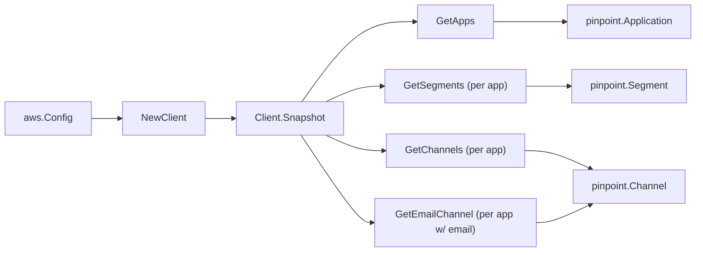

# Amazon Pinpoint SDK Adapter

## Purpose

`internal/collector/awscloud/services/pinpoint/awssdk` adapts AWS SDK for Go v2
Pinpoint responses to the scanner-owned `Client` contract. It owns application
pagination, per-application segment pagination, channel-settings reads, the
email-channel SES-reference enrichment read, throttle classification, and
per-call AWS API telemetry.

## Ownership boundary

This package owns SDK calls for Pinpoint. It does not own workflow claims,
credential acquisition, Pinpoint fact selection, graph writes, reducer
admission, or query behavior.

## Exported surface

See `doc.go` for the godoc contract.

- `Client` - AWS SDK-backed implementation of `pinpoint.Client`.
- `NewClient` - builds a `Client` for one claimed AWS boundary.

## Dependencies

- `internal/collector/awscloud` for account, region, and service boundary
  labels.
- `internal/collector/awscloud/services/pinpoint` for scanner-owned result
  types.
- `internal/telemetry` for AWS API call and throttle instruments.
- AWS SDK for Go v2 `pinpoint` and Smithy error contracts.

## Telemetry

Pinpoint paginator pages and point reads are wrapped with:

- `aws.service.pagination.page`
- `eshu_dp_aws_api_calls_total`
- `eshu_dp_aws_throttle_total`

Metric labels stay bounded to service, account, region, operation, and result.
Pinpoint resource ARNs, names, tags, and raw AWS error payloads stay out of
metric labels.

## Gotchas / invariants

- The adapter reads metadata only. It must never call `SendMessages` or any send
  API, `GetEndpoint`/`GetUserEndpoints` or any endpoint read, message/template
  content reads, exports, or any `Create*`, `Update*`, `Delete*` mutation API.
- `GetEmailChannel` returns a verified `FromAddress` (an email address). The
  adapter never copies it onto the scanner model; it keeps only the SES
  `ConfigurationSet` name and the SES `Identity` ARN reference.
- A segment `ImportDefinition` returns an S3 URL, external id, and role ARN. The
  adapter keeps only the presence flag, the import format, and the aggregate
  size; it never copies the URL, external id, or role.
- Application tags and segment tags are returned inline by `GetApps`/
  `GetSegments`; no separate tag read is needed.
- SDK adapters translate AWS records into scanner-owned types; scanner tests
  should not mock AWS SDK pagination.

## Related docs

- `docs/public/services/collector-aws-cloud-scanners.md`
- `docs/public/services/collector-aws-cloud-security.md`
