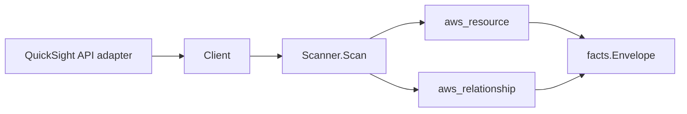

# Amazon QuickSight Scanner

## Purpose

`internal/collector/awscloud/services/quicksight` owns the Amazon QuickSight
scanner contract for the AWS cloud collector. It converts QuickSight data
source, dataset, dashboard, and analysis metadata into `aws_resource` facts and
emits relationship evidence for data-source-to-backing-store (Redshift cluster,
RDS instance, Athena workgroup, S3 bucket), data-source-to-VPC-connection
(security group, subnet), dataset-to-data-source, and dashboard/analysis-to-
dataset dependencies.

## Ownership boundary

This package owns scanner-level QuickSight fact selection and identity mapping.
It does not own AWS SDK pagination, STS credentials, workflow claims, fact
persistence, graph writes, reducer admission, or query behavior.

## Exported surface

See `doc.go` for the godoc contract.

- `Client` - minimal QuickSight metadata read surface consumed by `Scanner`.
- `Scanner` - emits data source, dataset, dashboard, and analysis resources plus
  their relationships for one boundary.
- `Snapshot`, `DataSource`, `DataSet`, `Dashboard`, `Analysis`, `VPCConnection`,
  `BackingStore` - scanner-owned views with credential, secret, SQL, and
  visual-definition fields intentionally absent.

## Dependencies

- `internal/collector/awscloud` for boundaries, resource constants, relationship
  constants, partition helpers, and envelope builders.
- `internal/facts` for emitted fact envelope kinds.

The package depends on a small `Client` interface rather than the AWS SDK for
Go v2 so tests can use fake clients and the runtime adapter can own SDK
behavior.

## Telemetry

This scanner emits no spans or logs directly. `awsruntime.ClaimedSource`
records scan duration and emitted resource counts after `Scanner.Scan` returns.
The `awssdk` adapter records QuickSight API call counts, throttles, and
pagination spans.

## Gotchas / invariants

- QuickSight facts are metadata only. The scanner must never read or persist
  data-source credentials, connection passwords, secret connection parameters,
  the Secrets Manager secret value, SQL query bodies, or visual definitions. The
  data source `secret_configured` attribute is a boolean presence flag only.
- A QuickSight subscription is account-scoped. A not-subscribed account yields an
  empty result (with a `quicksight_not_subscribed` warning), never a failed scan.
  Genuine IAM authorization failures still fail the scan.
- The data source node publishes its resource_id as the data source ARN (falling
  back to the data source id). Dataset-to-data-source edges key the data source
  by the ARN QuickSight reports for the physical table, which matches that node.
- Backing-store edges are emitted only when the connector reports a resolvable
  target id: bare Redshift cluster id, bare RDS DB instance id, bare Athena
  workgroup name (each matching its scanner's published resource_id), and the
  partition-aware synthesized `arn:<partition>:s3:::<bucket>` for S3, derived via
  `awscloud.PartitionForBoundary`. A host/port-only connection or an unscanned
  connector type emits no backing edge.
- VPC-connection edges are emitted only when the data source uses a VPC
  connection that resolved to a known summary. Security groups and subnets are
  keyed by bare id, matching the EC2 scanner's published resource_id.
- Emit reported evidence only. Do not infer deployment, workload, repository
  ownership, environment, or deployable-unit truth from resource names or tags.

## Evidence

Collector Performance Evidence:
`go test ./internal/collector/awscloud/services/quicksight/...` covers the
bounded QuickSight metadata path: one paginated ListDataSources stream, one
paginated ListVPCConnections stream, one paginated ListDataSets/ListDashboards/
ListAnalyses stream each, one DescribeDataSet/DescribeDashboard/DescribeAnalysis
point read per resource to resolve internal edges, one ListTagsForResource point
read per resource, no credential reads, no SQL reads, and no graph writes in the
collector.

No-Regression Evidence: metadata-only control-plane scanner; new read path, no change to existing hot paths. `go test ./internal/collector/awscloud/services/quicksight/...` green.

No-Observability-Change: reuses shared AWS pagination span + API-call/throttle counters; no telemetry contract change.

Collector Deployment Evidence: QuickSight runs inside the existing hosted
`collector-aws-cloud` runtime, so `/healthz`, `/readyz`, `/metrics`, and
`/admin/status` stay covered by the command wiring and Helm collector runtime.

## Related docs

- `docs/public/services/collector-aws-cloud.md`
- `docs/public/services/collector-aws-cloud-scanners.md`
- `docs/public/services/collector-aws-cloud-security.md`
