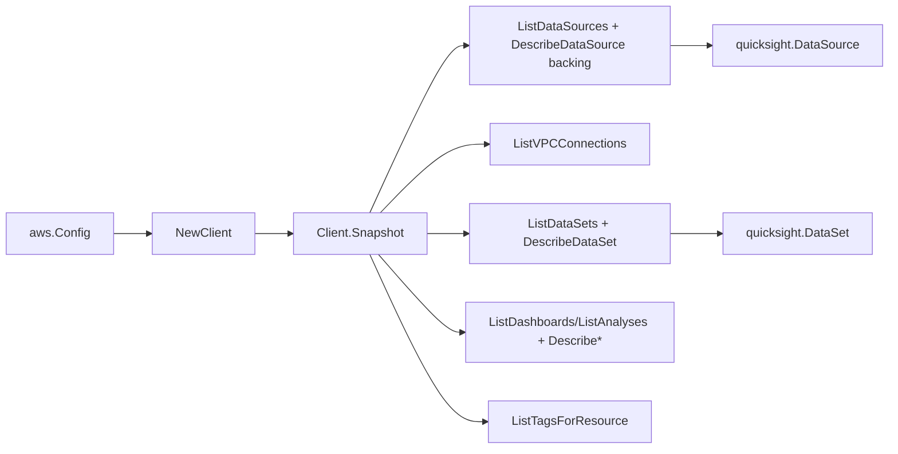

# Amazon QuickSight SDK Adapter

## Purpose

`internal/collector/awscloud/services/quicksight/awssdk` adapts AWS SDK for Go
v2 QuickSight responses to the scanner-owned `Client` contract. It owns data
source/dataset/dashboard/analysis pagination, the per-resource describe fan-out
that resolves internal edges, VPC connection resolution, resource-tag reads,
not-subscribed handling, throttle classification, and per-call AWS API
telemetry.

## Ownership boundary

This package owns SDK calls for QuickSight. It does not own workflow claims,
credential acquisition, QuickSight fact selection, graph writes, reducer
admission, or query behavior.

## Exported surface

See `doc.go` for the godoc contract.

- `Client` - AWS SDK-backed implementation of `quicksight.Client`.
- `NewClient` - builds a `Client` for one claimed AWS boundary, threading the
  boundary AWS account id into every call.

## Dependencies

- `internal/collector/awscloud` for account, region, and service boundary
  labels.
- `internal/collector/awscloud/services/quicksight` for scanner-owned result
  types.
- `internal/telemetry` for AWS API call and throttle instruments.
- AWS SDK for Go v2 `quicksight` and Smithy error contracts.

## Telemetry

QuickSight paginator pages and point reads are wrapped with:

- `aws.service.pagination.page`
- `eshu_dp_aws_api_calls_total`
- `eshu_dp_aws_throttle_total`

Metric labels stay bounded to service, account, region, operation, and result.
QuickSight resource ARNs, names, tags, and raw AWS error payloads stay out of
metric labels.

## Gotchas / invariants

- Nearly every QuickSight API requires the caller's AWS account id. `NewClient`
  reads it from `boundary.AccountID`; `Snapshot` fails fast when it is empty.
- The adapter reads metadata only. It must never call any Create/Update/Delete
  mutation, ingestion or refresh API, embed-URL generation, or permissions read,
  and it must never read data-source credentials, connection secrets, custom-SQL
  query bodies, or visual definitions. `backingStore` reads only the bare
  cluster/instance/workgroup id and the S3 manifest bucket name from connection
  parameters; it never reads hosts with embedded credentials or any secret field.
- A not-subscribed account is detected by an AccessDenied/ResourceNotFound error
  whose message contains "not signed up"/"not subscribed"; that single case maps
  to an empty snapshot with a warning. Every other AccessDenied on the first list
  call fails the scan so genuine authorization failures are not masked.
- A denied or missing describe/tag read for a single resource degrades to
  summary-only metadata; it does not fail the whole scan.
- SDK adapters translate AWS records into scanner-owned types; scanner tests
  should not mock AWS SDK pagination.

## Related docs

- `docs/public/services/collector-aws-cloud-scanners.md`
- `docs/public/services/collector-aws-cloud-security.md`
