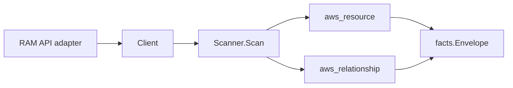

# AWS Resource Access Manager Scanner

## Purpose

`internal/collector/awscloud/services/ram` owns the AWS Resource Access Manager
scanner contract for the AWS cloud collector. It converts the resource shares
an account owns into `aws_resource` facts, emits each share's managed
permissions as `aws_resource` facts, and emits relationship evidence for
share-to-shared-resource, share-to-principal, and share-to-permission
dependencies. It pairs with the `organizations` scanner for cross-account and
organization context: principal-account edges join to organizations accounts by
bare account id, and OU/organization principal edges join by ARN.

## Ownership boundary

This package owns scanner-level RAM fact selection and relationship target-type
and join-key construction. It does not own AWS SDK pagination, STS credentials,
workflow claims, fact persistence, graph writes, reducer admission, or query
behavior. The shared observation and envelope contract lives in the parent
`awscloud` package.

## Exported surface

See `doc.go` for the godoc contract.

- `Client` - metadata-only RAM read surface consumed by `Scanner`. It exposes
  one `ListResourceShares` read and no mutation; the permission policy document
  body is not part of the contract.
- `Scanner` - emits resource-share, permission, and relationship facts for one
  boundary.
- `ResourceShare`, `SharedResource`, `Principal`, and `Permission` -
  scanner-owned metadata representations. The permission policy document body is
  absent by design: `Permission` carries only name, ARN, version, type, and
  status.

## Dependencies

- `internal/collector/awscloud` for boundaries, resource constants,
  relationship constants, and envelope builders. It also reuses the
  organizations resource constants (`aws_organizations_account`,
  `aws_organizations_organizational_unit`, `aws_organizations_root`) as
  principal relationship target types.
- `internal/facts` for emitted fact envelope kinds.

The package depends on a small `Client` interface rather than the AWS SDK for
Go v2 so tests can use fake clients and runtime adapters can own SDK behavior.

## Telemetry

This scanner emits no spans or logs directly. `awsruntime.ClaimedSource`
records scan duration and emitted resource/relationship counts after
`Scanner.Scan` returns. Resource counts surface through
`eshu_dp_aws_resources_emitted_total{service="ram"}` with the existing
per-resource `resource_type` label. The `awssdk` adapter records RAM API call
counts, throttles, and pagination spans.

## Gotchas / invariants

- The scanner never persists a permission policy document body. The
  scanner-owned `Permission` type does not declare a policy field, and the SDK
  adapter reaches only `ListResourceSharePermissions` (metadata) and never
  `GetPermission` (policy body), proven by the adapter exclusion test.
- The scanner observes only shares the account owns (resource owner SELF). It
  does not enumerate shares owned by other accounts.
- Permission resources are deduplicated by ARN across shares so a managed
  permission used by many shares emits one resource fact.
- Every relationship sets a non-empty `target_type` and a non-empty join key:
  - share-to-resource targets the shared resource's ARN with its RAM-reported
    `service-code:resource-code` type (for example `ec2:subnet`) as the target
    type;
  - share-to-principal-account targets `aws_organizations_account` by bare
    account id, matching the organizations scanner's account `resource_id`
    (no target ARN, because organizations keys accounts by bare id);
  - share-to-principal-OU targets `aws_organizations_organizational_unit` by OU
    ARN;
  - share-to-principal-organization targets `aws_organizations_root` by
    organization or root ARN;
  - share-to-permission targets `aws_ram_permission` by permission ARN.
- Principal classification keys on the principal id form (12-digit account id,
  `:ou/`, `:organization/`, `:root/` path segments) rather than a hardcoded
  `arn:aws:` prefix, so GovCloud and China partition principals classify the
  same way.
- The scanner stops on client errors and wraps them with `%w`. Runtime adapters
  decide whether an AWS service error is retryable, terminal, or a warning fact.

## Evidence

Collector Performance Evidence: `go test ./internal/collector/awscloud/services/ram/...`
covers the bounded RAM metadata path: one paginated GetResourceShares stream
scoped to resource owner SELF, then per-share paginated ListResources,
ListPrincipals, and ListResourceSharePermissions streams. No mutation API and no
permission-policy-body read is reachable, and the collector performs no graph
writes.

No-Regression Evidence: `go test ./cmd/collector-aws-cloud ./internal/collector/awscloud/...`
covers resource-share and permission fact emission, every relationship's
non-empty target type and join key, principal classification for account/OU/
organization forms, permission deduplication across shares, blank-join-key
skipping, runtime registration, and command configuration. The SDK adapter
reflection contract test proves the mutation APIs and GetPermission policy-body
read are unreachable.

Collector Observability Evidence: RAM uses the existing AWS collector
`aws.service.pagination.page` span plus `eshu_dp_aws_api_calls_total`,
`eshu_dp_aws_throttle_total`,
`eshu_dp_aws_resources_emitted_total{service="ram"}`,
`eshu_dp_aws_relationships_emitted_total`, and `aws_scan_status` rows. Metric
labels stay bounded to service, account, region, operation, result, and
resource type.

No-Observability-Change: the existing AWS collector telemetry contract already
diagnoses RAM scans through `aws.service.scan`, `aws.service.pagination.page`,
API/throttle counters, resource/relationship counters, and `aws_scan_status`.
No new instrument or label was added.

Collector Deployment Evidence: RAM runs inside the existing hosted
`collector-aws-cloud` runtime, so `/healthz`, `/readyz`, `/metrics`, and
`/admin/status` stay covered by the command wiring and Helm collector runtime.

## Related docs

- `docs/public/services/collector-aws-cloud.md`
- `docs/public/services/collector-aws-cloud-scanners.md`
- `docs/public/guides/collector-authoring.md`
