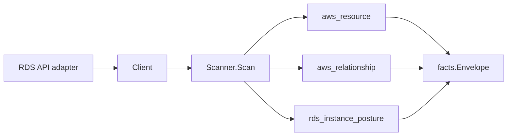

# AWS RDS Scanner

## Purpose

`internal/collector/awscloud/services/rds` owns the Amazon RDS scanner contract
for the AWS cloud collector. It converts RDS control-plane metadata into
`aws_resource` facts and emits relationship evidence when RDS directly reports
database cluster membership, DB subnet groups, VPC security groups, KMS keys,
monitoring roles, associated IAM roles, parameter groups, and option groups.

For every DB instance and Aurora DB cluster the scanner also emits one
`rds_instance_posture` fact: derived security and operations posture
(`publicly_accessible`, encryption + KMS key, IAM database authentication,
backup retention + multi-AZ + deletion protection, Performance Insights enabled
+ retention + PI-KMS key, parameter/option-group identity, a curated set of
security-relevant parameters, and the CA certificate identifier). Posture facts
are derived from the same bounded describe pass; they add no per-resource AWS
API fan-out and emit no graph edges. Reducer-owned graph projection of posture
follows in a separate PR.

## Ownership boundary

This package owns scanner-level RDS fact selection and identity mapping. It
does not own AWS SDK pagination, STS credentials, workflow claims, fact
persistence, graph writes, reducer admission, workload ownership, or query
behavior.

## Exported surface

See `doc.go` for the godoc contract.

- `Client` - minimal RDS metadata read surface consumed by `Scanner`.
- `Scanner` - emits DB instance, DB cluster, DB subnet group, direct
  relationship, and `rds_instance_posture` facts for one boundary.
- `DBInstance`, `DBCluster`, and `DBSubnetGroup` - scanner-owned metadata-only
  resource representations. `DBInstance` and `DBCluster` also carry the
  posture inputs (Performance Insights retention, CA certificate identifier,
  and curated security parameters) used to derive the posture fact.
- `ParameterGroup`, `OptionGroup`, and `ClusterMember` - reported RDS
  relationship details.

The `rds_instance_posture` fact kind, schema version, and payload envelope are
owned by `internal/facts` and `internal/collector/awscloud`
(`facts.RDSInstancePostureFactKind`, `awscloud.RDSPostureObservation`,
`awscloud.NewRDSInstancePostureEnvelope`).

## Dependencies

- `internal/collector/awscloud` for boundaries, resource constants,
  relationship constants, and envelope builders.
- `internal/facts` for emitted fact envelope kinds.

The package depends on a small `Client` interface rather than the AWS SDK for Go
v2 so tests can use fake clients and runtime adapters can own SDK behavior.

## Telemetry

This scanner emits no spans or logs directly. `awsruntime.ClaimedSource`
records scan duration and emitted resource counts after `Scanner.Scan` returns.
The `awssdk` adapter records RDS API call counts, throttles, and pagination
spans.

## Gotchas / invariants

- RDS facts are metadata only. The scanner must not connect to databases, read
  snapshots, read log contents, read Performance Insights samples, discover
  schemas or tables, or mutate RDS resources.
- The `rds_instance_posture` fact carries only derived booleans, retention
  windows, and KMS/parameter/option-group identifiers from the describe APIs.
  Performance Insights *configuration* (enabled, retention, KMS key) is metadata;
  Performance Insights *samples* are data-plane and must never be read or
  persisted. `security_parameters` must be populated only from already-reported
  configuration, never by reading database contents.
- Posture facts emit no graph edges. Reducers own KMS, parameter/option-group,
  and internet-exposure projection from this evidence.
- Database names, master usernames, passwords, connection secrets, snapshot
  identifiers, log payloads, schemas, tables, and row data are not persisted.
- DB instance and cluster endpoints are reported control-plane metadata and are
  used only as resource attributes and correlation anchors, never metric labels.
- Tags are raw AWS tag evidence. Do not infer environment, owner, workload,
  repository, or deployable-unit truth from tags in this package.
- Parameter and option group relationships are name-based evidence unless a
  later metadata slice emits first-class group resources.
- Cluster membership and dependency edges are reported join evidence only.
  Correlation belongs in reducers.

## Evidence

Collector Performance Evidence: `go test ./internal/collector/awscloud/services/rds/...`
covers the bounded RDS metadata path: paginated DescribeDBInstances,
DescribeDBClusters, DescribeDBSubnetGroups, and ListTagsForResource for
ARN-addressable RDS resources; no database connections, snapshots, log reads,
Performance Insights sample reads, schema/table reads, mutations, or graph
writes in the collector.

No-Regression Evidence: `go test ./cmd/collector-aws-cloud ./internal/collector/awscloud/...`
covers RDS metadata fact emission, direct relationship emission, omission of
secret/database/log fields, runtime registration, command configuration, and the
SDK adapter's safe metadata mapping.

Collector Observability Evidence: RDS uses the existing AWS collector
`aws.service.pagination.page` span plus `eshu_dp_aws_api_calls_total`,
`eshu_dp_aws_throttle_total`, `eshu_dp_aws_resources_emitted_total`,
`eshu_dp_aws_relationships_emitted_total`, and `aws_scan_status` rows. Metric
labels stay bounded to service, account, region, operation, result, and status.

No-Observability-Change: the existing AWS collector telemetry contract already
diagnoses RDS scans through `aws.service.scan`, `aws.service.pagination.page`,
API/throttle counters, resource/relationship counters, and `aws_scan_status`.

Collector Deployment Evidence: RDS runs inside the existing hosted
`collector-aws-cloud` runtime, so `/healthz`, `/readyz`, `/metrics`, and
`/admin/status` stay covered by the command wiring and Helm collector runtime.

### Partition-aware ARNs (#866)

No-Regression Evidence: `go test ./internal/collector/awscloud/services/rds/... -count=1`
covers the new `TestSecurityGroupARNDerivesPartition` (commercial / `aws-us-gov`
/ `aws-cn`, plus already-ARN passthrough) alongside the existing assertions. EC2
reports a bare security-group id, so the RDS instance/cluster ->
security-group join target now derives the partition from the scan boundary via
`awscloud.PartitionForBoundary` instead of hardcoding `aws`. Commercial output
(`us-east-1`) is byte-for-byte unchanged; this is a metadata-only correctness
fix with no graph-write, queue, or hot-path behavior change.

No-Observability-Change: the fix only changes the partition substring of a
synthesized ARN value; no instrument, span, metric label, or `aws_scan_status`
row changes.

### RDS/Aurora posture facts (#1145, PR1 facts-only)

No-Regression Evidence: `go test ./internal/collector/awscloud/services/rds/... ./internal/facts -count=1`
covers the new `rds_instance_posture` fact for DB instances and Aurora clusters
(`TestScannerEmitsInstanceAndClusterPostureFacts`,
`TestScannerEmitsNoPostureRelationships`,
`TestNewRDSInstancePostureEnvelope*`, `TestRDSPosture*`). Posture is derived
inside the existing bounded `DescribeDBInstances` / `DescribeDBClusters`
pages; the slice adds no per-resource AWS API fan-out (no N+1) and emits no
graph edges. The metadata-only guarantees and per-resource stable identity are
asserted directly.

No-Observability-Change: posture facts reuse the existing AWS collector
telemetry contract (`aws.service.scan`, `aws.service.pagination.page`,
`eshu_dp_aws_api_calls_total`, and `aws_scan_status`); no new instrument, span,
or metric label is introduced and no new AWS API call is added.

## Related docs

- `docs/public/services/collector-aws-cloud.md`
- `docs/public/guides/collector-authoring.md`
