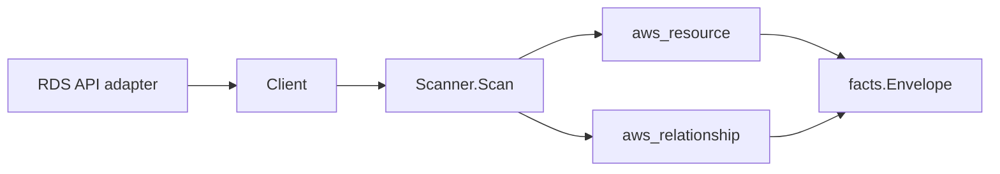

# AWS RDS Scanner

## Purpose

`internal/collector/awscloud/services/rds` owns the Amazon RDS scanner contract
for the AWS cloud collector. It converts RDS control-plane metadata into
`aws_resource` facts and emits relationship evidence when RDS directly reports
database cluster membership, DB subnet groups, VPC security groups, KMS keys,
monitoring roles, associated IAM roles, parameter groups, and option groups.

## Ownership boundary

This package owns scanner-level RDS fact selection and identity mapping. It
does not own AWS SDK pagination, STS credentials, workflow claims, fact
persistence, graph writes, reducer admission, workload ownership, or query
behavior.



## Exported surface

See `doc.go` for the godoc contract.

- `Client` - minimal RDS metadata read surface consumed by `Scanner`.
- `Scanner` - emits DB instance, DB cluster, DB subnet group, and direct
  relationship facts for one boundary.
- `DBInstance`, `DBCluster`, and `DBSubnetGroup` - scanner-owned metadata-only
  resource representations.
- `ParameterGroup`, `OptionGroup`, and `ClusterMember` - reported RDS
  relationship details.

## Dependencies

- `internal/collector/awscloud` for boundaries, resource constants,
  relationship constants, and envelope builders.
- `internal/facts` for emitted fact envelope kinds.

The package depends on a small `Client` interface rather than the AWS SDK for Go
v2 so tests can use fake clients and runtime adapters can own SDK behavior.

## Telemetry

This scanner emits no spans or logs directly. `awsruntime.ClaimedSource`
records scan duration and emitted resource counts after `Scanner.Scan` returns.
The `awssdk` adapter records RDS API call counts, throttles, and pagination
spans.

## Gotchas / invariants

- RDS facts are metadata only. The scanner must not connect to databases, read
  snapshots, read log contents, read Performance Insights samples, discover
  schemas or tables, or mutate RDS resources.
- Database names, master usernames, passwords, connection secrets, snapshot
  identifiers, log payloads, schemas, tables, and row data are not persisted.
- DB instance and cluster endpoints are reported control-plane metadata and are
  used only as resource attributes and correlation anchors, never metric labels.
- Tags are raw AWS tag evidence. Do not infer environment, owner, workload,
  repository, or deployable-unit truth from tags in this package.
- Parameter and option group relationships are name-based evidence unless a
  later metadata slice emits first-class group resources.
- Cluster membership and dependency edges are reported join evidence only.
  Correlation belongs in reducers.

## Verification

```bash
go test ./internal/collector/awscloud/services/rds/... -count=1
go test ./cmd/collector-aws-cloud ./internal/collector/awscloud/... -count=1
go run ./cmd/eshu docs verify ../go/internal/collector/awscloud/services/rds --limit 1000 \
  --fail-on contradicted,missing_evidence
```

Run the AWS runtime tests when scan warnings or partial-status behavior changes.

## Related docs

- `docs/public/services/collector-aws-cloud.md`
- `docs/public/guides/collector-authoring.md`
