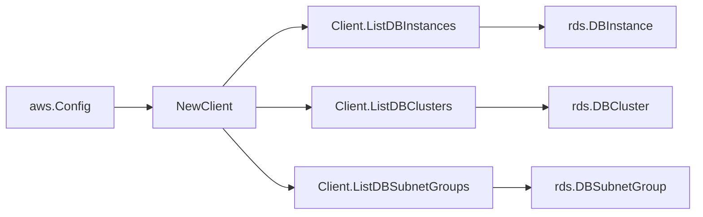

# AWS RDS SDK Adapter

## Purpose

`internal/collector/awscloud/services/rds/awssdk` adapts AWS SDK for Go v2 RDS
responses to the scanner-owned `Client` contract. It owns RDS pagination,
resource tag reads, throttle classification, and per-call AWS API telemetry.

## Ownership boundary

This package owns SDK calls for RDS. It does not own workflow claims,
credential acquisition, RDS fact selection, graph writes, reducer admission,
workload ownership, or query behavior.

## Exported surface

See `doc.go` for the godoc contract.

- `Client` - AWS SDK-backed implementation of `rds.Client`.
- `NewClient` - builds a `Client` for one claimed AWS boundary.

## Dependencies

- `internal/collector/awscloud` for account, region, and service boundary
  labels.
- `internal/collector/awscloud/services/rds` for scanner-owned result types.
- `internal/telemetry` for AWS API call and throttle instruments.
- AWS SDK for Go v2 `rds` and Smithy error contracts.

## Telemetry

RDS list pages and tag reads are wrapped with:

- `aws.service.pagination.page`
- `eshu_dp_aws_api_calls_total`
- `eshu_dp_aws_throttle_total`

Metric labels stay bounded to service, account, region, operation, and result.
RDS ARNs, endpoints, tags, KMS key IDs, subnet group names, and raw AWS error
payloads stay out of metric labels.

## Gotchas / invariants

- The adapter calls only `DescribeDBInstances`, `DescribeDBClusters`,
  `DescribeDBSubnetGroups`, and `ListTagsForResource`.
- Describe calls set `MaxRecords=100`, the documented maximum, and follow RDS
  `Marker` pagination.
- `ListTagsForResource` is called only when AWS returned an ARN.
- The adapter maps safe control-plane fields and drops database names, master
  usernames, secrets, snapshots, log payloads, schemas, tables, and row data.
- The adapter must not call `DescribeDBLogFiles`, `DownloadDBLogFilePortion`,
  Performance Insights APIs, snapshot APIs, data-plane APIs, or mutation APIs.

## Related docs

- `docs/docs/adrs/2026-04-20-aws-cloud-scanner-collector.md`
- `docs/docs/guides/collector-authoring.md`
