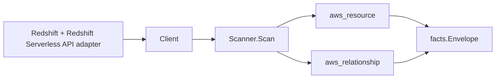

# AWS Redshift Scanner

## Purpose

`internal/collector/awscloud/services/redshift` owns the Amazon Redshift
scanner contract for the AWS cloud collector. It covers both provisioned
Redshift and Redshift Serverless. The scanner converts Redshift control-plane
metadata into `aws_resource` facts and emits relationship evidence when
Redshift directly reports VPCs, cluster subnet groups, cluster parameter
groups, VPC security groups, KMS keys, IAM roles, snapshot source clusters,
scheduled action target clusters, and Serverless namespace-to-workgroup
membership.

## Ownership boundary

This package owns scanner-level Redshift fact selection and identity mapping.
It does not own AWS SDK pagination, STS credentials, workflow claims, fact
persistence, graph writes, reducer admission, workload ownership, or query
behavior.

## Exported surface

See `doc.go` for the godoc contract.

- `Client` - minimal Redshift metadata read surface consumed by `Scanner`,
  covering provisioned and Serverless control planes.
- `Scanner` - emits cluster, parameter group, subnet group, snapshot, scheduled
  action, Serverless namespace, Serverless workgroup, and direct relationship
  facts for one boundary.
- `Cluster`, `ClusterParameterGroup`, `ClusterSubnetGroup`, `ClusterSnapshot`,
  `ScheduledAction`, `ServerlessNamespace`, and `ServerlessWorkgroup` -
  scanner-owned metadata-only resource representations.
- `ServerlessConfigParameter` - reported Serverless workgroup configuration
  parameter metadata.

## Dependencies

- `internal/collector/awscloud` for boundaries, resource constants,
  relationship constants, and envelope builders.
- `internal/facts` for emitted fact envelope kinds.

The package depends on a small `Client` interface rather than the AWS SDK for
Go v2 so tests can use fake clients and runtime adapters can own SDK behavior.

## Telemetry

This scanner emits no spans or logs directly. `awsruntime.ClaimedSource`
records scan duration and emitted resource counts after `Scanner.Scan` returns.
The `awssdk` adapter records Redshift and Redshift Serverless API call counts,
throttles, and pagination spans. Provisioned and Serverless resources share the
`service="redshift"` metric label; the per-resource breakdown is exposed
through the `resource_type` attribute on `eshu_dp_aws_resources_emitted_total`,
not by widening the `service` label.

## Gotchas / invariants

- Redshift facts are metadata only. The scanner must not connect to
  warehouses, run queries, read snapshot contents, read table data, or call
  any Redshift / Redshift Serverless mutation API.
- Master user passwords and Serverless admin passwords are never returned by
  AWS and are never persisted. The scanner also deliberately omits master user
  names and admin user names because no downstream correlation depends on them
  and dropping them keeps the redaction line obvious.
- Snapshot facts carry identity, retention, encryption, node count, and
  source-cluster identifiers only. Snapshot data, restore outputs, and
  cross-account share lists are not persisted.
- Scheduled action facts carry the schedule, IAM role, state, and target
  cluster identifier. The raw `TargetAction` JSON, custom parameters, and
  resize node-count payloads are not persisted as-is; only the action name and
  target cluster identifier are emitted.
- Cluster ARNs are synthesized from the boundary and `ClusterIdentifier`
  because `DescribeClusters` does not return a `ClusterArn` field. The
  adapter must not impersonate `ClusterNamespaceArn` (which addresses the
  namespace) as the cluster ARN.
- Endpoints and tags are reported control-plane metadata and are used only as
  resource attributes and correlation anchors, never metric labels.
- Tags are raw AWS tag evidence. Do not infer environment, owner, workload,
  repository, or deployable-unit truth from tags in this package.
- Parameter and subnet group relationships use synthesized parameter-group and
  subnet-group ARNs as their target identity when AWS returns the group name
  alongside the cluster; the same ARN form is used by the parameter/subnet
  group resources so reducers see consistent identity.
- Cluster membership and dependency edges are reported join evidence only.
  Correlation belongs in reducers.

## Evidence

Collector Performance Evidence:
`go test ./internal/collector/awscloud/services/redshift/...` covers the
bounded Redshift metadata path: paginated `DescribeClusters`,
`DescribeClusterParameterGroups`, `DescribeClusterSubnetGroups`,
`DescribeClusterSnapshots`, `DescribeScheduledActions`, `ListNamespaces`,
`ListWorkgroups`, and `ListTagsForResource` for ARN-addressable Serverless
resources; no warehouse connections, query results, snapshot reads, table
reads, mutations, or graph writes in the collector.

No-Regression Evidence:
`go test ./cmd/collector-aws-cloud ./internal/collector/awscloud/...` covers
Redshift metadata fact emission, direct relationship emission, omission of
master/admin password fields, runtime registration, command configuration, and
the SDK adapter's safe metadata mapping.

Collector Observability Evidence: Redshift uses the existing AWS collector
`aws.service.pagination.page` span plus `eshu_dp_aws_api_calls_total`,
`eshu_dp_aws_throttle_total`, `eshu_dp_aws_resources_emitted_total`,
`eshu_dp_aws_relationships_emitted_total`, and `aws_scan_status` rows.
Provisioned and Serverless resource volume is distinguished through the
`resource_type` attribute on `eshu_dp_aws_resources_emitted_total`; the
`service` label stays `"redshift"` for both surfaces.

No-Observability-Change: the existing AWS collector telemetry contract already
diagnoses Redshift scans through `aws.service.scan`,
`aws.service.pagination.page`, API/throttle counters, resource/relationship
counters, and `aws_scan_status`.

Collector Deployment Evidence: Redshift runs inside the existing hosted
`collector-aws-cloud` runtime, so `/healthz`, `/readyz`, `/metrics`, and
`/admin/status` stay covered by the command wiring and Helm collector runtime.

## Related docs

- `docs/public/services/collector-aws-cloud.md`
- `docs/public/services/collector-aws-cloud-scanners.md`
- `docs/public/guides/collector-authoring.md`
